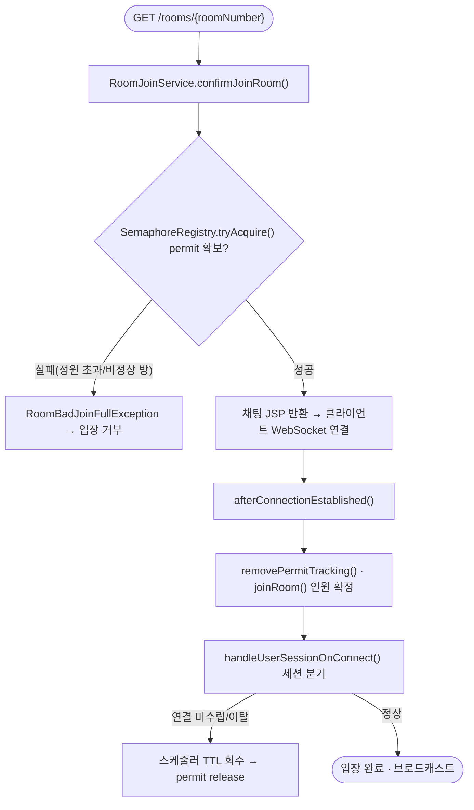
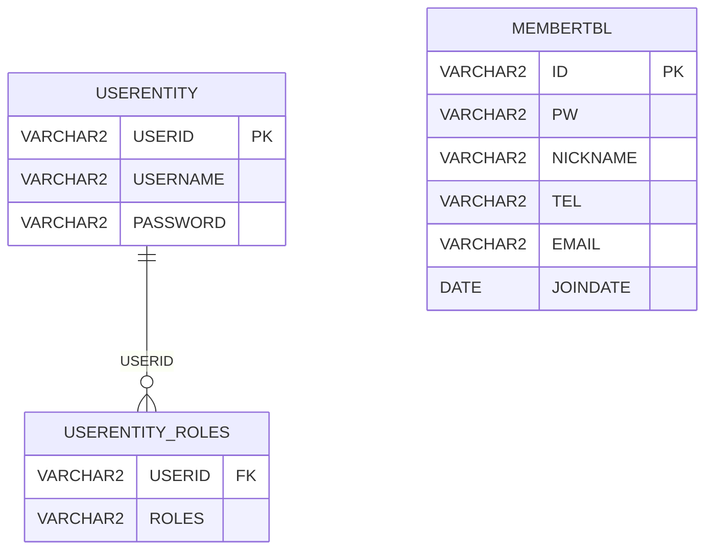
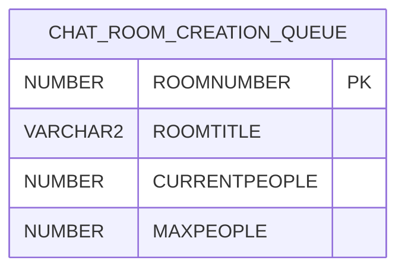

# ChatService — 실시간 채팅 서비스

> 채팅방에 동시에 몰리는 사용자를, REST 단계의 permit 선점과 WebSocket 단계의 입장 확정으로 나눠 처리해서 정원 초과 입장(Race Condition)·중복 로그인·비정상 연결의 자원 누수를 구조적으로 막은 Spring Boot 기반 실시간 채팅 서버.

| 항목 | 내용 |
| --- | --- |
| 개발 인원 | 1인 단독 |
| 개발 기간 | 2025.05 ~ 2026.06 (Git 커밋 이력 기준, 약 13개월·126 커밋) |
| 담당 역할 | 백엔드 설계·구현 단독 수행 |

### 핵심 성과
- 동시 입장 시나리오에서 정원 초과 입장을 막기 위해 4가지 동시성 제어 기법(if-else 조건 검사, `synchronized`, `ReentrantLock`, `Semaphore`)을 직접 비교 테스트하고, 방별 격리·비차단 `tryAcquire` 특성을 가진 `Semaphore`를 채택 (정량 결과는 `docs/포트폴리오` 동시성 적합성 테스트 결과서 참조)
- 입장 처리를 REST(permit 선점)와 WebSocket(입장 확정) 2단계로 분리해, 정원 초과 요청을 WebSocket 연결 비용(TCP 핸드셰이크·HTTP Upgrade) 없이 HTTP 단계에서 즉시 차단
- 새로고침·중복 탭·비정상 종료를 sessionKey와 TTL로 구분해, 단일 사용자 단일 세션 정합성과 비정상 연결의 자원 자동 회수를 보장

---

## 실행 화면


*REST로 입장 요청 → WebSocket 연결 수립 → 메시지 송수신까지 이어지는 정상 입장 흐름*


*동일 userId가 다른 탭/브라우저로 재접속하면 기존 세션을 강제 종료하고 새 세션으로 교체하는 장면*


*정원이 가득 찬 방에 입장 요청 시 permit 확보 실패로 입장이 거부되는 장면*

---

## 목차

1. [프로젝트 개요](#프로젝트-개요)
2. [주요 기능](#주요-기능)
3. [기술 스택](#기술-스택)
4. [시스템 아키텍처](#시스템-아키텍처)
5. [기술적 의사결정](#기술적-의사결정)
6. [데이터베이스 설계](#데이터베이스-설계)
7. [API 명세](#api-명세)
8. [디렉토리 구조](#디렉토리-구조)

---

## 프로젝트 개요

### 프로젝트 출발점
개인 프로젝트로 단독 기획·설계·구현했다. 실시간 채팅에서 발생하는 동시성·세션 정합성 문제를 직접 다뤄 보기 위해 비즈니스 로직과 시스템 아키텍처를 설계하고 동시성 제어·인증 구조를 구성했다. 현재 저장소 코드는 그 단독 작업의 결과이며, 동시성 제어 기법은 측정 비교를 통해 선택했다.

### 배경 및 문제 정의
실시간 채팅에서 REST API 기반 입장 허가와 WebSocket 기반 세션 수립은 물리적으로 분리된 이원 프로토콜이다. 이 구조에서 다음 세 가지 문제가 발생한다. 첫째, 복수 사용자가 동일 방에 동시 입장을 요청하면 HTTP 시점에는 정원 여유가 있었으나 WebSocket 연결이 확정되는 시점에 이미 초과가 발생하는 Race Condition 구간이 존재한다. 둘째, 동일 userId가 여러 탭/브라우저로 동시에 연결하면 메시지 중복, 인원수 불일치, 퇴장 처리 오류가 연쇄된다. 셋째, REST 단계에서 입장 permit을 확보한 사용자가 WebSocket 연결을 완료하지 않고 이탈하면 해당 permit이 점유 상태로 남아 다른 사용자의 입장을 막는다.

### 목적
사용자가 "정원이 가득 찬 방에 잘못 입장하거나", "여러 탭으로 같은 계정이 중복 접속하거나", "연결이 끊겨도 자리를 계속 점유하는" 상황을 신경 쓰지 않아도 되도록, 입장 자격 판별과 입장 확정을 분리하고 비정상 연결의 자원을 TTL로 자동 회수하는 서버 구조를 만든다.

### 프로젝트 범위
포함 범위: 입장 동시성 제어(Semaphore permit), WebSocket 세션 라이프사이클 관리(최초 입장/새로고침/중복 탭/위조 분기), JWT + Redis 기반 인증, 스케줄러 기반 자원 회수, 회원 가입·수정, 방 생성 대기열·방 목록 조회.
제외 범위: 프론트엔드 UI 고도화(JSP/JavaScript 최소 구현), 다중 인스턴스 분산 처리(현재 단일 인스턴스 전제 — 직렬화 가능한 상태의 Redis 이관은 후보로만 검토, `docs/db/redis_keys.md` 참조), 메시지 영속화(채팅 내용은 DB에 저장하지 않음).

---

## 주요 기능

- **입장 동시성 제어 및 Race Condition 차단**: REST 입장 요청 시 `RoomJoinService.confirmJoinRoom()`에서 `SemaphoreRegistry.tryAcquire()`로 permit을 선점하고, 성공한 요청만 WebSocket 연결 후 `joinRoom()`으로 인원수를 확정한다 (`Semaphore`의 원자적 `tryAcquire`로 정원 초과 차단).
- **중복 로그인 / 중복 탭 감지 및 세션 교체**: WebSocket 연결 시 서버 sessionKey와 클라이언트 sessionKey를 비교해 최초 입장·동일 탭 새로고침·중복 탭·위조 4가지로 분기하고, 중복 탭은 기존 세션을 `CloseStatus(3000)`으로 강제 종료한 뒤 새 세션으로 교체한다 (`ChatSessionRegistry.handleUserSessionOnConnect()`).
- **WebSocket 연결 여부에 따른 입장 유효성 분리**: REST 단계에서는 permit만 선점하고 인메모리 대기열(`InMemoryRoomQueueTracker`)에 임시 상태로 두며, 실제 방 생성·인원 반영은 WebSocket 연결이 성립된 `joinRoom()`에서만 수행한다 (유령 방 생성 방지).
- **TTL 기반 자원 회수**: `ChatServiceScheduler`가 미연결 permit(120초 초과), 비명시적 종료 사용자 VO(10초 TTL), 미생성 방 생성 대기열(2분 초과)을 주기적으로 정리해, 연결 실패·새로고침·탭 종료 흐름에서도 자원이 자동 복구된다.
- **Redis 기반 JWT 인증 상태 관리**: 로그인 시 토큰별 서명키와 `userId→토큰` 매핑을 Redis에 저장하고, 매 요청마다 토큰으로 서명키를 조회해 검증한다. 재로그인 시 기존 토큰을 무효화해 동일 사용자 단일 세션을 강제한다 (`LoginFilter`, `JwtAuthProcessorFilter`, `RedisHandler`).

---

## 기술 스택

| 구분 | 기술 |
| --- | --- |
| Language |  Java 21 |
| Framework |    Spring WebSocket(native) |
| Database (Write) |  Oracle (ojdbc8 19.8.0.0) |
| Cache / Auth Store | -DC382D?logo=redis&logoColor=white) JWT 서명키·토큰 매핑 저장 |
| 인증 | -000000?logo=jsonwebtokens&logoColor=white) 쿠키 전송 + Redis 서명키 검증, Stateless |
| View | -F37726?logoColor=white) 서버 사이드 렌더링 |
| 동시성 | `java.util.concurrent` — `Semaphore`, `ConcurrentHashMap`, `@Scheduled` |
| 빌드 |  Gradle |
| 형상관리 |   |

---

## 시스템 아키텍처

단일 Spring Boot 애플리케이션 안에서 HTTP REST와 WebSocket을 동시에 운용하며, 요청 흐름은 `API/뷰 계층(컨트롤러·필터) → 입장 제어 계층(RoomJoinService·SemaphoreRegistry) → WebSocket 세션 계층(핸들러·ChatSessionRegistry)`로 이어진다. 채팅방의 실시간 상태(세션·인원·sessionKey)는 전부 인메모리(`ConcurrentHashMap`)로 관리하고, Oracle은 사용자 계정과 방 생성 대기열만, Redis는 JWT 인증 상태만 담당한다.


### 도메인 구성
- **auth**: Spring Security 필터 체인(경로별 분리), JWT 발급·검증, Redis 서명키 연동 (`/login`, `/logout`, 보호 경로 인증)
- **createroom**: 방 생성 대기열 등록 및 인메모리 추적, DB 백업 (`POST /rooms/new` 인증)
- **joinroom**: 입장 자격 판별(permit 선점)과 입장 확정 (`GET /rooms/{roomNumber}` 인증)
- **websocketcore**: WebSocket 연결/해제/메시지 브로드캐스트, 세션 정합성 관리 (`/chat` 인증)
- **roomlist**: 방 목록 페이지·데이터 조회 (`/rooms`, `/api/rooms` 인증)
- **user**: 회원 가입·수정 (`/members/**`, 가입·로그인 페이지는 공개)
- **redis**: Redis 연산 래퍼 및 범용 단일데이터 API
- **scheduler / concurrency**: TTL 기반 자원 회수, 방별 Semaphore 레지스트리

### 저장소 — 인메모리 상태 + 영속 백업 분리
- **Write/영속 (Oracle)**: 사용자 계정(`USERENTITY`, `MEMBERTBL`)과 방 생성 대기열(`CHAT_ROOM_CREATION_QUEUE`)만 저장. 서버 재기동 시 `InMemoryRoomQueueTracker`가 `@PostConstruct`로 대기열을 복원한다.
- **실시간 상태 (JVM 인메모리)**: 방 메타·인원수·세션 집합·sessionKey·permit 점유를 `ConcurrentHashMap` 계열로 관리해 DB I/O 없이 동시성 제어를 수행한다.
- **인증 상태 (Redis)**: 토큰별 서명키와 `userId→토큰` 매핑(TTL 30분)을 저장하며, 항상 로그인 시 Write 후 매 요청에서 Read로 검증한다.

### 외부 연동 · 배치
외부 API 연동은 없다. 요청 경로 밖(out-of-band) 배치는 `ChatServiceScheduler`가 담당한다: 미생성 방 대기열 정리(20초 주기, TTL 2분), 미연결 permit 회수(30초 주기, TTL 120초), 비명시적 종료 사용자·빈 방 정리(0.5초 주기, VO TTL 10초).

### 처리 흐름: 2단계 입장과 폴백


---

## 기술적 의사결정

### 1. 입장 동시성 제어: Semaphore(fair) tryAcquire로 채택

**복수 사용자의 동시 입장에서 정원 초과를 막아야 하나, 단순 조건 검사(if-else)는 검사와 증가 사이에 원자성이 없어 Race Condition에 취약. 4개 기법을 시나리오 테스트로 비교한 뒤 방별 격리·비차단 점유가 가능한 `Semaphore`로 전환.**

| 후보 | 테스트/검토에서 드러난 특성 (동시 입장 시나리오) | 판정 |
|---|---|---|
| if-else 인원 검사 | 검사–증가 사이 원자성 없음 → 정원 초과 입장 발생 | 문제 출발점 |
| `synchronized` (1Phase/2Phase) | 단일 모니터 기반 전역 직렬화 → 방 간 간섭, 확장성 제약 | 배제 |
| `ReentrantLock` (fair/non-fair) | 방별 락 구성은 가능하나 수동 `unlock` 필요 → 누수 위험 | 배제 |
| **`Semaphore`(fair=true, tryAcquire)** | **방별 격리, 비차단 점유로 정원 초과 즉시 차단, permit으로 잔여 인원 산출** | **채택** |

방마다 독립 `Semaphore`를 두므로(`semaphoreMap`이 `ConcurrentHashMap`) 방 간 경합이 없고, `tryAcquire()`는 JVM 레벨에서 원자적이라 정원 초과가 구조적으로 발생하지 않는다. 정량 비교 데이터와 측정 절차는 `docs/포트폴리오/Java Spring 환경의 동시성 제어 기법 별 적합성 테스트` 결과서 및 `docs/테스트 문서`에 정리되어 있다.

### 2. 입장 처리 위치: HTTP(REST) 단계 permit 선점으로 분리

**permit 확보를 WebSocket 연결 시점까지 미루면 모든 요청이 TCP 핸드셰이크·HTTP Upgrade를 거친 뒤에야 정원 초과를 판별 → 불필요한 연결 비용 발생. HTTP 단계에서 permit을 선점해 초과 요청을 연결 전에 차단.**

| 후보 | 검토 내용 | 판정 |
|---|---|---|
| WebSocket 연결 후 정원 판별 | 초과 요청도 연결 비용을 모두 치른 뒤 거부 | 배제 |
| **HTTP(`confirmJoinRoom`) permit 선점 → WebSocket(`joinRoom`) 확정** | **초과 요청을 연결 비용 없이 즉시 차단, 자격 판별(HTTP)과 세션 관리(WS) 책임 분리** | **채택** |

두 메서드의 유일한 공유 상태는 `SemaphoreRegistry`의 permit 점유뿐이며, 입장 자격 판별은 HTTP 요청-응답 사이클에서 동기적으로, 입장 확정은 WebSocket 연결 이벤트에서 수행되어 관심사가 분리된다.

### 3. JWT 인증 상태 저장: Redis 중앙 저장으로 단일 세션·즉시 무효화

**순수 Stateless JWT는 서버가 토큰을 저장하지 않아 중복 로그인 차단·즉시 무효화가 어렵다. 토큰별 서명키와 `userId→토큰` 매핑을 Redis에 저장해 단일 세션을 강제.**

| 후보 | 검토 내용 | 판정 |
|---|---|---|
| 순수 Stateless JWT(서버 비저장) | 재로그인/탈취 시 기존 토큰 즉시 무효화 불가, 중복 로그인 차단 어려움 | 배제 |
| **Redis 저장(토큰→서명키, userId→토큰, TTL 30분)** | **재로그인 시 기존 토큰 삭제로 단일 세션 강제, 요청마다 서명키 조회로 검증, 무효화는 키 삭제로 처리** | **채택** |

서명키를 토큰별로 보관하므로 토큰마다 검증 키가 달라지고, `userId→토큰` 역매핑으로 재로그인 시 직전 토큰을 무효화한다. 키 설계·TTL·생명주기는 `docs/db/redis_keys.md`에 정리되어 있다.

### 4. 채팅방 실시간 상태: 인메모리(ConcurrentHashMap) 관리

**입퇴장마다 DB에 방 상태를 쓰면 실시간 I/O 비용과 DB 락 의존이 커진다. 방 상태는 인메모리로 두고 DB는 계정·대기열만 담당.**

| 후보 | 검토 내용 | 판정 |
|---|---|---|
| DB에 방 상태 저장 | 실시간 입퇴장마다 DB I/O, 동시성을 DB 락에 의존 | 배제 |
| **인메모리 상태 + DB는 대기열/계정만** | **DB I/O 없이 Semaphore·ConcurrentHashMap으로 실시간 동시성 제어, 재기동 시 대기열만 복원** | **채택(단일 인스턴스 전제)** |

`WebSocketSession`은 직렬화 대상이 아니어서 인스턴스 로컬 유지가 불가피하다. 다중 인스턴스/재기동 내구성이 필요해지면 직렬화 가능한 상태(인원수·sessionKey·대기열)를 Redis로 이관하는 방안을 후보로 남겨 두었다(`docs/db/redis_keys.md`).

---

## 데이터베이스 설계

Oracle(스키마 `TOYCHAT`)에는 인증·회원·방 생성 대기열만 영속화한다. JPA 엔티티를 정적 분석해 도출한 스키마이며(`spring.jpa.hibernate.ddl-auto: none`, `PhysicalNamingStrategyStandardImpl`로 물리 식별자는 대문자), 채팅방 실시간 상태와 세션은 DB가 아닌 JVM 인메모리에 존재한다. PK는 사용자 식별자가 애플리케이션 지정 문자열(`USERID`, `ID`)이고, 방 번호(`ROOMNUMBER`)만 IDENTITY로 자동 채번된다.

### 인증 / 회원 도메인

`MembersRepository.addMember()`가 `MEMBERTBL`과 `USERENTITY`에 동시 저장(회원 = 인증 사용자 1:1 대응)하지만, 엔티티에 JPA 관계/외래키가 선언돼 있지 않아 두 테이블 사이 FK는 두지 않는다(논리 참조). 유일하게 선언된 FK는 `@ElementCollection`이 만드는 `USERENTITY_ROLES → USERENTITY` 하나뿐이다.

### 방 생성 대기열 도메인

`CHAT_ROOM_CREATION_QUEUE`는 독립 테이블(선언된 FK 없음)이며, 서버 기동 시 `InMemoryRoomQueueTracker`가 이 테이블에서 대기열을 복원한다.

### 핵심 테이블
| 테이블 | 역할 |
| --- | --- |
| `USERENTITY` | Spring Security 인증용 사용자(아이디·비밀번호) |
| `USERENTITY_ROLES` | 사용자 권한 목록(자식, `@ElementCollection`) |
| `MEMBERTBL` | 회원 마스터(닉네임·연락처·가입일 등) |
| `CHAT_ROOM_CREATION_QUEUE` | 방 생성 대기열의 영속 백업(재기동 복원용) |

> 상세 스키마/DDL: `docs/db/erd_chatservice.md`, `docs/db/ddl_toychat.sql` · Redis 키 설계: `docs/db/redis_keys.md`

---

## API 명세

기본 컨텍스트 경로는 `/ChatService`(서버 포트 8186)이다. 인증 표기 — **필수**: JWT 인증이 요구되는 보호 경로, **불필요**: 공개 경로. 인증은 쿠키(`Authorization`)의 JWT를 `JwtAuthProcessorFilter`가 Redis 서명키로 검증한다.

### 인증 / 회원 (auth · user)
| Method | Endpoint | 설명 | 인증 |
| --- | --- | --- | --- |
| POST | `/login` | 로그인 처리, JWT 발급·쿠키 삽입, Redis 서명키 저장 (`LoginFilter`) | 불필요 |
| POST/GET | `/logout` | 로그아웃, 쿠키·Redis 토큰 키 정리 후 `/`로 이동 | 불필요 |
| GET | `/members/login` | 로그인 페이지(JSP) | 불필요 |
| GET | `/members/join` | 회원가입 페이지(JSP) | 불필요 |
| POST | `/members/join` | 회원가입 요청 처리(`@Valid`) | 불필요 |
| GET | `/members/edit?editid={id}` | 회원정보 수정 페이지(JSP) | 불필요 |
| POST | `/members/edit` | 회원정보 수정, JWT 쿠키 갱신 | 필수 |

### 방 목록 / 생성 (roomlist · createroom)
| Method | Endpoint | 설명 | 인증 |
| --- | --- | --- | --- |
| GET | `/` | 메인 페이지(전체 방 수·인원 수) | 불필요 |
| GET | `/rooms` | 방 목록 페이지(JSP) | 필수 |
| GET | `/api/rooms` | 방 목록 데이터 조회(JSON, `List<RoomDTO>`) | 필수 |
| GET | `/rooms/new` | 방 생성 페이지(JSP) | 필수 |
| POST | `/rooms/new` | 방 생성 대기열 등록 → `201 Created` + 방 번호 | 필수 |

### 입장 / 실시간 (joinroom · websocketcore)
| Method | Endpoint | 설명 | 인증 |
| --- | --- | --- | --- |
| GET | `/rooms/{roomNumber}` | 입장 자격 판별(`confirmJoinRoom`) 후 채팅 페이지(JSP) 반환 | 필수 |
| WS | `/chat?roomNumber={n}&sessionKey={key}` | WebSocket 연결(입장 확정·세션 분기·브로드캐스트) | 필수 |

WebSocket 서버 → 클라이언트 메시지 타입: `CHAT`(채팅 브로드캐스트), `INFO`(입·퇴장 알림), `USER_COUNT`(현재 인원수), `SESSION_KEY`(세션키 발급·초기화 동기화).

### Redis 범용 단일데이터 (redis)
| Method | Endpoint | 설명 | 인증 |
| --- | --- | --- | --- |
| POST | `/api/v1/redis/singleData/getValue` | 키로 단일 값 조회 | 불필요 |
| POST | `/api/v1/redis/singleData/setValue` | 단일 값 등록/수정(`duration` 지정 시 TTL) | 불필요 |
| DELETE | `/api/v1/redis/singleData/delete` | 키로 단일 값 삭제 | 불필요 |

---

## 디렉토리 구조

```
ChatService
├── build.gradle · settings.gradle                      # 빌드 설정
├── docs/                                                # 설계명세서 · 클래스해설 · DB/ERD · 동시성 테스트 · 포트폴리오
└── src/main
    ├── java/com/chatservice
    │   ├── auth/              # 인증: SecurityConfig, JWT/로그인 필터, 인증 예외 처리
    │   ├── concurrency/       # SemaphoreRegistry (방별 동시 입장 permit 제어)
    │   ├── createroom/        # 방 생성 대기열 등록·인메모리 추적(InMemoryRoomQueueTracker)·DB 백업
    │   ├── joinroom/          # 입장 자격 판별/확정(RoomJoinService), 입장 예외 처리
    │   ├── redis/             # RedisConfig, RedisHandler, 단일데이터 API
    │   ├── roomlist/          # 방 목록 페이지·데이터 조회
    │   ├── scheduler/         # ChatServiceScheduler (TTL 자원 회수)
    │   ├── user/              # 회원 가입·수정, 회원 예외 처리
    │   ├── web/               # 메인 페이지(전체 방/인원 집계)
    │   ├── websocketcore/     # WebSocket 핸들러·핸드셰이크·세션 정합성(ChatSessionRegistry)
    │   └── ChatServiceApplication.java                  # 진입점
    ├── resources/            # application.yml · static(css/js/images)
    └── webapp/WEB-INF/views/ # JSP 뷰(index, chat, rooms, new, members)
```

> 각 핵심 클래스의 설계 책임·실행 흐름은 `docs/클래스해설/` 의 클래스별 `.md` 문서에 정리되어 있다.

---

> 본 문서는 저장소(`https://github.com/bumjinDev/ChatService`)의 실제 소스 코드를 분석해 작성되었다. 측정 정량 데이터는 `docs/포트폴리오`·`docs/테스트 문서`의 동시성 적합성 테스트 결과서를 참조.