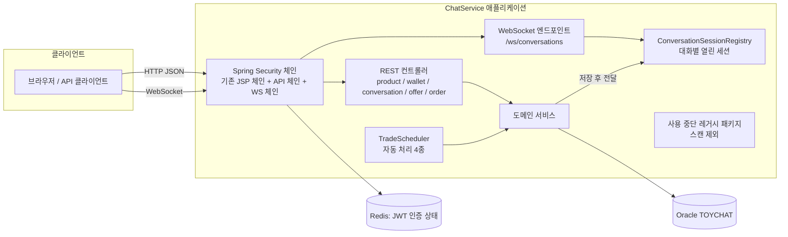
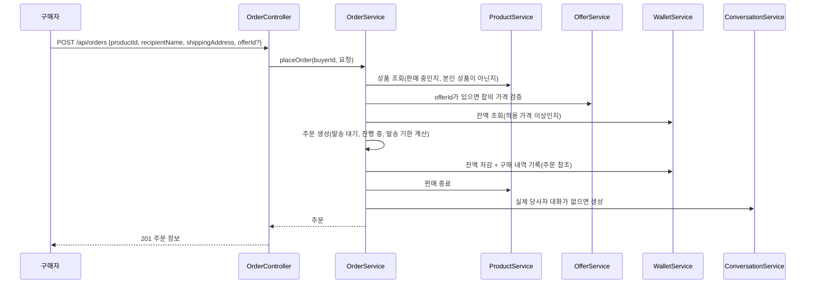
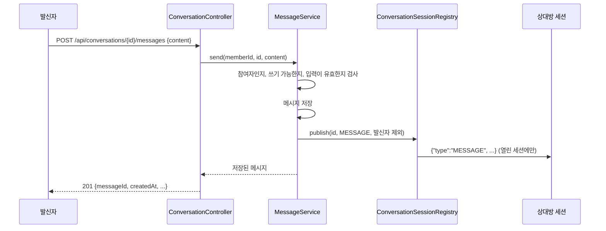
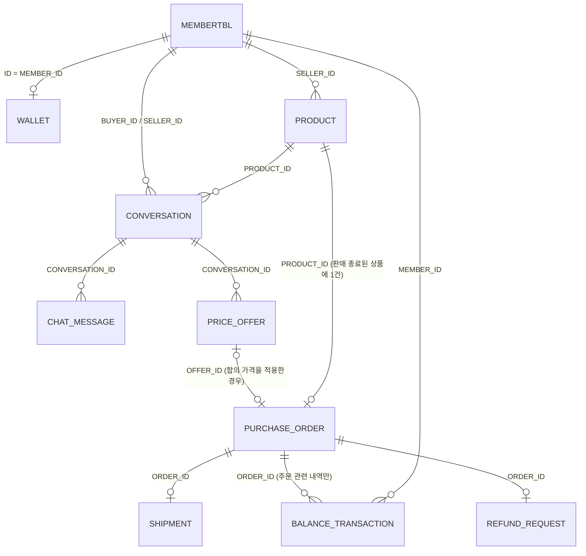

# C2C Marketplace 설계 명세서

| 항목 | 내용 |
| --- | --- |
| 문서 버전·상태 | 2.0 / 초안(검토 요청) |
| 작성일·최종 수정일 | 2026-09-29 / 2026-09-30 |
| 기준 요구사항 | 「2. C2C_Marketplace_요구사항_명세서.md」 1.0 확정 정책 반영본(2026-09-29), 「1. C2C_Marketplace_프로젝트_기획서.md」 |
| 부속 문서 | 「C2C_Marketplace_설계_결정_기록.md」 — 설계 전제와 근거, 설계 결정과 대안, 미결정 사항, 구현 순서, 후속 과제 검토 기준 |
| 설계 대상 | 기존 시스템(ChatService) 변경·확장 |
| 구현 상태 | 구현 전 설계 |

## 1. 설계 범위

### 1.1 목적과 범위

이 문서는 기존 ChatService를 C2C Marketplace로 확장하기 위한 기본 기능 설계를 정한다. 기본 기능은 요청 하나가 정상적으로 처리되는 흐름, 입력 검증, 권한 확인, 요청이 한 번에 하나씩 순서대로 들어올 때(이하 순차 요청)의 상태 변경, 저장과 조회를 뜻한다.

이번 설계에 포함하는 내용은 다음과 같다.

- 요구사항 명세서의 기능 열아홉 개 전부(F-001~F-019). 기능마다 요청 주체, 입력, 검사 항목, 정상 처리 순서, 상태 변경, 저장과 조회 내용, 업무 오류를 정한다. 기능은 다음과 같다.
  - 상품 등록과 공개 조회(F-001, F-002)
  - 테스트 잔액 충전과 잔액·변동 내역 조회(F-003, F-004)
  - 상품별 1:1 채팅 시작, 메시지 전송, 채팅 조회(F-005~F-007)
  - 가격 제안과 판매자의 수락·거절(F-008, F-009)
  - 잔액 결제(F-010)
  - 발송 정보 등록(F-011)
  - 발송 전 취소와 미발송 자동 취소(F-012, F-013)
  - 모의 배송 완료(F-014)
  - 정상 수령 확인과 판매대금 지급(F-015)
  - 상품 확인 기간 만료 자동 완료(F-016)
  - 환불 요청과 거래 보류(F-017)
  - 판매자의 환불 응답과 무응답 자동 환불(F-018)
  - 주문·결제·금전 결과 조회(F-019)
- 상품, 잔액, 대화, 메시지, 가격 제안, 주문, 발송, 환불 요청의 데이터 모델과 상태 모델
- HTTP API와 WebSocket 인터페이스
- 자동 처리 4종(미발송 자동 취소, 모의 배송 완료, 상품 확인 기간 만료 자동 완료, 환불 무응답 자동 환불)의 대상 조회 조건과 순차 처리 순서
- 기존 코드를 재사용할지, 수정할지, 사용을 중단할지에 대한 판단
- 기본 기능 테스트 계획

이번 설계에서 다루지 않는 내용은 다음과 같다. 모두 후속 과제다.

- 트랜잭션 경계, 전파, 격리 수준
- 동시 요청 제어. 대상이 되는 경우는 다음과 같다.
  - 같은 상품을 두 구매자가 동시에 결제하는 경우
  - 한 회원이 여러 상품을 동시에 결제해 잔액을 초과하는 경우
  - 같은 대화가 동시에 두 번 생성되는 경우
  - 발송 등록과 취소가 동시에 들어오는 경우
  - 환불 요청과 완료 처리가 동시에 들어오는 경우
  - 자동 처리와 사용자 요청이 같은 주문을 동시에 바꾸는 경우
- 같은 요청이 다시 전송되었을 때 중복으로 처리하지 않는 보장
- 처리 도중 실패했을 때의 복구, 스케줄러가 겹쳐 실행되는 문제
- 성능 목표, 최적화, 인덱스 설계

위 항목은 요구사항 명세서의 다음 규칙에 대응한다.

- 금액 변화, 관련 내역, 업무 결과는 함께 반영되어야 한다(BR-003).
- 같은 요청을 재시도하거나 자동 처리가 반복되어도 업무 결과, 금전, 메시지는 중복 반영되지 않는다. 배타적인 상태 전환은 하나만 성립한다(BR-004).
- 한 거래의 정상 완료, 환불 완료, 취소 완료는 서로 배타적이다(BR-005).
- 각 기능의 추가 규칙과 수용 기준에도 동시 요청, 같은 요청의 재전송, 처리 도중 실패를 다루는 항목이 있다.

이 요구사항은 기본 기능 구현이 끝난 뒤 별도로 설계하고 검증한다.

## 2. 개발 환경과 기존 구현

### 2.1 개발 환경

기존 ChatService의 환경이다.

| 구분 | 항목 | 내용 | 확인 파일 |
| --- | --- | --- | --- |
| 소스 | 저장소 | `E:\devSpace\SpringBootProjects\ChatService`, 브랜치 `main`, 커밋 `a48774c` | git log |
| 언어 | Java | 21. `build.gradle`에 버전 선언이 없어 구현 시작 시 `java.toolchain`으로 명시한다 | Jenkinsfile, README.md |
| 프레임워크 | Spring Boot | 3.3.5 | build.gradle |
| 프레임워크 | 사용 모듈 | Spring MVC, Spring Security, Spring Data JPA, Spring WebSocket, Bean Validation, Spring Data Redis(Lettuce) | build.gradle |
| 빌드 | Gradle | wrapper 8.13, `war` 플러그인, `bootWar`로 패키징 | gradle-wrapper.properties, build.gradle |
| 뷰 | JSP | tomcat-embed-jasper, JSTL 2.0 | build.gradle, src/main/webapp |
| DB | Oracle XE | 스키마 `TOYCHAT`, ojdbc8, Hibernate 6 | application.yml, build.gradle |
| DB | 스키마 관리 | `ddl-auto: none`. DDL은 `docs/1. 프로젝트개발/2. db/ddl_toychat.sql`에 손으로 작성한다. 식별자는 따옴표 없는 대문자다 | application.yml, ddl_toychat.sql |
| DB | 기존 테이블 | `USERENTITY`, `USERENTITY_ROLES`, `MEMBERTBL`, `CHAT_ROOM_CREATION_QUEUE` | ddl_toychat.sql |
| 인증 저장소 | Redis | JWT 서명키와 회원별 현재 토큰을 저장한다 | RedisConfig.java, LoginFilter.java |
| 인증 | JWT 쿠키 | `Authorization` HttpOnly 쿠키의 JWT를 `JwtAuthProcessorFilter`가 검증한다. 컨트롤러는 `@AuthenticationPrincipal`로 회원 ID를 받는다 | JwtAuthProcessorFilter.java |
| 인증 | 보안 체인 | `securityMatcher`로 나눈 체인 여섯 개(`/`, `/login`, `/logout`, `/members/**`, `/rooms*`, `/chat*`). 어느 체인에도 속하지 않는 경로는 보안 필터 없이 처리된다 | SecurityConfig.java |
| 실시간 | Spring WebSocket | STOMP 없이 `TextWebSocketHandler`를 쓴다. 서버가 보내는 JSON은 `type` 필드로 종류를 구분한다 | WebSocketConfig.java, ChatTextWebSocketHandler.java |
| 테스트 | JUnit 5 | junit-jupiter 5.10.0, spring-boot-starter-test. 테스트 코드는 없다 | build.gradle, src/test/java |
| 실행 | 포트·경로 | 8186, 컨텍스트 경로 `/ChatService` | application.yml |
| 배포 | Jenkins | `bootWar` 결과를 `/opt/chatservice/ChatService.war`로 복사하고 systemd로 재시작한다 | Jenkinsfile |

### 2.2 기존 구현의 재사용·변경·사용 중단

기존 구현은 세 가지로 나눠 다룬다.

- 재사용: 파일을 바꾸지 않고 그대로 쓴다.
- 변경: 파일을 수정하거나 새 파일로 대체한다.
- 사용 중단: 코드는 남겨 두되 컴포넌트 스캔에서 제외해 실행에 사용하지 않는다.

#### 2.2.1 재사용하는 구현

| 구현 | 내용 | 재사용 이유 |
| --- | --- | --- |
| auth 패키지, redis.config, redis.handler | 로그인, JWT 발급, 요청마다 쿠키 검증, 인증 실패 처리 | 공개 상품 조회를 제외한 회원 기능에 필요한 인증(BR-001)을 이미 제공한다 |
| user 패키지와 로그인·가입·수정 JSP | 회원 가입, 로그인 화면, 회원 정보 조회와 수정 | 잔액은 별도 테이블에 두므로 회원 엔티티와 화면을 바꿀 필요가 없다 |
| `index.jsp`와 정적 CSS/JS | 메인 화면 | 로그인 뒤 진입 화면으로 계속 쓴다 |
| `@Valid`와 jakarta.validation 어노테이션 입력 검증 방식 | `MemberDTO`에서 쓰는 방식 | 새 API의 입력 검증에 같은 방식을 쓴다 |
| `IXxxService` 인터페이스와 구현 클래스를 나누는 관례 | 기존 서비스 전부가 따른다 | 새 서비스도 같은 형태로 만든다 |
| `ddl_toychat.sql`의 식별자 규칙 | 대문자, 따옴표 없음, 엔티티에 `@Column(name)` 명시 | 새 테이블 DDL도 같은 규칙으로 작성한다 |

#### 2.2.2 변경하는 구현

##### `SecurityConfig`

- **변경 내용:** `/api/**` 체인과 `/ws/**` 체인을 추가한다(5.1절). 기존 체인 여섯 개는 그대로 둔다
- **변경 이유:** 새 API와 WebSocket 경로에 인증을 적용해야 한다

---

##### `ChatServiceApplication`

- **변경 내용:** `@ComponentScan` 제외 필터를 추가한다(8.2절)
- **변경 이유:** 사용을 중단할 패키지를 빈으로 만들지 않기 위해서다

---

##### `MemberAPIControllerExceptionHandler`, `MemberViewControllerExceptionHandler`

- **변경 내용:** 새 `ApiExceptionHandler`로 대체한다(5.1절). `/members/join`의 `@Valid` 실패도 새 핸들러가 처리한다
- **변경 이유:** 두 클래스의 `@ControllerAdvice(basePackages)`가 다른 프로젝트의 패키지를 가리켜 이 프로젝트의 컨트롤러에 적용되지 않는다. 반환하는 뷰 `error/memberError`, `error/genericError`도 존재하지 않는다

---

##### 예외 응답 형식 `{code, status, message}`

- **변경 내용:** 형식은 유지하고 `code`에 HTTP 상태 숫자 대신 기능별 오류 코드 문자열을 넣는다(5.1절)
- **변경 이유:** 클라이언트가 잔액 부족, 판매 종료 등 오류의 원인을 구분할 수 있어야 한다

---

##### 메인 화면 컨트롤러

- **변경 내용:** 방 개수와 인원을 집계하던 `WebController`를 제외하고, 집계 없이 `index.jsp`를 그리는 `MainPageController`를 새로 만든다
- **변경 이유:** 방 집계 기능의 사용을 중단하기 때문이다

#### 2.2.3 사용을 중단하는 구현

---

##### websocketcore 패키지(`WebSocketConfig`, `ChatHandShakeIntercepter`, `ChatTextWebSocketHandler`, `ChatSessionRegistry`)와 `chat.js`

**처리**

- 원본은 스캔에서 제외한다.
- 복사본을 새 `conversation.realtime` 패키지의 시작점으로 쓴다.
- 복사본에서 방 번호, 인원수, sessionKey 분기, 방 단위 브로드캐스트를 제거한다.
- 같은 회원의 새 연결이 기존 연결을 `close(3000)`으로 닫는 처리는 유지한다

**사용 중단 이유:** 사용자 지시. 원본은 남기고 새 대화 기능은 복사본으로 만든다

---

##### joinroom, createroom, concurrency(`SemaphoreRegistry`), scheduler(`ChatServiceScheduler`, `RoomQueueEntityJpa`), roomlist, web 패키지

**처리:** 스캔에서 제외한다

**사용 중단 이유:** 사용자 지시. 정원, permit, 방 생성 대기열, 방 목록, 인원 집계는 1:1 대화에 대응하는 요구사항이 없다

---

##### `CHAT_ROOM_CREATION_QUEUE` 테이블

**처리:** DDL에 남긴다. `RoomQueueEntity`는 엔티티 스캔에 남지만 `ddl-auto: none`이라 동작에 영향이 없다

**처리 이유:** 사용을 중단하는 패키지가 쓰던 테이블이므로 기존 DDL은 남겨 둔다

---

##### redis.controller, redis.service, `RedisDto`, `redisTemplateAllMapData` 빈

**처리:** 스캔에서 제외한다. `redisTemplateAllMapData`는 `RedisConfig`에 남지만 호출하는 곳이 없다

**사용 중단 이유:** 요구사항에 없는 범용 Redis API다. `/api/v1/redis/singleData/*`는 어느 보안 체인에도 속하지 않아 인증 없이 호출된다

---

##### JPA 인터페이스를 감싸기만 하는 저장소 클래스 관례(`RoomQueueRepository`)

**처리:** 새 코드에서는 따르지 않는다. 서비스가 Spring Data 인터페이스를 직접 쓴다

**사용 중단 이유:** 감싸는 클래스가 `save` 호출 외에 다른 로직을 갖지 않는다

### 2.3 요구사항별 구현 현황과 추가 개발 항목

| 요구사항 | 현재 상태 | 대응 방안 |
| --- | --- | --- |
| BR-001 인증과 당사자 권한 | JWT 인증은 있다. 거래 당사자인지 확인하는 검사는 없다 | 인증은 재사용한다. 당사자 검사는 기능마다 서비스에서 새로 만든다(6장) |
| F-001 상품 등록 | 없다 | 신규 개발(6.1절) |
| F-002 상품 목록·상세 조회 | 없다 | 신규 개발(6.2절) |
| F-003 테스트 잔액 충전 | 없다 | 신규 개발(6.3절) |
| F-004 잔액·변동 내역 조회 | 없다 | 신규 개발(6.4절) |
| F-005 채팅 시작·이어가기 | 방 생성 대기열과 2단계 입장이 있으나 용도가 다르다 | 신규 개발(6.5절). 기존 방 생성과 입장은 코드를 남겨 두고 사용을 중단한다 |
| F-006 채팅 메시지 전송 | WebSocket으로 방 전체에 전달만 하고 저장하지 않는다 | 핸들러를 복사한 뒤 수정한다(6.6절). REST로 저장한 뒤 WebSocket으로 전달한다 |
| F-007 채팅 목록·내역·거래 표시 조회 | 없다 | 신규 개발(6.7절) |
| F-008 가격 제안 | 없다 | 신규 개발(6.8절) |
| F-009 가격 제안 수락·거절 | 없다 | 신규 개발(6.9절) |
| F-010 구매·잔액 결제 | 없다 | 신규 개발(6.10절) |
| F-011 발송 정보 등록 | 없다 | 신규 개발(6.11절) |
| F-012 발송 전 주문 취소 | 없다 | 신규 개발(6.12절) |
| F-013 미발송 자동 취소 | `@Scheduled` 구조만 있다 | 스케줄러 구조를 참고해 신규 개발(6.13절, 7.1절) |
| F-014 모의 배송 완료 | 없다 | 신규 개발(6.14절, 7.1절) |
| F-015 정상 수령 확인·판매대금 지급 | 없다 | 신규 개발(6.15절) |
| F-016 상품 확인 기간 만료 자동 완료 | 없다 | 신규 개발(6.16절, 7.1절) |
| F-017 환불 요청·거래 보류 | 없다 | 신규 개발(6.17절) |
| F-018 판매자 환불 응답·무응답 자동 환불 | 없다 | 신규 개발(6.18절, 7.1절) |
| F-019 주문·결제·금전 결과 조회 | 없다 | 신규 개발(6.19절) |
| BR-002 수량 1개, 예약 없음, 판매 종료 복구 없음 | 없다 | 결제 성공 시 상품을 판매 종료로 변경한다. 결제 전에는 예약하지 않으며, 취소·환불 후에도 판매 종료 상태를 유지한다(4.4절, 6.10절). |
| BR-003 금액은 정수, 잔액 초과 금지, 함께 반영 | 없다 | 금액 표현(4.3절)과 6장 각 절의 "함께 반영할 변경"으로 정의한다 |
| BR-004 재시도와 자동 반복의 중복 금지 | 없다 | 수동 요청은 현재 상태를 검사하고, 자동 처리는 대상 조회 조건으로 이미 처리한 건을 제외한다(6장, 7.1절). |
| BR-005 최종 결과는 하나만 | 없다 | 정상 완료·환불 완료·취소 완료된 거래는 다른 상태로 변경하지 않는다(4.4절). |
| BR-006 KST, 48시간, 영업일 | 없다 | KST를 기준으로 발송 기한을 계산하고, 두 종류의 48시간 기한을 각각의 시작 시점부터 계산한다(4.3절). |
| BR-007 대화 쓰기 가능·읽기 전용 | 없다 | 상품과 주문 상태를 조회해 대화에 메시지를 쓸 수 있는지 판단한다(6.6절). |
| BR-008 조회 권한 | 없다 | 공개 상품 조회를 제외한 조회에서는 본인 잔액, 참여한 대화, 당사자인 주문만 제공한다(6.2절, 6.4절, 6.7절, 6.19절). |
| NFR-001 실시간 전달 | 방 전체 브로드캐스트가 있다 | 대화 상대방의 세션에만 전달하도록 수정한다(7.2절) |
| NFR-002 재접속 후 복구 | 없다. 메시지를 저장하지 않는다 | 재접속하면 저장된 메시지와 제안 결과, 상품의 최신 상태를 다시 조회한다(6.7절). |
| NFR-003 접근 통제 | 없다 | 서비스에서 당사자 권한을 검사하고 권한이 없는 요청에는 403을 반환한다(6장, 5.1절). |

#### 후속 단계에서 구현·검증할 항목

기본 구현 이후에는 동시 요청, 요청 재시도, 처리 도중 실패하는 상황을 다룬다. 아래 항목은 그 단계에서 구현하고 검증할 내용이다. 트랜잭션과 동시성 제어 방식은 해당 단계에서 결정한다.

---

##### 잔액 변경과 결제 결과의 일치

충전·결제·취소·환불·판매대금 지급 과정에서 잔액, 변동 내역, 주문과 환불 상태가 함께 반영되도록 한다. 처리 도중 실패하면 잔액만 바뀌거나 거래 상태만 바뀌는 일이 없는지 검증한다(F-003, F-010, F-012, F-013, F-015, F-018, BR-003).

같은 상품에 여러 구매자가 동시에 결제하면 한 명만 성공하고, 실패한 구매자에게는 주문이나 잔액 차감이 남지 않아야 한다. 한 회원이 여러 상품을 동시에 결제할 때도 보유 잔액을 초과해 사용하지 못하도록 한다(F-010-AC-01, F-010-AC-02, BR-002).

---

##### 같은 요청의 재시도와 중복 생성 방지

동일한 충전·결제·메시지 요청이 다시 들어와도 충전, 주문, 차감, 메시지는 한 번만 반영되도록 한다. 사용자가 의도한 별도 신규 요청과 네트워크 재시도를 구분하는 방법을 정하고 검증한다(F-003-AC-01, F-006-AC-02, F-010-AC-04, BR-004).

같은 회원이 같은 상품의 대화를 동시에 시작해도 대화는 하나만 만들어져야 한다. 발송 정보와 환불 요청도 같은 요청의 재전송으로 중복 생성되지 않아야 하며, 환불 요청의 최초 접수 시점과 응답 기한이 다시 시작되지 않는지 확인한다(F-005-AC-01, F-011, F-017).

---

##### 가격 제안과 채팅 권한의 동시 변경

가격 제안이 동시에 들어오거나 같은 요청이 반복돼도 한 대화의 응답 대기 제안은 최대 하나여야 한다. 판매자의 수락과 거절이 겹치면 하나만 반영하고, 다른 구매자의 결제와 겹치더라도 판매 종료 후에는 제안에 새로 응답하지 못하도록 한다(F-008, F-009).

대화가 읽기 전용으로 바뀌는 시점에 메시지 전송이 겹치면, 전환 이후 새 메시지가 저장되지 않도록 한다(F-006, BR-007).

---

##### 발송·취소·완료·환불 사이의 충돌 처리

발송 등록과 수동 또는 자동 취소가 동시에 진행돼도 발송과 취소가 모두 성공하지 않도록 한다. 취소가 반복되거나 자동 취소와 겹쳐도 구매자에게 결제 금액을 한 번만 반환해야 한다(F-011~F-013).

정상 수령 확인·자동 완료와 유효한 환불 요청이 겹치면 완료와 보류가 함께 성립하지 않도록 한다. 환불 요청이 기한 안에 접수됐다면 자동 완료가 늦게 실행되더라도 보류를 유지하고 판매대금을 지급하지 않아야 한다(F-015~F-017).

판매자의 환불 동의·거절과 무응답 자동 환불이 겹칠 때는 하나의 결과만 반영한다. 정상 완료, 환불 완료, 취소 완료 중 하나만 최종 결과로 남고, 판매대금 지급과 구매자 반환이 함께 이루어지지 않는지 검증한다(F-018, BR-005).

---

##### 자동 처리의 반복 실행과 실패

자동 취소·완료·환불을 반복 실행해도 이미 처리한 주문의 결과를 바꾸거나 추가로 지급·반환하지 않도록 한다. 자동 완료와 구매자의 수령 확인이 겹치는 경우도 함께 검증한다(F-013, F-016, F-018, BR-004).

모의 배송 완료가 겹쳐 실행되더라도 최초 배송 완료 안내 시점(`DELIVERED_AT`)과 상품 확인 기한을 변경하지 않아야 한다(F-014).

자동 처리 도중 실패했을 때 일부 변경만 남지 않도록 하고, 재실행 시 이미 반영한 금액을 중복 처리하지 않는지 확인한다(F-013 및 금전 처리를 수행하는 자동 작업).

## 3. 시스템 구조

### 3.1 전체 구조

단일 Spring Boot 애플리케이션이다. 기존 인증(auth), 회원(user), Redis 인증 저장소는 그대로 두고, 새 도메인은 `com.chatservice.marketplace` 패키지 아래에 만든다. 사용을 중단할 레거시 패키지는 소스에 남기되 컴포넌트 스캔에서 제외한다.

아래 그림은 클라이언트 요청이 어떤 구성요소를 거쳐 어떤 저장소에 접근하는지 보여 준다.



외부 결제 시스템, 택배사 시스템, 운영자 시스템은 없다. 현재 시각은 애플리케이션이 주입받는 `Clock`에서 읽는다(4.3절).

### 3.2 구성요소의 책임

#### 인증과 공통 처리

기존 `auth`는 로그인과 JWT 발급을 담당하고 요청마다 쿠키를 검증한다. Redis에서 서명키와 현재 토큰을 읽고 쓰며, 인증된 회원 ID를 `SecurityContext`에 넣는다. 새 API와 WebSocket 경로에도 보안 체인을 등록한다(BR-001).

`marketplace.common`은 기능별 예외(`BusinessException`, `ErrorCode`), API 예외 핸들러와 오류 응답 형식을 제공한다. 모든 컨트롤러와 서비스가 함께 사용하며, `Clock` 빈과 KST 시간 계산을 담당하는 `TimeRules`도 이 패키지에 둔다(BR-006).

---

#### 상품과 잔액

`marketplace.product`는 상품 등록, 공개 목록·상세 조회, 판매 상태 저장을 담당한다. 결제가 성공하면 주문 서비스의 요청에 따라 상품을 판매 종료로 변경한다(F-001, F-002, BR-002).

`marketplace.wallet`은 회원 잔액과 변동 내역을 저장하고 충전·조회 기능을 제공한다. 잔액 증감과 내역 기록을 한 곳에서 처리하며, 주문·완료·취소·환불 서비스가 이를 호출한다(F-003, F-004, BR-003).

---

#### 대화와 가격 제안

`marketplace.conversation`은 대화 생성과 재사용, 참여 권한 검사, 메시지 저장·조회를 담당한다. 상품과 주문을 조회해 대화에 메시지를 쓸 수 있는지 판단하고, 저장한 메시지의 실시간 전달을 요청한다(F-005~F-007, BR-007).

`marketplace.conversation.realtime`은 WebSocket 설정, 핸드셰이크의 참여자 검사, 세션 등록과 이벤트 전달을 담당한다. 대화·제안·주문 서비스가 요청한 이벤트를 클라이언트에 전달한다(F-006, NFR-001).

`marketplace.offer`는 가격 제안의 생성·응답과 합의 가격의 조회·검증을 담당한다. 처리 전에 대화 참여 여부와 상품 판매 상태를 확인하며, 주문 서비스가 결제에 사용할 합의 가격의 검증을 요청한다(F-008, F-009).

---

#### 주문과 거래 처리

`marketplace.order`는 주문부터 거래 종료까지의 처리를 다음 서비스로 나눈다(F-010~F-019, BR-005).

- `OrderService`는 주문 생성과 결제를 처리한다.
- `ShipmentService`는 발송 등록과 모의 배송 완료를 처리한다.
- `OrderCancellationService`는 주문 취소를 처리한다.
- `TradeCompletionService`는 정상 완료와 판매대금 지급을 처리한다.
- `RefundService`는 환불을 처리한다.
- `OrderQueryService`는 주문 정보를 조회한다.

이 서비스들은 상품·지갑·대화·제안 서비스를 호출한다. 대화 상태가 바뀌면 `CONVERSATION_STATE` 이벤트의 실시간 전달도 요청한다.

---

#### 자동 실행과 메인 화면

`marketplace.order.scheduler.TradeScheduler`는 자동 처리 네 종류를 주기적으로 실행한다. 실제 처리는 각 주문 서비스의 자동 처리 메서드에 위임한다(F-013, F-014, F-016, F-018).

`marketplace.web.MainPageController`는 방 집계 없이 기존 `index.jsp`를 렌더링한다.

### 3.3 주요 처리 흐름

**결제(F-010).** 아래 그림은 구매자가 결제를 요청했을 때 주문 서비스가 어느 서비스를 어떤 순서로 호출하는지 보여 준다.



주문을 먼저 만들고 잔액 내역을 그 뒤에 기록하는 이유는 잔액 변동 내역이 주문 번호를 참조하기 때문이다.

**메시지 전송(F-006).** 아래 그림은 메시지가 저장된 뒤에야 상대방에게 전달된다는 순서를 보여 준다.



전달에 실패해도 저장 결과는 그대로다(F-006 추가 규칙). 상대방은 다시 접속한 뒤 저장된 내역을 조회해서 놓친 메시지를 확인한다(6.7절).

## 4. 데이터와 상태 설계

### 4.1 주요 데이터와 관계

| 데이터 | 역할 | 다른 데이터와의 관계 | 저장 위치 |
| --- | --- | --- | --- |
| 회원(`MEMBERTBL`, 기존) | 인증된 회원. 판매자인지 구매자인지는 거래마다 정해진다 | 상품, 대화, 주문, 잔액이 회원 ID(`ID`)로 참조한다 | Oracle(기존 테이블) |
| 상품(`PRODUCT`) | 수량 1개의 판매 등록 건. 판매 중인지 판매 종료인지를 저장한다 | 판매자 회원을 참조한다<br>대화, 제안, 주문이 상품을 참조한다 | Oracle |
| 잔액(`WALLET`) | 회원의 현재 테스트 잔액 | 회원과 1:1이다<br>변동 내역이 참조한다 | Oracle |
| 잔액 변동 내역(`BALANCE_TRANSACTION`) | 충전, 구매, 취소 반환, 환불 반환, 판매대금 지급의 기록. 변동 후 잔액을 함께 저장한다 | 회원을 참조한다<br>주문과 관련된 내역은 주문을 참조한다 | Oracle |
| 대화(`CONVERSATION`) | 한 상품에 대한 구매 희망자와 판매자의 1:1 대화. 상품과 구매 희망자의 조합으로 식별한다 | 상품과 두 회원을 참조한다<br>메시지와 제안이 대화를 참조한다 | Oracle |
| 메시지(`CHAT_MESSAGE`) | 텍스트 메시지 | 대화와 발신자를 참조한다 | Oracle |
| 가격 제안(`PRICE_OFFER`) | 구매 희망자의 제안과 판매자의 응답. 수락된 제안이 합의 가격이다 | 대화, 상품, 구매자, 판매자를 참조한다<br>주문이 적용한 제안을 참조한다 | Oracle |
| 주문(`PURCHASE_ORDER`) | 구매 확정 사실. 적용 가격과 출처, 수령인과 주소, 배송 진행 상태, 거래 결과 상태, 기준 시각, 취소 정보를 저장한다 | 상품, 구매자, 판매자를 참조한다<br>발송, 환불 요청, 잔액 변동 내역이 주문을 참조한다 | Oracle |
| 발송(`SHIPMENT`) | 최초로 등록된 유효한 발송 정보. 등록 뒤 바뀌지 않는다 | 주문과 1:1이다 | Oracle |
| 환불 요청(`REFUND_REQUEST`) | 주문당 하나인 유효한 환불 요청과 판매자의 판단 또는 자동 승인 결과 | 주문과 1:1이다 | Oracle |
| 열린 WebSocket 세션 | 대화마다 회원별로 열려 있는 세션. 회원당 하나다 | 대화 ID와 회원 ID를 키로 쓴다 | JVM 메모리. 재기동하면 사라지고 클라이언트가 다시 연결한다 |
| JWT 인증 상태(기존) | 토큰별 서명키와 회원별 현재 토큰 | 회원 ID | Redis(기존) |

아래 그림은 위 테이블들이 어느 컬럼으로 서로 참조하는지 보여 준다.



매핑과 제약 규칙은 다음과 같다.

- 엔티티 사이의 참조는 식별자 값을 담는 컬럼(`Long`, `String`)으로 둔다. `@ManyToOne`, `@OneToMany` 같은 연관관계 매핑은 쓰지 않는다.
- 연관관계 매핑을 쓰지 않는 이유는 두 가지다. 기본 기능의 조회는 주문, 상품, 회원을 각각 읽어 서비스가 조립하면 충분하다. 연관관계 매핑은 지연 로딩과 fetch 전략을 함께 정해야 하는데, 이는 이번 범위 밖의 성능 주제다.
- DB의 FK 제약은 회원, 상품, 대화, 주문에 대한 참조에 둔다(4.2절).
- 동시 요청을 막을 목적의 제약(예: 대화의 상품과 구매 희망자 조합에 대한 UNIQUE)은 이번 범위에서 정하지 않는다. 후속 과제다.

### 4.2 저장 구조

모든 테이블에 공통으로 적용하는 규칙은 다음과 같다.

- 숫자 PK는 `NUMBER(19) GENERATED BY DEFAULT AS IDENTITY`로 만들고, JPA에서는 `@GeneratedValue(strategy = IDENTITY)`와 Java `Long`을 쓴다.
- 시각 컬럼은 `TIMESTAMP(6)`이고 Java 타입은 `Instant`다(4.3절).
- 금액 컬럼은 `NUMBER(15)`이고 Java 타입은 `long`이다.
- 열거형은 `VARCHAR2(30)` 컬럼에 `@Enumerated(EnumType.STRING)`으로 저장한다.
- 식별자는 `@Table(name)`과 `@Column(name)`에 명시하고, DDL은 대문자로 쓴다. 기존 DDL 규칙과 같다.

**PRODUCT**

| 컬럼 | 자료형 | 필수·기본값 | 제약 | 의미 |
| --- | --- | --- | --- | --- |
| PRODUCT_ID | NUMBER(19) IDENTITY | 필수 | PK | 상품 등록 건의 식별자 |
| SELLER_ID | VARCHAR2(255) | 필수 | FK → MEMBERTBL.ID | 등록한 회원 |
| NAME | VARCHAR2(100 CHAR) | 필수 | 1~100자 | 상품명 |
| DESCRIPTION | CLOB(확인 필요. VARCHAR2(4000)과 비교해 구현 시 정한다) | 필수 | 1자 이상 | 설명 |
| CATEGORY | VARCHAR2(30) | 필수 | `CLOTHING_ACCESSORIES`, `LIVING`, `ELECTRONICS`, `BOOKS_HOBBY`, `ETC` 중 하나 | 대분류 5종(F-001) |
| PRICE | NUMBER(15) | 필수 | 0보다 큼 | 등록 가격(원) |
| STATUS | VARCHAR2(30) | 필수, 기본값 `ON_SALE` | `ON_SALE`(판매 중), `SOLD`(판매 종료) | 판매 상태 |
| CREATED_AT | TIMESTAMP(6) | 필수 | | 등록 시각 |
| SOLD_AT | TIMESTAMP(6) | 선택 | | 판매 종료 시각. 결제가 성공한 시각과 같다 |

- 공개 목록은 `STATUS = 'ON_SALE'` 조건으로 조회하고, 요청에 카테고리가 있으면 `CATEGORY` 조건을 더한다. 정렬은 등록 시각 내림차순이다.
- 인덱스는 이번 범위에서 정하지 않는다.
- 판매 종료 뒤에도 행을 그대로 둔다. 상품 수정, 삭제, 판매 중단은 요구사항 명세서가 제외한 기능이고, 판매 종료 상품의 정보를 주문 당사자와 기존 대화 참여자가 조회할 수 있어야 한다(BR-008).

**WALLET**

| 컬럼 | 자료형 | 필수·기본값 | 제약 | 의미 |
| --- | --- | --- | --- | --- |
| MEMBER_ID | VARCHAR2(255) | 필수 | PK, FK → MEMBERTBL.ID | 회원 |
| BALANCE | NUMBER(15) | 필수, 기본값 0 | 0 이상(CHECK 제약) | 현재 잔액 |
| UPDATED_AT | TIMESTAMP(6) | 필수 | | 마지막으로 잔액이 바뀐 시각 |

- 회원 ID를 그대로 PK로 써서 회원과 1:1로 둔다.
- 지갑 행은 회원이 처음 충전하거나 처음 잔액을 조회할 때 잔액 0으로 만든다. 판매대금을 지급할 때 판매자의 지갑이 없으면 그때 만든다. 기존 회원 데이터를 옮기는 작업이 필요 없다.
- 잔액을 초과해 구매할 수 없다(BR-003). `BALANCE >= 0` CHECK 제약은 이 규칙을 데이터 수준에서 표현한 것이다.
- 두 요청이 동시에 잔액을 줄이려 할 때 이 제약이 어떤 결과를 내는지는 후속 과제다.

**BALANCE_TRANSACTION**

| 컬럼 | 자료형 | 필수·기본값 | 제약 | 의미 |
| --- | --- | --- | --- | --- |
| TRANSACTION_ID | NUMBER(19) IDENTITY | 필수 | PK | |
| MEMBER_ID | VARCHAR2(255) | 필수 | FK → MEMBERTBL.ID | 잔액의 주인 |
| TYPE | VARCHAR2(30) | 필수 | `CHARGE`(충전), `PURCHASE`(구매), `CANCEL_REFUND`(취소 반환), `REFUND`(환불 반환), `SALE_PAYOUT`(판매대금 지급) | 잔액 변동 내역 조회가 구분해서 보여 주는 다섯 유형(F-004) |
| AMOUNT | NUMBER(15) | 필수 | 0이 아님 | 변동 금액. 잔액이 늘면 양수, 줄면 음수 |
| BALANCE_AFTER | NUMBER(15) | 필수 | 0 이상 | 변동 후 잔액 |
| ORDER_ID | NUMBER(19) | 선택 | FK → PURCHASE_ORDER.ORDER_ID | 관련 주문. 충전에는 없다 |
| REQUEST_ID | VARCHAR2(64) | 선택 | | 충전 요청에 클라이언트가 넣은 요청 식별자. 기본 구현은 이 값으로 중복을 판단하지 않는다 |
| CREATED_AT | TIMESTAMP(6) | 필수 | | 발생 시각 |

- 조회는 회원 ID 기준으로 `TRANSACTION_ID` 내림차순이다.
- 삭제하지 않는다.

**CONVERSATION**

| 컬럼 | 자료형 | 필수·기본값 | 제약 | 의미 |
| --- | --- | --- | --- | --- |
| CONVERSATION_ID | NUMBER(19) IDENTITY | 필수 | PK | |
| PRODUCT_ID | NUMBER(19) | 필수 | FK → PRODUCT | 대화 대상 상품 |
| BUYER_ID | VARCHAR2(255) | 필수 | FK → MEMBERTBL.ID | 구매 희망자. 결제 뒤에는 구매자 |
| SELLER_ID | VARCHAR2(255) | 필수 | FK → MEMBERTBL.ID | 상품 판매자. 참여자 검사 때 상품을 다시 조회하지 않도록 상품에서 복사해 둔다 |
| CREATED_AT | TIMESTAMP(6) | 필수 | | 생성 시각 |
| CREATED_BY_SYSTEM | NUMBER(1) | 필수, 기본값 0 | 0 또는 1 | 1이면 결제 성공 시 시스템이 만든 대화다 |

- 상품 하나와 구매 희망자 하나의 조합에 대화는 하나다(F-005). 기본 구현은 먼저 조회하고 없으면 만드는 순차 처리다.
- 두 요청이 동시에 들어와도 하나만 만들어지게 하는 방법은 후속 과제다.
- 대화에 상태 컬럼을 두지 않는다. 쓰기 가능한지 읽기 전용인지는 조회할 때 상품과 주문의 상태로 계산한다(6.6절).

**CHAT_MESSAGE**

| 컬럼 | 자료형 | 필수·기본값 | 제약 | 의미 |
| --- | --- | --- | --- | --- |
| MESSAGE_ID | NUMBER(19) IDENTITY | 필수 | PK | 한 대화 안에서 조회 순서의 기준 |
| CONVERSATION_ID | NUMBER(19) | 필수 | FK → CONVERSATION | |
| SENDER_ID | VARCHAR2(255) | 필수 | FK → MEMBERTBL.ID | 발신자 |
| CONTENT | VARCHAR2(1000 CHAR) | 필수 | 1~1000자. 공백만으로 된 내용은 불가 | 메시지 본문 |
| CLIENT_MESSAGE_ID | VARCHAR2(64) | 선택 | | 클라이언트가 넣은 요청 식별자 |
| CREATED_AT | TIMESTAMP(6) | 필수 | | 저장 시각 |

- 조회 순서는 `MESSAGE_ID` 오름차순이다. 같은 대화의 메시지는 저장된 순서대로 식별자가 커지므로 한 대화 안에서 순서가 일정하다(F-007 추가 규칙).
- 동시에 전송된 두 메시지의 절대적인 선후는 보장 대상이 아니다(F-007 추가 규칙).
- 재접속 뒤 놓친 메시지를 가져올 때는 `MESSAGE_ID > :afterId` 조건으로 조회한다(6.7절).

**PRICE_OFFER**

| 컬럼 | 자료형 | 필수·기본값 | 제약 | 의미 |
| --- | --- | --- | --- | --- |
| OFFER_ID | NUMBER(19) IDENTITY | 필수 | PK | |
| CONVERSATION_ID | NUMBER(19) | 필수 | FK → CONVERSATION | 제안이 속한 대화 |
| PRODUCT_ID | NUMBER(19) | 필수 | FK → PRODUCT | 대상 상품 |
| BUYER_ID | VARCHAR2(255) | 필수 | FK → MEMBERTBL.ID | 제안한 회원 |
| SELLER_ID | VARCHAR2(255) | 필수 | FK → MEMBERTBL.ID | 응답할 수 있는 회원 |
| AMOUNT | NUMBER(15) | 필수 | 0보다 크고 등록 가격보다 작음 | 제안 금액 |
| STATUS | VARCHAR2(30) | 필수, 기본값 `PENDING` | `PENDING`(응답 대기), `ACCEPTED`(수락), `REJECTED`(거절) | 응답 상태 |
| REQUEST_ID | VARCHAR2(64) | 선택 | | 클라이언트가 넣은 요청 식별자 |
| CREATED_AT | TIMESTAMP(6) | 필수 | | 제안 시각 |
| RESPONDED_AT | TIMESTAMP(6) | 선택 | | 응답 시각 |

- 한 대화에 `PENDING` 제안은 최대 하나다.
- `ACCEPTED` 제안이 있으면 새 제안을 만들 수 없다. 수락 뒤 재협상은 없다.
- `REJECTED` 뒤에는 새 제안을 만들 수 있다(F-008).
- 상품이 판매 종료되어도 `PENDING` 제안의 상태를 바꾸지 않는다(F-009 추가 규칙). 그 제안에 응답하려는 요청은 상품 상태 검사에서 거절된다.

**PURCHASE_ORDER**

`ORDER`는 Oracle 예약어라서 테이블 이름을 `PURCHASE_ORDER`로 한다.

| 컬럼 | 자료형 | 필수·기본값 | 제약 | 의미 |
| --- | --- | --- | --- | --- |
| ORDER_ID | NUMBER(19) IDENTITY | 필수 | PK | |
| PRODUCT_ID | NUMBER(19) | 필수 | FK → PRODUCT | |
| BUYER_ID | VARCHAR2(255) | 필수 | FK → MEMBERTBL.ID | 구매자 |
| SELLER_ID | VARCHAR2(255) | 필수 | FK → MEMBERTBL.ID | 판매자 |
| PAID_AMOUNT | NUMBER(15) | 필수 | 0보다 큼 | 실제 결제 금액 |
| PRICE_SOURCE | VARCHAR2(30) | 필수 | `LISTED`(등록 가격), `AGREED`(합의 가격) | 적용 가격의 출처 |
| OFFER_ID | NUMBER(19) | 선택 | FK → PRICE_OFFER | 적용한 수락 제안. `AGREED`일 때만 있다 |
| RECIPIENT_NAME | VARCHAR2(100 CHAR) | 필수 | 공백 불가 | 수령인 |
| SHIPPING_ADDRESS | VARCHAR2(500 CHAR) | 필수 | 공백 불가 | 배송 주소 |
| SHIPPING_STATUS | VARCHAR2(30) | 필수, 기본값 `WAITING_SHIPMENT` | `WAITING_SHIPMENT`(발송 대기), `SHIPPING`(배송 중), `DELIVERED`(배송 완료) | 주문과 배송의 진행 상태 |
| TRADE_STATUS | VARCHAR2(30) | 필수, 기본값 `IN_PROGRESS` | `IN_PROGRESS`(진행 중), `ON_HOLD`(보류), `COMPLETED`(정상 완료), `REFUNDED`(환불 완료), `CANCELLED`(취소 완료) | 거래 결과 상태 |
| COMPLETION_CAUSE | VARCHAR2(30) | 선택 | `BUYER_CONFIRMED`(구매자 수령 확인), `AUTO_EXPIRED`(확인 기간 만료), `REFUND_REJECTED`(환불 거절) | 정상 완료가 된 이유. 주문 조회에 표시한다(F-019) |
| CONFIRMED_AT | TIMESTAMP(6) | 필수 | | 구매 확정 시각. 결제가 성공한 시각과 같다 |
| SHIP_DEADLINE_AT | TIMESTAMP(6) | 필수 | | 발송 기한이 지나는 시점(4.3절). 현재 시각이 이 값 이상이면 기한이 지난 것이다 |
| DELIVERED_AT | TIMESTAMP(6) | 선택 | 한 번 기록한 뒤 바꾸지 않음 | 배송 완료 안내 시점 |
| INSPECTION_DEADLINE_AT | TIMESTAMP(6) | 선택 | DELIVERED_AT + 48시간 | 상품 확인 기간이 끝나는 시점 |
| FINALIZED_AT | TIMESTAMP(6) | 선택 | | 정상 완료, 환불 완료, 취소 완료가 된 시각 |
| CANCELLED_BY | VARCHAR2(30) | 선택 | `BUYER`, `SELLER`, `SYSTEM` | 누가 취소했는가 |
| CANCEL_REASON | VARCHAR2(500 CHAR) | 선택 | 당사자가 취소할 때는 필수 | 취소 사유. 자동 취소는 고정 문자열 `SHIPMENT_DEADLINE_EXPIRED`를 넣는다 |
| REQUEST_ID | VARCHAR2(64) | 선택 | | 결제 요청에 클라이언트가 넣은 요청 식별자 |

- 취소는 배송 상태가 아니라 거래 결과(`TRADE_STATUS`)로 둔다. 요구사항 명세서의 상태 표가 취소 완료를 거래 결과로 분류하고, 취소는 발송 전에만 일어나기 때문이다.
- 취소된 주문은 `SHIPPING_STATUS`가 `WAITING_SHIPMENT`인 채로 남고 `TRADE_STATUS`가 `CANCELLED`가 된다. 발송 뒤에는 취소가 없으므로 `SHIPPING`이나 `DELIVERED`가 `CANCELLED`와 함께 나타나는 조합은 생기지 않는다.
- 판매 종료된 상품 하나에 주문은 하나다. 두 결제가 동시에 들어와도 하나만 만들어지게 하는 방법은 후속 과제다.
- 구매 목록은 `BUYER_ID`로, 판매 목록은 `SELLER_ID`로 조회한다. 자동 처리는 상태와 기준 시각 조건으로 대상을 조회한다(7.1절).

**SHIPMENT**

| 컬럼 | 자료형 | 필수·기본값 | 제약 | 의미 |
| --- | --- | --- | --- | --- |
| SHIPMENT_ID | NUMBER(19) IDENTITY | 필수 | PK | |
| ORDER_ID | NUMBER(19) | 필수 | FK → PURCHASE_ORDER | 주문당 하나 |
| CARRIER_NAME | VARCHAR2(100 CHAR) | 필수 | 공백 불가. 실제 업체 목록이나 형식은 검증하지 않는다(F-011) | 택배사명 |
| TRACKING_NUMBER | VARCHAR2(100 CHAR) | 필수 | 공백 불가 | 운송장 번호 |
| SHIPPED_AT | TIMESTAMP(6) | 필수 | | 발송 등록 시각. 모의 배송이 시작되는 시각이다 |
| DELIVERY_DUE_AT | TIMESTAMP(6) | 필수 | SHIPPED_AT + 모의 배송 기간 | 모의 배송이 완료될 예정 시각 |
| REQUEST_ID | VARCHAR2(64) | 선택 | | 클라이언트가 넣은 요청 식별자 |

- 발송 정보는 주문당 한 번 등록하며 수정과 재등록이 없다(F-011 추가 규칙). 삭제 기능도 두지 않는다.
- 이 행이 있다는 것 자체가 발송되었다는 사실이다.
- 배송 완료 시각은 발송이 아니라 주문(`DELIVERED_AT`)이 저장한다.

**REFUND_REQUEST**

| 컬럼 | 자료형 | 필수·기본값 | 제약 | 의미 |
| --- | --- | --- | --- | --- |
| REFUND_REQUEST_ID | NUMBER(19) IDENTITY | 필수 | PK | |
| ORDER_ID | NUMBER(19) | 필수 | FK → PURCHASE_ORDER | 주문당 유효한 요청 하나 |
| BUYER_ID | VARCHAR2(255) | 필수 | FK → MEMBERTBL.ID | 요청한 회원 |
| REASON_CODE | VARCHAR2(30) | 필수 | `DESCRIPTION_MISMATCH` | 사유. 이번 범위에서는 "상품 설명과 실제 상태가 다름" 한 가지다 |
| DETAIL | VARCHAR2(2000 CHAR) | 필수 | 공백 불가 | 상세 설명 |
| DECISION | VARCHAR2(30) | 필수, 기본값 `PENDING` | `PENDING`(응답 대기), `APPROVED`(판매자 동의), `REJECTED`(판매자 거절), `AUTO_APPROVED`(무응답 자동 승인) | 판매자의 판단 또는 자동 승인 결과 |
| REQUESTED_AT | TIMESTAMP(6) | 필수 | 한 번 기록한 뒤 바꾸지 않음 | 최초 접수 시점 |
| RESPONSE_DEADLINE_AT | TIMESTAMP(6) | 필수 | REQUESTED_AT + 48시간 | 판매자 응답 기한 |
| DECIDED_AT | TIMESTAMP(6) | 선택 | | 판단하거나 자동 승인된 시각 |
| REQUEST_ID | VARCHAR2(64) | 선택 | | 클라이언트가 넣은 요청 식별자 |

- 환불 요청은 수정과 철회가 없다(F-017 추가 규칙).

### 4.3 공통 데이터 표현

**금액**

- 원화 정수다. Java는 `long`, DB는 `NUMBER(15)`를 쓴다.
- 등록 가격, 제안 금액, 충전 금액은 0보다 커야 한다(BR-003). 소수, 0, 음수가 입력되면 400으로 거절한다.
- 충전 상한과 보유 잔액 상한은 두지 않는다(F-003 추가 규칙).
- 변동 내역의 `AMOUNT`는 부호가 있는 변동량이다.

**시각 저장**

- 모든 시각을 `Instant`(UTC)로 저장한다. DB 컬럼은 `TIMESTAMP(6)`이고 Hibernate 설정에 `hibernate.jdbc.time_zone=UTC`를 추가한다.
- API 응답은 ISO-8601 UTC 문자열(예: `2026-09-29T02:00:00Z`)이다. 화면에 표시할 시간대로 바꾸는 일은 클라이언트가 한다.
- KST 대신 UTC로 저장하는 이유는 영업일과 자정 경계 계산을 한 컴포넌트에 모으고, 서버의 시간대 설정에 결과가 좌우되지 않게 하기 위해서다.
- Oracle `TIMESTAMP`와 `Instant`의 매핑이 의도대로 동작하는지는 구현을 시작할 때 확인한다(확인 필요).

**현재 시각**

- 서비스는 `java.time.Clock` 빈에서만 현재 시각을 읽는다.
- 운영 설정은 `Clock.systemUTC()`이고, 테스트에서는 시각을 고정하거나 옮길 수 있는 Clock을 주입한다(9장).
- 새 코드에서는 `LocalDateTime.now()`와 `System.currentTimeMillis()`를 쓰지 않는다.

**KST 업무 규칙**

요구사항의 시간 규칙은 다음과 같다(BR-006).

- 업무 시간은 KST다.
- 48시간은 실제 경과 시간이다.
- 영업일은 월요일부터 금요일이고 공휴일은 따로 빼지 않는다.
- 발송 기한은 구매 확정 다음 영업일을 1일째로 세어 5번째 영업일이 끝날 때까지다.

`TimeRules` 컴포넌트가 `ZoneId.of("Asia/Seoul")`을 기준으로 다음 값을 계산한다.

발송 기한이 지나는 시점 `shipDeadlineAt(confirmedAt)`은 다음 순서로 구한다.

1. 구매 확정 시각 `confirmedAt`을 KST 날짜 `d0`로 바꾼다.
2. `d = d0`, `count = 0`에서 시작한다. `count`가 5보다 작은 동안 `d`를 하루 늘리고, 늘린 날의 요일이 월요일부터 금요일 사이면 `count`를 1 늘린다. 공휴일은 제외하지 않는다.
3. `count`가 5가 된 날 `d`의 다음 날 00:00 KST를 `Instant`로 바꾼 값이 기한이 지나는 시점이다.

발송 기한의 적용은 다음과 같다.

- 발송 등록은 현재 시각이 이 값보다 작을 때 허용한다.
- 자동 취소는 현재 시각이 이 값 이상일 때 대상으로 삼는다.
- 검산: 월요일에 확정한 주문은 화(1), 수(2), 목(3), 금(4), 월(5)을 거쳐 화요일 00:00 KST에 기한이 지난다. 요구사항의 수용 기준도 같다. 월요일에 구매 확정하고 다음 월요일까지 발송하지 않은 주문은 화요일 00:00 KST에 자동 취소 대상이 된다(F-013-AC-01).
- 검산: 금요일에 확정하면 월(1)부터 금(5)까지 세어 토요일 00:00 KST에 기한이 지난다.

48시간 기한의 적용은 다음과 같다.

- 48시간 기한은 기준 시각에 48시간을 더한 값이다.
- 수동 요청은 현재 시각이 기한보다 작을 때 허용한다. 정상 수령 확인(F-015-AC-03), 환불 요청(F-017-AC-02), 판매자의 환불 응답(F-018-AC-03)이 해당한다.
- 자동 처리는 현재 시각이 기한 이상일 때 대상으로 삼는다. 확인 기간 만료 완료(F-016-AC-01)와 무응답 자동 환불(F-018-AC-03)이 해당한다.
- 요구사항의 수용 기준은 정확히 48시간이 되는 순간부터 수동 요청을 거절하고 자동 처리를 시작한다고 정한다. 위 두 규칙은 이에 맞춘 것이다.
- 시각 비교는 `Instant`끼리 그대로 한다.

모의 배송이 완료될 예정 시각은 발송 등록 시각에 설정값 `marketplace.mock-delivery.duration`을 더한 값이다. 설정값은 구현·테스트 단계에서 정한다.

**누락값의 의미**

- `DELIVERED_AT`이 null이면 아직 배송이 완료되지 않은 것이다.
- `OFFER_ID`가 null이면 등록 가격으로 결제한 것이다.
- `DECIDED_AT`이 null이면 판매자 응답을 기다리는 중이다.

**요청 식별자**

- 무언가를 새로 만드는 요청(충전, 메시지, 제안, 결제, 발송 등록, 환불 요청)의 본문에 선택 필드 `requestId`(최대 64자)를 둔다.
- 서버는 이 값을 새로 만든 행에 그대로 저장한다.
- 기본 구현은 이 값으로 중복 여부를 판단하지 않는다. 같은 요청이 다시 들어왔을 때 이 값으로 알아보고 중복을 막는 처리는 후속 과제다.

### 4.4 상태 전환

#### 4.4.1 상태와 저장 항목 요약

요구사항 명세서가 정한 업무 상태와 그것을 저장하는 데이터는 다음과 같다.

| 업무 상태 | 저장하는 데이터 | 값 |
| --- | --- | --- |
| 상품: 판매 중 → 판매 종료 | `PRODUCT.STATUS` | `ON_SALE` → `SOLD` |
| 제안: 응답 대기 → 수락 또는 거절 | `PRICE_OFFER.STATUS` | `PENDING` → `ACCEPTED` 또는 `REJECTED` |
| 주문·배송: 발송 대기 → 배송 중 → 배송 완료 | `PURCHASE_ORDER.SHIPPING_STATUS` | `WAITING_SHIPMENT` → `SHIPPING` → `DELIVERED` |
| 거래: 진행 중 → 정상 완료, 취소 완료, 보류 중 하나<br>보류 → 정상 완료 또는 환불 완료 | `PURCHASE_ORDER.TRADE_STATUS` | `IN_PROGRESS` → `COMPLETED`, `CANCELLED`, `ON_HOLD` 중 하나<br>`ON_HOLD` → `COMPLETED` 또는 `REFUNDED` |
| 환불 요청: 대기 → 승인, 거절, 자동 승인 중 하나 | `REFUND_REQUEST.DECISION` | `PENDING` → `APPROVED`, `REJECTED`, `AUTO_APPROVED` 중 하나 |
| 대화: 쓰기 가능 또는 읽기 전용 | 저장하지 않는다. 상품과 주문의 상태로 계산한다 | 6.6절의 규칙 |

---

#### 4.4.2 기능별 상태 변경 조건과 처리 결과

각 기능을 실행할 수 있는 조건과 실행 후 바뀌는 상태·저장 내용을 설명한다. 여기서는 요청을 한 번에 하나씩 순서대로 처리하는 경우를 다룬다.

##### 상품 등록(F-001)

로그인한 회원이 필수 상품 정보를 올바르게 입력하면 상품을 등록할 수 있다.

등록하면 `PRODUCT`에 새 상품을 저장하고 판매 상태를 ‘판매 중’(`ON_SALE`)으로 설정한다. 기존 상품의 상태를 바꾸는 처리가 아니라 새 상품을 만드는 처리다.

---

##### 구매·잔액 결제(F-010)

구매자는 판매 중(`ON_SALE`)인 다른 회원의 상품을 결제할 수 있다. 구매자의 잔액은 실제 적용할 가격 이상이어야 한다. 합의 가격을 선택했다면 해당 상품과 구매자에게 적용되는 판매자 수락 제안인지 확인하고, 선택하지 않았다면 등록 가격을 적용한다.

결제가 성공하면 주문을 만들고 구매자 잔액에서 결제 금액을 차감한다. 차감 내역은 `PURCHASE`로 기록한다. 상품은 ‘판매 종료’(`SOLD`)로 변경하고 판매 종료 시각(`SOLD_AT`)을 저장한다.

새 주문의 거래 상태는 ‘진행 중’(`IN_PROGRESS`), 배송 상태는 ‘발송 대기’(`WAITING_SHIPMENT`)로 설정한다. 구매 확정 시각(`CONFIRMED_AT`)과 발송 기한(`SHIP_DEADLINE_AT`)도 기록한다. 실제 구매자와 판매자의 대화가 없으면 함께 만든다.

---

##### 가격 제안(F-008)

상품이 판매 중(`ON_SALE`)이고 대화에 응답 대기(`PENDING`) 또는 수락된(`ACCEPTED`) 제안이 없으면, 해당 대화의 구매 희망자가 가격을 제안할 수 있다. 제안 금액은 0보다 크고 상품의 등록 가격보다 작아야 한다. 이전 제안이 거절된(`REJECTED`) 경우에는 새 제안을 할 수 있다.

제출하면 `PRICE_OFFER`에 새 제안을 저장하고 상태를 ‘응답 대기’(`PENDING`)로 설정한다. 거절된 기존 제안을 다시 변경하는 것이 아니라 별도의 제안을 만든다.

---

##### 가격 제안 수락·거절(F-009)

상품이 판매 중(`ON_SALE`)일 때 해당 판매자만 응답 대기(`PENDING`) 제안에 답할 수 있다.

수락하면 제안 상태를 `ACCEPTED`로, 거절하면 `REJECTED`로 변경한다. 두 경우 모두 응답 시각(`RESPONDED_AT`)을 기록한다. 수락한 가격은 해당 구매자의 결제에 사용할 수 있지만, 상품을 예약하거나 판매 종료로 변경하지는 않는다.

---

##### 발송 정보 등록(F-011)

판매자는 거래가 진행 중(`IN_PROGRESS`)이고 배송이 발송 대기(`WAITING_SHIPMENT`)인 주문에 발송 정보를 등록할 수 있다. 현재 시각이 발송 기한(`SHIP_DEADLINE_AT`)보다 이르고, 기존 `SHIPMENT`가 없어야 한다. 택배사명과 운송장 번호도 올바르게 입력해야 한다.

등록하면 `SHIPMENT`에 발송 정보를 저장하고 주문의 배송 상태를 ‘배송 중’(`SHIPPING`)으로 변경한다.

---

##### 발송 전 주문 취소(F-012)

구매자 또는 판매자는 발송 전인 주문에 취소 사유를 입력해 취소할 수 있다. 거래가 진행 중(`IN_PROGRESS`)이고 배송 상태가 발송 대기(`WAITING_SHIPMENT`)인 주문만 취소할 수 있다.

취소하면 거래 상태를 `CANCELLED`로 변경하고 실제 결제 금액 전액을 구매자 잔액으로 돌려준다. 반환 내역은 `CANCEL_REFUND`로 기록하며, 취소 주체·사유·거래 종료 시각도 저장한다(`CANCELLED_BY`, `CANCEL_REASON`, `FINALIZED_AT`).

---

##### 미발송 주문 자동 취소(F-013)

시스템은 거래가 진행 중(`IN_PROGRESS`)이고 배송이 발송 대기(`WAITING_SHIPMENT`)인 주문 중 발송 기한이 지난 주문을 확인한다. 현재 시각이 `SHIP_DEADLINE_AT` 이상이고 발송 정보(`SHIPMENT`)가 없으면 자동으로 취소한다.

거래 상태를 `CANCELLED`로 변경하고 실제 결제 금액 전액을 구매자 잔액으로 반환한다. `CANCEL_REFUND` 내역과 거래 종료 시각(`FINALIZED_AT`)을 기록한다. 취소 주체(`CANCELLED_BY`)는 `SYSTEM`, 취소 사유(`CANCEL_REASON`)는 `SHIPMENT_DEADLINE_EXPIRED`로 저장한다.

---

##### 모의 배송 완료(F-014)

시스템은 거래가 진행 중(`IN_PROGRESS`)이고 배송이 배송 중(`SHIPPING`)인 주문을 확인한다. 현재 시각이 모의 배송 완료 예정 시각(`SHIPMENT.DELIVERY_DUE_AT`) 이상이고, 배송 완료 시각(`DELIVERED_AT`)이 아직 기록되지 않은 주문을 처리한다.

배송 상태를 `DELIVERED`로 변경하고 현재 시각을 최초 배송 완료 안내 시점(`DELIVERED_AT`)으로 기록한다. 상품 확인 기한(`INSPECTION_DEADLINE_AT`)은 그 시각부터 48시간 뒤로 설정한다. 배송 완료만으로 거래를 정상 완료하거나 판매대금을 지급하지는 않는다.

---

##### 구매자의 정상 수령 확인(F-015)

구매자는 배송이 완료된(`DELIVERED`) 진행 중(`IN_PROGRESS`) 주문에 정상 수령을 확인할 수 있다. 현재 시각이 상품 확인 기한(`INSPECTION_DEADLINE_AT`)보다 이르고, 환불 요청이 없어야 한다.

확인하면 거래를 `COMPLETED`로 변경하고 실제 결제 금액을 판매자 잔액에 지급한다. 지급 내역은 `SALE_PAYOUT`으로 기록한다. 정상 완료 사유(`COMPLETION_CAUSE`)는 `BUYER_CONFIRMED`로 저장하고 거래 종료 시각(`FINALIZED_AT`)도 기록한다.

---

##### 상품 확인 기간 만료에 따른 자동 완료(F-016)

시스템은 배송이 완료된(`DELIVERED`) 진행 중(`IN_PROGRESS`) 주문에서 상품 확인 기한을 확인한다. 현재 시각이 `INSPECTION_DEADLINE_AT` 이상이고 환불 요청이 없으면 자동으로 거래를 완료한다.

거래 상태를 `COMPLETED`로 변경하고 실제 결제 금액을 판매자 잔액에 지급하며 `SALE_PAYOUT` 내역을 남긴다. 정상 완료 사유(`COMPLETION_CAUSE`)는 `AUTO_EXPIRED`로 저장하고 거래 종료 시각(`FINALIZED_AT`)을 기록한다.

---

##### 환불 요청과 거래 보류(F-017)

구매자는 배송이 완료된(`DELIVERED`) 진행 중(`IN_PROGRESS`) 주문에 환불을 요청할 수 있다. 현재 시각이 상품 확인 기한(`INSPECTION_DEADLINE_AT`)보다 이르고, 기존 환불 요청이 없어야 한다. 환불 사유와 상세 설명도 올바르게 입력해야 한다.

접수하면 거래를 `ON_HOLD`로 변경하고 `REFUND_REQUEST`에 응답 대기(`PENDING`) 요청을 저장한다. 최초 접수 시각(`REQUESTED_AT`)과 그로부터 48시간 뒤인 판매자 응답 기한(`RESPONSE_DEADLINE_AT`)을 기록한다. 보류 중에는 정상 수령 확인이나 자동 완료로 판매대금을 지급할 수 없다.

---

##### 판매자의 환불 동의(F-018)

판매자는 거래가 보류 중(`ON_HOLD`)이고 환불 요청이 응답 대기(`PENDING`)일 때 환불에 동의할 수 있다. 현재 시각은 판매자 응답 기한(`RESPONSE_DEADLINE_AT`)보다 일러야 한다.

동의하면 환불 요청을 `APPROVED`로 변경하고 판단 시각(`DECIDED_AT`)을 기록한다. 거래는 `REFUNDED`로 변경하며, 실제 결제 금액 전액을 구매자 잔액으로 돌려준다. 반환 내역은 `REFUND`로 저장하고 거래 종료 시각(`FINALIZED_AT`)을 기록한다.

---

##### 판매자의 환불 거절(F-018)

판매자는 거래가 보류 중(`ON_HOLD`)이고 환불 요청이 응답 대기(`PENDING`)일 때 환불을 거절할 수 있다. 현재 시각은 판매자 응답 기한(`RESPONSE_DEADLINE_AT`)보다 일러야 한다.

거절하면 환불 요청을 `REJECTED`로 변경하고 판단 시각(`DECIDED_AT`)을 기록한다. 거래는 `COMPLETED`로 변경하고 실제 결제 금액을 판매자 잔액에 지급한다. 지급 내역은 `SALE_PAYOUT`, 정상 완료 사유(`COMPLETION_CAUSE`)는 `REFUND_REJECTED`로 저장한다. 거래 종료 시각(`FINALIZED_AT`)도 기록한다.

---

##### 판매자 무응답에 따른 자동 환불(F-018)

시스템은 거래가 보류 중(`ON_HOLD`)이고 환불 요청이 응답 대기(`PENDING`)인 주문을 확인한다. 현재 시각이 판매자 응답 기한(`RESPONSE_DEADLINE_AT`) 이상이면 자동으로 환불을 승인한다.

환불 요청을 `AUTO_APPROVED`로 변경하고 판단 시각(`DECIDED_AT`)을 기록한다. 거래는 `REFUNDED`로 변경하며 실제 결제 금액 전액을 구매자 잔액으로 반환한다. 반환 내역은 `REFUND`로 저장하고 거래 종료 시각(`FINALIZED_AT`)을 기록한다.

---

#### 4.4.3 최종 상태와 금지되는 전환

최종 결과에 관한 요구사항 규칙은 다음과 같다(BR-005).

- 한 거래의 정상 완료, 환불 완료, 취소 완료는 서로 배타적이다.
- 판매대금 지급과 구매자 반환을 함께 허용하지 않는다.
- 보류 중에는 정상 수령, 자동 완료, 판매대금 지급을 금지한다.

이에 따라 일어나지 않는 전환은 다음과 같다. 요구사항 명세서의 상태별 허용·금지 동작 표와 같은 내용이다.

- `SOLD` 상품이 `ON_SALE`로 돌아가는 일은 없다. 취소나 환불 뒤에도 상품은 `SOLD`다. 다시 팔려면 새 상품을 등록한다.
- `COMPLETED`, `REFUNDED`, `CANCELLED`는 최종 상태다. 어떤 사건으로도 다른 상태로 바뀌지 않는다. 뒤늦게 들어온 수동 요청은 현재 상태 검사에서 거절되고, 뒤늦게 실행된 자동 처리는 대상 조회 조건에서 제외된다.
- `ON_HOLD`에서는 정상 수령 확인, 자동 완료, 당사자 취소, 발송 등록을 할 수 없다.
- `SHIPPING`과 `DELIVERED`에서는 취소할 수 없다.
- `ACCEPTED`나 `REJECTED`가 된 제안은 다시 바뀌지 않는다. `SOLD` 상품의 `PENDING` 제안에는 응답할 수 없고 상태도 바뀌지 않는다.

주문의 최종 상태 변경과 그에 대응하는 잔액 변동, 내역 기록, `FINALIZED_AT` 기록은 함께 반영되어야 하는 묶음이다. 금액 변화, 관련 내역, 업무 결과는 함께 반영되어야 하기 때문이다(BR-003). 이 묶음을 실제로 하나로 반영되게 하는 트랜잭션 설계는 후속 과제다.

## 5. 인터페이스 설계

### 5.1 공통 규약

**경로와 형식**

- HTTP API는 `/ChatService/api/**` 아래에 둔다. 요청과 응답은 JSON(UTF-8)이다.
- 컨텍스트 경로 `/ChatService`는 기존 설정을 따른다. 아래 표의 경로는 컨텍스트 경로를 뺀 경로다.

**인증**

- 기존 방식을 그대로 쓴다. `Authorization` 쿠키의 JWT를 `JwtAuthProcessorFilter`가 검증한다.
- 컨트롤러는 `@AuthenticationPrincipal String memberId`로 회원 ID를 받는다. 기존 `RoomJoinViewController`도 같은 방식이다.

**보안 체인 추가**

`SecurityConfig`에 두 체인을 추가한다. 기존 체인 여섯 개는 그대로 둔다.

#### `apiFilterChain`

**담당 경로:** `/api/**`

**규칙**

- `GET /api/products`, `GET /api/products/*`는 permitAll(F-002)
- 그 밖의 `/api/**`는 인증 필요
- `JwtAuthProcessorFilter` 적용
- 인증 없음: `ApiAuthenticationEntryPoint`가 JSON 401 응답
- 권한 없음: `ApiAccessDeniedHandler`가 JSON 403 응답

---

#### `conversationWebSocketFilterChain`

**담당 경로:** `/ws/**`

**규칙**

- 인증 필요
- `JwtAuthProcessorFilter` 적용
- 기존 `chatWebSocketFilterChain`과 같은 구성

- 기존 핸들러가 돌려주는 HTML `<script>alert()` 응답은 API에 쓰지 않는다.
- `/rooms*`와 `/chat` 체인이 가리키는 컨트롤러는 스캔에서 제외되므로 그 경로는 404를 돌려줄 것으로 예상한다. 구현 시작 시 기동해서 확인한다.
- 어느 체인에도 속하지 않는 경로는 기존과 같이 보안 필터 없이 처리된다. 새 기능은 전부 `/api/**`와 `/ws/**` 아래에 둔다.

**권한 검사의 위치**

- 인증은 필터가 한다.
- 요청한 회원이 거래 당사자인지 또는 대화 참여자인지(BR-001, BR-008)는 서비스가 검사한다. 당사자가 아니면 403이며 오류 코드는 `NOT_TRADE_PARTY` 또는 `NOT_CONVERSATION_MEMBER`다.
- 존재하지 않는 자원은 404다.

**오류 응답**

`ApiExceptionHandler`(`@RestControllerAdvice`, `com.chatservice` 아래의 REST 컨트롤러 대상)가 다음 형식으로 돌려준다.

```json
{ "code": "PRODUCT_NOT_ON_SALE", "status": 409, "message": "이미 판매 종료된 상품입니다." }
```

- 입력 검증에 실패하면 `code`는 `VALIDATION_ERROR`, `status`는 400이다. 어느 필드가 왜 잘못되었는지 `fieldErrors` 객체를 더한다. 예: `"fieldErrors": { "price": "0보다 큰 정수여야 합니다." }`
- 업무 오류 코드 전체 목록은 6.20절에 있다.

**HTTP 상태 코드**

| 상황 | 상태 코드 |
| --- | --- |
| 조회, 기존 자원 재사용 | 200 |
| 생성 | 201 |
| 입력 오류 | 400 |
| 인증 없음 | 401 |
| 당사자가 아님 | 403 |
| 대상 없음 | 404 |
| 현재 상태에서 허용되지 않는 요청(잔액 부족 포함) | 409 |

**그 밖의 규약**

- 시각은 ISO-8601 UTC 문자열, 금액은 원화 정수다(4.3절).
- 목록 조회는 페이지를 나누지 않고 전체를 돌려준다. 페이지 조회는 기본 기능이 끝난 뒤 데이터 양과 화면 요구를 보고 정한다.
- 같은 요청이 다시 들어왔을 때 모든 API의 결과는 현재 상태에서 다시 검사한 결과다. 같은 요청인지 알아보고 중복을 막는 처리는 후속 과제다.

### 5.2 HTTP API

#### 5.2.1 상품 등록

| 항목 | 내용 |
| --- | --- |
| 관련 요구사항 | F-001, BR-001, BR-002 |
| 목적·호출 주체 | 인증된 회원이 자기 명의로 상품을 등록한다 |
| 호출 방식 | `POST /api/products` |
| 인증·권한 | 인증이 필요하다. 판매자는 요청한 회원이다 |

**입력**

- `name`(1~100자)
- `description`(1자 이상)
- `category`(다섯 값 중 하나)
- `price`(양의 정수)

**성공 결과**

201과 상품 상세(5.2.3의 응답과 같은 형식). `status`는 `ON_SALE`이다

**오류 결과**

400 `VALIDATION_ERROR`: 필수 값 누락, 길이 초과, 카테고리 오류, 가격이 0 이하이거나 소수

**재호출 처리**

다시 호출하면 별도의 상품이 만들어진다. 별도 등록은 과거 거래와 독립된 새 상품이다(F-001 추가 규칙)

#### 5.2.2 상품 목록 조회

| 항목 | 내용 |
| --- | --- |
| 관련 요구사항 | F-002, BR-002, BR-008 |
| 목적·호출 주체 | 비회원과 회원이 판매 중인 상품을 찾는다 |
| 호출 방식 | `GET /api/products?category=` |
| 인증·권한 | 인증이 필요 없다 |

**입력**

쿼리 `category`(선택). 다섯 값이 아닌 값을 보내면 400이다

**성공 결과**

- 200과 `ON_SALE` 상품 배열(등록 시각 내림차순)
- 항목 필드: `productId`, `name`, `category`, `price`, `sellerNickname`, `createdAt`
- 목록에는 `description`을 넣지 않는다. 설명은 상세 조회, 대화 조회, 주문 조회에서 제공한다
- 판매 종료된 상품의 정보는 대화 상세(5.2.8)와 주문 상세(5.2.15)에서 당사자에게만 제공한다(F-002 추가 규칙, BR-008)

**오류 결과**

400 `VALIDATION_ERROR`

**재호출 처리**

조회는 상태를 바꾸지 않는다

#### 5.2.3 상품 상세 조회

| 항목 | 내용 |
| --- | --- |
| 관련 요구사항 | F-002, BR-008 |
| 목적·호출 주체 | 비회원과 회원이 상품 하나를 자세히 본다 |
| 호출 방식 | `GET /api/products/{productId}` |
| 인증·권한 | 인증이 필요 없다. 공개 대상은 `ON_SALE` 상품뿐이다 |

**입력**

경로의 `productId`

**성공 결과**

200과 `productId`, `name`, `description`, `category`, `price`, `status`, `sellerNickname`, `createdAt`

**오류 결과**

404 `PRODUCT_NOT_FOUND`: 없는 상품과 `SOLD` 상품 모두 이 응답이다. 판매 종료 상품은 공개 상세로 제공하지 않는다(F-002-AC-02)

**재호출 처리**

조회는 상태를 바꾸지 않는다

#### 5.2.4 테스트 잔액 충전

| 항목 | 내용 |
| --- | --- |
| 관련 요구사항 | F-003, BR-001, BR-003, BR-004 |
| 목적·호출 주체 | 인증된 회원이 자기 잔액을 충전한다 |
| 호출 방식 | `POST /api/wallet/charges` |
| 인증·권한 | 인증이 필요하다. 대상은 요청한 회원 본인이다 |

**입력**

- `amount`(양의 정수)
- `requestId`(선택, 64자 이하)

**성공 결과**

201과 `balance`(변동 후 잔액), `transaction`(`transactionId`, `type = CHARGE`, `amount`, `balanceAfter`, `createdAt`)

**오류 결과**

400 `VALIDATION_ERROR`

**재호출 처리**

기본 구현은 호출할 때마다 별도의 충전으로 반영한다. 같은 요청의 재시도를 한 번만 반영하는 것(F-003-AC-01)은 후속 과제다

#### 5.2.5 잔액·변동 내역 조회

| 항목 | 내용 |
| --- | --- |
| 관련 요구사항 | F-004, BR-001, BR-008 |
| 목적·호출 주체 | 인증된 회원이 자기 잔액과 내역을 본다 |
| 인증·권한 | 인증이 필요하다. 경로에 회원 ID를 받지 않으므로 다른 회원의 잔액은 조회할 수 없다(F-004-AC-02) |

**호출 방식**

- `GET /api/wallet`(잔액)
- `GET /api/wallet/transactions`(내역)

별도의 입력값은 받지 않는다.

**성공 결과**

- 200
- `/api/wallet`: `memberId`, `balance`
- `/api/wallet/transactions`: `transactionId`, `type`, `amount`, `balanceAfter`, `orderId`, `createdAt`을 가진 항목의 배열(최신순)

**오류 결과**

401

**재호출 처리**

잔액과 내역은 바꾸지 않는다. 지갑 행이 아직 없을 때만 잔액 0인 행을 만든다

#### 5.2.6 채팅 시작·이어가기

| 항목 | 내용 |
| --- | --- |
| 관련 요구사항 | F-005, BR-001, BR-002, BR-007 |
| 목적·호출 주체 | 인증된 구매 희망자가 상품 화면에서 대화를 시작한다 |
| 호출 방식 | `POST /api/products/{productId}/conversations` |
| 인증·권한 | 인증이 필요하다. 요청한 회원이 판매자이면 안 된다 |

**입력**

경로의 `productId`. 본문은 없다

**성공 결과**

- 기존 대화가 있으면 200으로 그 대화를, 없으면 새로 만든 뒤 201로 돌려준다
- 본문은 대화 상세(5.2.8)와 같은 형식이다

**오류 결과**

- 404 `PRODUCT_NOT_FOUND`: 없는 상품
- 403 `SELF_TRADE_NOT_ALLOWED`: 본인 상품
- 409 `PRODUCT_NOT_ON_SALE`: 판매 종료 상품에 새 대화를 만들려는 경우. 기존 대화가 있으면 판매 종료 상품이라도 200으로 돌려준다

**재호출 처리**

- 순서대로 다시 호출하면 기존 대화를 돌려준다
- 동시에 두 번 시작해도 대화는 하나여야 한다(F-005-AC-01). 이 보장은 후속 과제다

#### 5.2.7 내 채팅 목록 조회

| 항목 | 내용 |
| --- | --- |
| 관련 요구사항 | F-007, BR-008 |
| 목적·호출 주체 | 인증된 회원이 자기가 참여한 대화 목록을 본다 |
| 호출 방식 | `GET /api/conversations` |
| 인증·권한 | 인증이 필요하다. 요청한 회원이 구매 희망자이거나 판매자인 대화만 돌려준다 |

별도의 입력값은 받지 않는다.

**성공 결과**

- 200과 배열(생성 시각 내림차순)
- 항목 필드: `conversationId`, `product`(`productId`, `name`, `price`, `status`), `myRole`(`BUYER` 또는 `SELLER`), `counterpartNickname`, `writable`, `createdAt`

**오류 결과**

401

**재호출 처리**

조회는 상태를 바꾸지 않는다

#### 5.2.8 대화 상세·거래 표시 조회

| 항목 | 내용 |
| --- | --- |
| 관련 요구사항 | F-007, BR-007, BR-008, NFR-002 |
| 목적·호출 주체 | 대화 참여자가 대화의 상품 정보, 판매 상태, 제안 내역, 쓰기 가능 여부를 본다 |
| 호출 방식 | `GET /api/conversations/{conversationId}` |
| 인증·권한 | 인증이 필요하다. 참여자만 조회할 수 있다 |

**입력**

경로의 `conversationId`

**성공 결과**

- 200과 다음 필드
- `conversationId`
- `product`: `productId`, `name`, `description`, `category`, `price`, `status`
- `buyer`, `seller`: 각각 `nickname`
- `myRole`
- `writable`
- `readOnlyReason`: `PRODUCT_SOLD_TO_OTHER`, `TRADE_FINALIZED`, 또는 null
- `offers`: 각 항목은 `offerId`, `amount`, `status`, `createdAt`, `respondedAt`
- `order`: 실제 당사자 대화이고 주문이 있으면 `orderId`, `tradeStatus`, `shippingStatus`. 아니면 null

**오류 결과**

- 404 `CONVERSATION_NOT_FOUND`: 없는 대화
- 403 `NOT_CONVERSATION_MEMBER`: 참여자가 아닌 회원

**재호출 처리**

조회는 상태를 바꾸지 않는다. 다시 접속했을 때 이 응답으로 최신 저장 상태를 확인한다(F-007-AC-02)

#### 5.2.9 메시지 내역·누락 메시지 조회

| 항목 | 내용 |
| --- | --- |
| 관련 요구사항 | F-007, NFR-002 |
| 목적·호출 주체 | 대화 참여자가 저장된 메시지를 본다. 다시 접속했을 때 놓친 메시지만 가져올 수도 있다 |
| 호출 방식 | `GET /api/conversations/{conversationId}/messages?afterId=` |
| 인증·권한 | 인증이 필요하다. 참여자만 조회할 수 있다 |

**입력**

쿼리 `afterId`(선택). 있으면 `messageId`가 그 값보다 큰 메시지만 돌려준다

**성공 결과**

- 200과 배열(`messageId` 오름차순)
- 항목 필드: `messageId`, `senderId`, `senderNickname`, `content`, `createdAt`

**오류 결과**

- 404 `CONVERSATION_NOT_FOUND`
- 403 `NOT_CONVERSATION_MEMBER`

**재호출 처리**

조회는 상태를 바꾸지 않는다

#### 5.2.10 메시지 전송

| 항목 | 내용 |
| --- | --- |
| 관련 요구사항 | F-006, BR-001, BR-004, BR-007, NFR-001 |
| 목적·호출 주체 | 대화 참여자가 텍스트 메시지를 보낸다 |
| 호출 방식 | `POST /api/conversations/{conversationId}/messages` |
| 인증·권한 | 인증이 필요하다. 참여자만 보낼 수 있다 |

**입력**

- `content`(1~1000자, 공백만은 불가)
- `requestId`(선택)

**성공 결과**

- 201과 저장된 메시지(`messageId`, `senderId`, `content`, `createdAt`)
- 저장한 뒤 상대방의 열린 세션에 `MESSAGE` 이벤트를 보낸다(5.3절)

**오류 결과**

- 400 `VALIDATION_ERROR`
- 404 `CONVERSATION_NOT_FOUND`
- 403 `NOT_CONVERSATION_MEMBER`
- 409 `CONVERSATION_READ_ONLY`: 읽기 전용 대화

**재호출 처리**

기본 구현은 호출할 때마다 별도의 메시지로 저장한다. 같은 전송의 재시도를 한 번만 저장하는 것(F-006-AC-02)은 후속 과제다

#### 5.2.11 가격 제안

| 항목 | 내용 |
| --- | --- |
| 관련 요구사항 | F-008, BR-001, BR-002, BR-004, BR-007 |
| 목적·호출 주체 | 대화의 구매 희망자가 가격을 제안한다 |
| 호출 방식 | `POST /api/conversations/{conversationId}/offers` |
| 인증·권한 | 인증이 필요하다. 요청한 회원이 대화의 구매 희망자여야 한다 |

**입력**

- `amount`(양의 정수, 등록 가격보다 작음)
- `requestId`(선택)

**성공 결과**

- 201과 제안(`offerId`, `amount`, `status = PENDING`, `createdAt`)
- 판매자의 열린 세션에 `OFFER` 이벤트를 보낸다

**오류 결과**

- 400 `VALIDATION_ERROR`: 금액이 0 이하이거나 등록 가격 이상
- 403 `NOT_CONVERSATION_MEMBER`: 참여자가 아님
- 403 `NOT_BUYER`: 판매자가 제안함
- 409 `PRODUCT_NOT_ON_SALE`: 판매 종료 상품
- 409 `OFFER_PENDING_EXISTS`: 응답 대기 제안이 이미 있음
- 409 `OFFER_ALREADY_ACCEPTED`: 수락된 제안이 있어 재협상이 안 됨

**재호출 처리**

응답 대기 제안이 있으면 409로 거절한다. 동시에 제안하는 경우는 후속 과제다

#### 5.2.12 가격 제안 수락·거절

| 항목 | 내용 |
| --- | --- |
| 관련 요구사항 | F-009, BR-001, BR-002, BR-004 |
| 목적·호출 주체 | 상품 판매자가 응답 대기 제안에 답한다 |
| 인증·권한 | 인증이 필요하다. 요청한 회원이 제안의 판매자여야 한다 |

**호출 방식**

- `POST /api/offers/{offerId}/accept`
- `POST /api/offers/{offerId}/reject`

**입력**

경로의 `offerId`. 본문은 없다

**성공 결과**

- 200과 제안(`status`가 `ACCEPTED` 또는 `REJECTED`, `respondedAt`)
- 구매 희망자의 열린 세션에 `OFFER` 이벤트를 보낸다

**오류 결과**

- 404 `OFFER_NOT_FOUND`
- 403 `NOT_SELLER`
- 409 `PRODUCT_NOT_ON_SALE`: 다른 구매자가 결제해 판매 종료된 상품(F-009-AC-02)
- 409 `OFFER_ALREADY_RESPONDED`: 이미 응답한 제안

**재호출 처리**

이미 응답한 제안은 409로 거절해 결과를 바꾸지 않는다. 수락과 거절이 동시에 들어오는 경우는 후속 과제다

#### 5.2.13 구매·잔액 결제

| 항목 | 내용 |
| --- | --- |
| 관련 요구사항 | F-010, BR-001, BR-002, BR-003, BR-004, BR-005 |
| 목적·호출 주체 | 인증된 구매자가 잔액으로 상품을 결제한다 |
| 호출 방식 | `POST /api/orders` |
| 인증·권한 | 인증이 필요하다. 구매자는 요청한 회원이다. 합의 가격은 본인에게 수락된 제안만 쓸 수 있다 |

**입력**

아래 결제 요청 본문 표

**성공 결과**

201과 주문 상세(5.2.15의 응답과 같은 형식). `tradeStatus`는 `IN_PROGRESS`, `shippingStatus`는 `WAITING_SHIPMENT`다

**오류 결과**

- 400 `VALIDATION_ERROR`
- 404 `PRODUCT_NOT_FOUND`
- 403 `SELF_TRADE_NOT_ALLOWED`: 본인 상품
- 409 `PRODUCT_NOT_ON_SALE`: 판매 종료 상품
- 409 `INSUFFICIENT_BALANCE`: 잔액 부족
- 409 `INVALID_OFFER_SELECTION`: 제안이 없거나, 수락되지 않았거나, 다른 상품의 제안이거나, 다른 구매자의 제안

**재호출 처리**

- 성공한 뒤 다시 호출하면 상품이 이미 판매 종료되어 `PRODUCT_NOT_ON_SALE`로 거절된다
- 응답을 받지 못했다면 구매 목록 조회(F-019)로 결과를 확인한다
- 다음 보장은 후속 과제다. 같은 결제 요청을 재시도해도 주문과 차감은 한 번이다(F-010-AC-04). 같은 상품에 두 구매자가 동시에 결제하면 한 명만 성공한다(F-010-AC-02). 한 회원의 동시 결제는 잔액을 초과하지 않는다(F-010-AC-01)

결제 요청 본문의 필드는 다음과 같다.

| 필드 | 타입 | 필수 여부 | 제약·의미 |
| --- | --- | --- | --- |
| productId | number | 필수 | 구매할 상품 |
| recipientName | string | 필수 | 1~100자 |
| shippingAddress | string | 필수 | 1~500자 |
| offerId | number | 선택 | 본인에게 수락된 제안. 없으면 등록 가격을 적용한다 |
| requestId | string | 선택 | 64자 이하 |

#### 5.2.14 구매·판매 목록 조회

| 항목 | 내용 |
| --- | --- |
| 관련 요구사항 | F-019, BR-008 |
| 목적·호출 주체 | 인증된 회원이 자기가 구매한 주문 또는 판매한 주문의 목록을 본다 |
| 인증·권한 | 인증이 필요하다. 요청한 회원이 구매자인 주문, 또는 판매자인 주문만 돌려준다 |

**호출 방식**

- `GET /api/orders/purchases`
- `GET /api/orders/sales`

별도의 입력값은 받지 않는다.

**성공 결과**

- 200과 배열(구매 확정 시각 내림차순)
- 항목 필드: `orderId`, `product`(`productId`, `name`), `paidAmount`, `priceSource`, `shippingStatus`, `tradeStatus`, `confirmedAt`, `finalizedAt`

**오류 결과**

401

**재호출 처리**

조회는 상태를 바꾸지 않는다

#### 5.2.15 주문 상세·결제·배송·최종 금전 결과 조회

| 항목 | 내용 |
| --- | --- |
| 관련 요구사항 | F-019, BR-008, NFR-003 |
| 목적·호출 주체 | 주문의 구매자 또는 판매자가 주문의 진행과 결과를 본다 |
| 호출 방식 | `GET /api/orders/{orderId}` |
| 인증·권한 | 인증이 필요하다. 당사자만 조회할 수 있다. 수령인과 주소도 당사자에게만 보여 준다 |

**입력**

경로의 `orderId`

**성공 결과**

200과 아래 주문 상세 응답 표의 필드

**오류 결과**

- 404 `ORDER_NOT_FOUND`
- 403 `NOT_TRADE_PARTY`: 당사자가 아닌 회원(F-019-AC-03)

**재호출 처리**

조회는 상태를 바꾸지 않는다

주문 상세 응답의 필드는 다음과 같다. 결제(5.2.13), 발송 등록(5.2.16), 취소(5.2.17), 정상 수령 확인(5.2.18), 환불 요청(5.2.19), 환불 응답(5.2.20)의 성공 응답도 같은 형식이다.

| 필드 | 내용 |
| --- | --- |
| `orderId` | 주문 식별자 |
| `product` | `productId`, `name`, `description`, `category`, `price` |
| `buyerNickname`, `sellerNickname` | 당사자 닉네임 |
| `myRole` | `BUYER` 또는 `SELLER` |
| `paidAmount`, `priceSource`, `offerId` | 실제 결제 금액, 가격 출처, 적용한 제안 |
| `recipientName`, `shippingAddress` | 수령인과 주소 |
| `shippingStatus`, `tradeStatus`, `completionCause` | 배송 진행 상태, 거래 결과 상태, 정상 완료 사유 |
| `confirmedAt`, `shipDeadlineAt` | 구매 확정 시각, 발송 기한 |
| `shipment` | `carrierName`, `trackingNumber`, `shippedAt`, `deliveryDueAt`. 발송 전이면 null |
| `deliveredAt`, `inspectionDeadlineAt` | 배송 완료 안내 시점, 상품 확인 기한 |
| `cancellation` | `cancelledBy`, `reason`, `cancelledAt`. 취소가 아니면 null |
| `refundRequest` | `reasonCode`, `detail`, `requestedAt`, `responseDeadlineAt`, `decision`, `decidedAt`. 요청이 없으면 null |
| `finalizedAt` | 최종 상태가 된 시각 |
| `myBalanceTransactions` | 이 주문에 연결된 요청한 회원 본인의 잔액 변동 내역 배열 |

#### 5.2.16 발송 정보 등록

| 항목 | 내용 |
| --- | --- |
| 관련 요구사항 | F-011, BR-001, BR-004, BR-006 |
| 목적·호출 주체 | 주문의 판매자가 택배사명과 운송장 번호를 등록한다 |
| 호출 방식 | `POST /api/orders/{orderId}/shipment` |
| 인증·권한 | 인증이 필요하다. 요청한 회원이 판매자여야 한다 |

**입력**

- `carrierName`(공백 불가)
- `trackingNumber`(공백 불가)
- `requestId`(선택)

**성공 결과**

201과 주문 상세. `shippingStatus`는 `SHIPPING`이고 `shipment.deliveryDueAt`이 채워진다

**오류 결과**

- 400 `VALIDATION_ERROR`
- 404 `ORDER_NOT_FOUND`
- 403 `NOT_SELLER`
- 409 `SHIPMENT_DEADLINE_PASSED`: 발송 기한이 지남
- 409 `ALREADY_SHIPPED`: 이미 등록되어 있어 원래 정보를 유지함(F-011-AC-03)
- 409 `ORDER_NOT_IN_PROGRESS`: 정상 완료, 환불 완료, 취소 완료된 주문

**재호출 처리**

등록한 뒤 다시 호출하면 `ALREADY_SHIPPED`로 거절한다. 취소와 동시에 들어오는 경우는 후속 과제다

#### 5.2.17 발송 전 주문 취소

| 항목 | 내용 |
| --- | --- |
| 관련 요구사항 | F-012, BR-001, BR-003, BR-004, BR-005 |
| 목적·호출 주체 | 주문의 구매자 또는 판매자가 발송 전에 주문을 취소한다 |
| 호출 방식 | `POST /api/orders/{orderId}/cancel` |
| 인증·권한 | 인증이 필요하다. 당사자만 취소할 수 있다 |

**입력**

`reason`(1~500자)

**성공 결과**

- 200과 주문 상세. `tradeStatus`는 `CANCELLED`이고 `cancellation`이 채워진다
- 요청한 회원이 구매자이면 `myBalanceTransactions`에 `CANCEL_REFUND` 내역이 들어간다

**오류 결과**

- 400 `VALIDATION_ERROR`
- 404 `ORDER_NOT_FOUND`
- 403 `NOT_TRADE_PARTY`
- 409 `ORDER_ALREADY_SHIPPED`: 발송 이후(F-012-AC-02)
- 409 `TRADE_ALREADY_FINALIZED`: 이미 정상 완료, 환불 완료, 취소 완료된 주문

**재호출 처리**

- 취소한 뒤 다시 호출하면 `TRADE_ALREADY_FINALIZED`로 거절되므로 순차 요청에서는 반환이 반복되지 않는다
- 자동 취소와 겹쳐도 반환은 한 번이어야 한다(F-012 추가 규칙). 이 보장은 후속 과제다

#### 5.2.18 정상 수령 확인

| 항목 | 내용 |
| --- | --- |
| 관련 요구사항 | F-015, BR-001, BR-003, BR-004, BR-005, BR-006 |
| 목적·호출 주체 | 주문의 구매자가 상품을 정상적으로 받았다고 확인한다 |
| 호출 방식 | `POST /api/orders/{orderId}/confirm-receipt` |
| 인증·권한 | 인증이 필요하다. 요청한 회원이 구매자여야 한다 |

**입력**

본문은 없다

**성공 결과**

200과 주문 상세. `tradeStatus`는 `COMPLETED`, `completionCause`는 `BUYER_CONFIRMED`다

**오류 결과**

- 404 `ORDER_NOT_FOUND`
- 403 `NOT_BUYER`
- 409 `ORDER_NOT_DELIVERED`: 아직 배송 완료 전
- 409 `ORDER_ON_HOLD`: 환불 요청으로 보류 중(F-015-AC-02)
- 409 `INSPECTION_PERIOD_ENDED`: 상품 확인 기간이 끝남(F-015-AC-03)
- 409 `TRADE_ALREADY_FINALIZED`: 이미 최종 상태

**재호출 처리**

완료한 뒤 다시 호출하면 `TRADE_ALREADY_FINALIZED`로 거절한다. 자동 완료나 환불 요청과 동시에 들어오는 경우는 후속 과제다

#### 5.2.19 환불 요청

| 항목 | 내용 |
| --- | --- |
| 관련 요구사항 | F-017, BR-001, BR-004, BR-005, BR-006 |
| 목적·호출 주체 | 주문의 구매자가 환불을 요청해 거래를 보류시킨다 |
| 호출 방식 | `POST /api/orders/{orderId}/refund-request` |
| 인증·권한 | 인증이 필요하다. 요청한 회원이 구매자여야 한다 |

**입력**

- `reasonCode`(`DESCRIPTION_MISMATCH`)
- `detail`(1~2000자)
- `requestId`(선택)

**성공 결과**

201과 주문 상세. `tradeStatus`는 `ON_HOLD`이고 `refundRequest`가 채워진다

**오류 결과**

- 400 `VALIDATION_ERROR`
- 404 `ORDER_NOT_FOUND`
- 403 `NOT_BUYER`
- 409 `ORDER_NOT_DELIVERED`: 아직 배송 완료 전
- 409 `INSPECTION_PERIOD_ENDED`: 상품 확인 기간이 끝남(F-017-AC-02)
- 409 `REFUND_ALREADY_REQUESTED`: 이미 유효한 요청이 있음
- 409 `TRADE_ALREADY_FINALIZED`: 이미 최종 상태

**재호출 처리**

접수한 뒤 다시 호출하면 `REFUND_ALREADY_REQUESTED`로 거절되므로 순차 요청에서는 최초 접수 시점이 유지된다(F-017-AC-03). 완료 처리와 동시에 들어오는 경우는 후속 과제다

#### 5.2.20 판매자 환불 동의·거절

| 항목 | 내용 |
| --- | --- |
| 목적·호출 주체 | 주문의 판매자가 환불 요청에 동의하거나 거절한다 |
| 인증·권한 | 인증이 필요하다. 요청한 회원이 판매자여야 한다 |

**관련 요구사항**

- F-018, BR-001, BR-003, BR-004, BR-005, BR-006
- 환불 정책은 요구사항 명세서의 변경 이력을 따른다(CH-001). 판매자 동의는 전액 환불, 거절은 정상 완료, 접수 후 48시간 무응답은 자동 환불이다

**호출 방식**

- `POST /api/orders/{orderId}/refund-request/approve`
- `POST /api/orders/{orderId}/refund-request/reject`

**입력**

본문은 없다

**성공 결과**

- 200과 주문 상세
- 동의: `tradeStatus`가 `REFUNDED`, `refundRequest.decision`이 `APPROVED`
- 거절: `tradeStatus`가 `COMPLETED`, `completionCause`가 `REFUND_REJECTED`, `decision`이 `REJECTED`

**오류 결과**

- 404 `REFUND_REQUEST_NOT_FOUND`
- 403 `NOT_SELLER`
- 409 `ORDER_NOT_ON_HOLD`: 보류 중인 주문이 아님
- 409 `REFUND_ALREADY_DECIDED`: 이미 판단했거나 자동 승인됨
- 409 `REFUND_RESPONSE_DEADLINE_PASSED`: 접수 후 정확히 48시간이 지나 판매자가 응답할 수 없음

**재호출 처리**

- 판단한 뒤 다시 호출하면 `REFUND_ALREADY_DECIDED`로 거절한다
- 자동 환불과 판매자의 늦은 거절이 겹치면 자동 환불만 유효해야 한다(F-018-AC-03). 이 보장은 후속 과제다

### 5.3 WebSocket

| 항목 | 내용 |
| --- | --- |
| 관련 요구사항 | F-006, F-007, NFR-001, NFR-002, BR-001 |
| 목적·호출 주체 | 대화 참여자가 대화 화면을 열어 두는 동안 서버가 보내는 이벤트를 받는다 |
| 호출 방식 | `GET /ws/conversations?conversationId={id}` 요청을 WebSocket으로 업그레이드한다 |

**인증·권한**

- `Authorization` 쿠키의 JWT를 WebSocket 체인이 검증한다
- 핸드셰이크 인터셉터가 요청한 회원이 `conversationId`의 참여자인지 확인하고, 아니면 403으로 거부한다

**입력**

- 쿼리 `conversationId`
- 클라이언트가 서버로 보내는 텍스트 프레임은 사용하지 않는다. 받으면 무시하고 로그만 남긴다. 메시지 전송은 REST(5.2.10)로 한다

**성공 결과**

연결이 유지되는 동안 서버가 보내는 이벤트를 받는다

**오류 결과**

- 401: 인증 실패(체인)
- 403: 참여자가 아님
- 400: `conversationId`가 없거나 숫자가 아님

**재호출 처리**

- 같은 회원이 같은 대화에 다시 연결하면 기존 연결을 종료 코드 3000으로 닫고 새 연결로 바꾼다
- 클라이언트는 3000을 받으면 "다른 탭에서 접속했다"고 안내하고 다시 연결하지 않는다. 기존 `chat.js`가 3000을 같은 방식으로 처리한다
- 연결이 닫힐 때 레지스트리는 현재 등록된 세션이 닫힌 세션과 같을 때만 제거한다. 새 연결로 바뀐 직후 이전 세션의 종료 이벤트가 도착해 새 세션을 지우는 일을 막기 위해서다

서버가 클라이언트로 보내는 이벤트는 다음과 같다. JSON의 `type` 필드로 종류를 구분하는 방식은 기존 `chat.js`와 같다.

| type | 언제 보내는가 | 본문 |
| --- | --- | --- |
| `MESSAGE` | 메시지를 저장한 직후 | `messageId`, `conversationId`, `senderId`, `senderNickname`, `content`, `createdAt` |
| `OFFER` | 제안을 만들거나 수락하거나 거절한 직후 | `offerId`, `conversationId`, `amount`, `status`, `createdAt`, `respondedAt` |
| `CONVERSATION_STATE` | 상품이 판매 종료되었을 때, 거래가 최종 상태가 되었을 때 | `conversationId`, `productStatus`, `writable`, `readOnlyReason` |

전달 규칙은 다음과 같다.

- 전달 대상은 그 대화에 등록된 참여자별 세션(회원당 하나) 가운데 사건을 일으킨 회원의 세션을 뺀 것이다. 사건을 일으킨 회원은 REST 응답으로 결과를 받는다.
- 시스템의 자동 처리로 생긴 `CONVERSATION_STATE`는 두 참여자의 세션 모두에 보낸다.
- 전달은 한 번 시도한다. 실패해도 다시 보내지 않으며, 저장 결과에는 영향이 없다.
- 놓친 내용은 대화 상세(5.2.8)와 메시지 조회(5.2.9)로 다시 가져온다.

## 6. 핵심 처리 설계

각 절은 처리 순서, 함께 반영할 변경, 후속 과제로 구성한다.

- 처리 순서: 요청 하나가 들어왔을 때 서비스가 검사하고 바꾸는 순서다.
- 함께 반영할 변경: 함께 성공하거나 함께 실패해야 하는 변경의 묶음이다. 금액 변화, 관련 내역, 업무 결과는 함께 반영되어야 하기 때문이다(BR-003). 이 묶음을 실제로 하나로 반영되게 하는 트랜잭션 범위, 잠금, 복구는 후속 과제다.
- 후속 과제: 동시 요청, 같은 요청의 재전송, 처리 도중 실패에 대해 다음 단계에서 구현하고 검증할 내용을 설명한다.

검사 순서는 모든 기능에서 같다.

1. 필터가 인증을 확인한다(없으면 401).
2. `@Valid`가 입력 형식을 확인한다(틀리면 400).
3. 서비스가 대상이 있는지 확인한다(없으면 404).
4. 서비스가 요청한 회원이 당사자인지 확인한다(아니면 403).
5. 서비스가 현재 상태와 시간이 요청을 허용하는지 확인한다(아니면 409).
6. 데이터를 바꾼다.

### 6.1 상품 등록 (F-001)

관련 요구사항: F-001, BR-001, BR-002

**처리 순서**

1. 입력을 검증한다. `name`은 1~100자, `description`은 1자 이상, `category`는 다섯 값 중 하나, `price`는 양의 정수여야 한다.
2. `PRODUCT` 행을 만든다. `sellerId`는 요청한 회원, `status`는 `ON_SALE`, `createdAt`은 `clock.now()`다.
3. 상품 상세를 돌려준다.

상품 정보와 초기 판매 상태를 `PRODUCT` 한 행에 저장한다.

같은 내용으로 다시 요청하면 별도의 상품을 만든다. 별도 등록은 과거 거래와 독립된 새 상품이며, 이 기능에 별도로 남겨 둔 후속 과제는 없다(F-001 추가 규칙).

### 6.2 상품 목록·상세 조회 (F-002)

관련 요구사항: F-002, BR-002, BR-008

**처리 순서**

- 목록: `status = ON_SALE` 조건으로 조회한다. 요청에 카테고리가 있으면 `category` 조건을 더한다. 각 상품의 판매자 닉네임을 `MEMBERTBL`에서 가져와 붙인다.
- 상세: `productId`로 조회한다. 없거나 `SOLD`이면 404를 돌려준다.
- 조회는 어떤 상태도 바꾸지 않는다.

### 6.3 테스트 잔액 충전 (F-003)

관련 요구사항: F-003, BR-001, BR-003, BR-004

**처리 순서**

1. 입력을 검증한다. `amount`는 양의 정수여야 한다.
2. 요청한 회원의 `WALLET`을 조회한다. 없으면 `balance = 0`으로 만든다.
3. `balance`에 `amount`를 더하고 `updatedAt`을 현재 시각으로 바꾼다.
4. `BALANCE_TRANSACTION`을 기록한다. `type`은 `CHARGE`, `amount`는 `+amount`, `balanceAfter`는 더한 뒤의 잔액, `orderId`는 null, `requestId`는 입력값이다.
5. 잔액과 내역을 돌려준다.

**함께 반영할 변경**

- `WALLET` 갱신
- `BALANCE_TRANSACTION` 생성
- 실행 중 실패해도 잔액만 또는 내역만 반영되는 일이 없어야 한다(F-003 추가 규칙).

**후속 단계에서 구현·검증할 내용**

후속 단계에서는 잔액 증가와 충전 내역 기록이 함께 반영되도록 한다. 처리 중 실패해도 어느 한쪽만 남지 않는지 확인하고, 같은 충전 요청이 재전송되면 한 번만 반영되도록 구현·검증한다(F-003-AC-01).

### 6.4 잔액·변동 내역 조회 (F-004)

관련 요구사항: F-004, BR-001, BR-008

**처리 순서**

- 요청한 회원 본인의 `WALLET`을 조회한다. 없으면 잔액 0으로 만든다.
- `BALANCE_TRANSACTION`을 `transactionId` 내림차순으로 돌려준다.
- 잔액 조회는 내역마다 관련 주문의 연결 정보를 제공해야 한다(F-004). 각 내역의 `orderId`가 그 연결 정보다.

### 6.5 채팅 시작·이어가기 (F-005)

관련 요구사항: F-005, BR-001, BR-002, BR-007

**처리 순서**

1. `PRODUCT`를 조회한다. 없으면 404다.
2. 상품의 `sellerId`가 요청한 회원이면 403 `SELF_TRADE_NOT_ALLOWED`로 거절한다.
3. `CONVERSATION`을 `productId`와 `buyerId = 요청한 회원`으로 조회한다. 있으면 그 대화를 200으로 돌려준다. 이때 상품이 판매 종료되었는지는 보지 않는다.
4. 없는 경우, 상품의 `status`가 `ON_SALE`이 아니면 409 `PRODUCT_NOT_ON_SALE`로 거절한다.
5. `CONVERSATION` 행을 만든다. `sellerId`는 상품의 판매자, `createdBySystem`은 0이다. 201로 돌려준다.

상품과 참여자 정보를 `CONVERSATION` 한 행에 저장한다.

**후속 단계에서 구현·검증할 내용**

같은 회원이 같은 상품에 대해 대화 시작을 동시에 요청해도 하나의 대화만 만들어지도록 구현하고 검증한다(F-005-AC-01).

### 6.6 메시지 전송과 쓰기 가능 판단 (F-006, BR-007)

관련 요구사항: F-006, BR-001, BR-004, BR-007, NFR-001

**쓰기 가능 판단 규칙**

대화가 쓰기 가능한지는 저장된 상태가 아니라 조회할 때 계산한다.

1. 대화의 `productId`로 `PRODUCT`를 조회한다.
2. 상품이 `ON_SALE`이면 쓰기 가능이다. 판매 중에는 모든 참여자가 쓸 수 있다.
3. 상품이 `SOLD`이면 그 상품의 `PURCHASE_ORDER`를 조회한다. 판매 종료된 상품에 주문은 하나다.
   - 주문의 `buyerId`가 대화의 `buyerId`와 다르면 읽기 전용이다. 사유는 `PRODUCT_SOLD_TO_OTHER`(다른 구매자가 결제함)다.
   - 주문의 `tradeStatus`가 `IN_PROGRESS` 또는 `ON_HOLD`이면 쓰기 가능이다. 실제 당사자가 거래를 진행하거나 보류 중이기 때문이다.
   - 주문의 `tradeStatus`가 `COMPLETED`, `REFUNDED`, `CANCELLED`이면 읽기 전용이다. 사유는 `TRADE_FINALIZED`(거래가 끝남)다.

규칙의 성질은 다음과 같다.

- 읽기 전용이 다시 쓰기 가능으로 돌아가는 일은 없다. 상품 상태와 거래 상태는 한 방향으로만 바뀌기 때문이다.
- 상품과 주문의 상태만으로 정해지므로 대화의 상태를 따로 바꾸는 처리가 필요 없다.

저장하는 대신 계산하는 이유는 다음과 같다.

- 대화에 상태 컬럼을 두면 결제가 성공할 때 그 상품의 다른 대화들을 전부 읽기 전용으로 바꾸고, 거래가 끝날 때 실제 당사자 대화를 또 바꿔야 한다.
- 같은 사실이 상품·주문과 대화 양쪽에 저장되어 어긋날 수 있다.
- 계산하면 전송할 때마다 상품과 주문을 조회하는 비용이 든다. 이번 범위에서는 그 비용을 문제로 보지 않는다.

**메시지 전송 처리 순서**

1. 입력을 검증한다. `content`는 1~1000자이고 공백만으로 이루어질 수 없다.
2. `CONVERSATION`을 조회한다. 없으면 404다. 요청한 회원이 `buyerId`도 `sellerId`도 아니면 403 `NOT_CONVERSATION_MEMBER`로 거절한다.
3. 위 규칙으로 쓰기 가능 여부를 계산한다. 읽기 전용이면 409 `CONVERSATION_READ_ONLY`로 거절한다.
4. `CHAT_MESSAGE`를 저장한다. `senderId`는 요청한 회원, `createdAt`은 현재 시각, `clientMessageId`는 입력의 `requestId`다.
5. 저장이 끝나면 `RealtimePublisher.publish(conversationId, MESSAGE 이벤트, 발신자 제외)`를 호출한다. 전달에 실패해도 무시하고 로그만 남긴다.
6. 저장된 메시지를 201로 돌려준다. 저장이 실패하면 예외가 발생하므로 성공 응답이 나가지 않는다. 저장 실패를 전송 성공으로 처리하지 않는다(F-006).

메시지 본문과 발신자 정보를 `CHAT_MESSAGE` 한 행에 저장한다.

**후속 단계에서 구현·검증할 내용**

동일한 전송 요청이 재시도돼도 메시지는 한 번만 저장되도록 한다(F-006-AC-02). 대화의 읽기 전용 전환과 전송이 겹치는 경우에는 전환 이후 새 메시지가 저장되지 않도록 처리하고 검증한다.

### 6.7 채팅 목록·내역·거래 표시 조회 (F-007)

관련 요구사항: F-007, BR-007, BR-008, NFR-002

**처리 순서**

- 목록: 요청한 회원이 `buyerId` 또는 `sellerId`인 `CONVERSATION`을 조회한다. 각 대화에 상품 요약, 상대방 닉네임, 쓰기 가능 여부를 붙인다.
- 상세: 참여자인지 확인한 뒤 상품(판매 상태 포함), 참여자 닉네임, 쓰기 가능 여부와 읽기 전용 사유, 그 대화의 `PRICE_OFFER` 목록(생성 시각 오름차순), 실제 당사자 대화라면 주문 요약을 돌려준다.
- 메시지: 참여자인지 확인한 뒤 `messageId` 오름차순으로 돌려준다. `afterId`가 있으면 그보다 큰 메시지만 돌려주므로 다시 접속한 클라이언트가 놓친 메시지만 가져올 수 있다.
- 반복해서 조회해도 상태는 바뀌지 않는다.

**화면 표시 규칙**

- 클라이언트는 메시지와 제안을 한 화면에 시간순으로 함께 보여 준다.
- 정렬 기준은 메시지의 `createdAt`, 제안의 `createdAt`, 제안 응답의 `respondedAt`이다.
- 제안은 일반 메시지와 구분해서 표시한다.

### 6.8 가격 제안 (F-008)

관련 요구사항: F-008, BR-001, BR-002, BR-004, BR-007

**처리 순서**

1. 입력을 검증한다. `amount`는 양의 정수여야 한다.
2. `CONVERSATION`을 조회한다. 없으면 404다. 참여자가 아니면 403 `NOT_CONVERSATION_MEMBER`다. 참여자이지만 `buyerId`가 아니면(판매자가 제안하려는 경우) 403 `NOT_BUYER`로 거절한다.
3. `PRODUCT`를 조회한다. `status`가 `ON_SALE`이 아니면 409 `PRODUCT_NOT_ON_SALE`로 거절한다.
4. `amount`가 상품의 등록 가격 이상이면 400 `VALIDATION_ERROR`로 거절한다. 제안 금액은 등록 가격보다 작아야 한다.
5. 그 대화에 `status = PENDING`인 제안이 있으면 409 `OFFER_PENDING_EXISTS`로, `status = ACCEPTED`인 제안이 있으면 409 `OFFER_ALREADY_ACCEPTED`로 거절한다.
6. `PRICE_OFFER` 행을 만든다. `status`는 `PENDING`, `createdAt`은 현재 시각이고 `productId`, `buyerId`, `sellerId`를 채운다.
7. 판매자의 세션에 `OFFER` 이벤트를 보낸 뒤 201로 돌려준다.

가격 제안과 참여자 정보를 `PRICE_OFFER` 한 행에 저장한다.

**후속 단계에서 구현·검증할 내용**

동시에 여러 가격 제안이 들어와도 한 대화의 응답 대기 제안은 최대 하나만 남도록 한다. 같은 제안 요청을 반복 전송해도 새 제안이 중복 생성되지 않는지 검증한다.

### 6.9 가격 제안 수락·거절 (F-009)

관련 요구사항: F-009, BR-001, BR-002, BR-004

**처리 순서**

1. `PRICE_OFFER`를 조회한다. 없으면 404다. 요청한 회원이 `sellerId`가 아니면 403 `NOT_SELLER`로 거절한다.
2. 상품의 `status`가 `ON_SALE`이 아니면 409 `PRODUCT_NOT_ON_SALE`로 거절한다. 다른 구매자가 결제한 뒤의 응답을 거절하는 경우(F-009-AC-02)가 여기에 해당한다. 제안의 상태는 바꾸지 않는다.
3. 제안의 `status`가 `PENDING`이 아니면 409 `OFFER_ALREADY_RESPONDED`로 거절한다.
4. `status`를 `ACCEPTED` 또는 `REJECTED`로 바꾸고 `respondedAt`을 현재 시각으로 채운다.
5. 구매 희망자의 세션에 `OFFER` 이벤트를 보낸 뒤 200으로 돌려준다.

**수락의 효과**

- 수락해도 상품을 예약하지 않고 공개 등록 가격도 바꾸지 않는다(BR-002, F-009).
- 수락된 제안은 상품이 판매 중인 동안 해당 구매자가 결제할 때 고를 수 있다(F-009-AC-01).

`PRICE_OFFER`의 응답 상태와 응답 시각을 함께 갱신한다.

**후속 단계에서 구현·검증할 내용**

판매자의 수락과 거절이 동시에 들어오면 하나의 응답만 반영되도록 한다. 다른 구매자의 결제와 제안 응답이 겹치더라도 판매 종료 후에 제안이 새로 수락되거나 거절되지 않도록 검증한다.

### 6.10 구매·잔액 결제 (F-010)

관련 요구사항: F-010, BR-001, BR-002, BR-003, BR-004, BR-005

**처리 순서**

1. 입력을 검증한다. `productId`, `recipientName`, `shippingAddress`는 필수다.
2. `PRODUCT`를 조회한다. 없으면 404다. `sellerId`가 요청한 회원이면 403 `SELF_TRADE_NOT_ALLOWED`로, `status`가 `ON_SALE`이 아니면 409 `PRODUCT_NOT_ON_SALE`로 거절한다.
3. 적용 가격을 정한다.
   - `offerId`가 없으면 적용 가격은 상품의 등록 가격이고 출처는 `LISTED`다.
   - `offerId`가 있으면 `PRICE_OFFER`를 조회한다. 제안이 없거나, `status`가 `ACCEPTED`가 아니거나, `productId`가 다르거나, `buyerId`가 요청한 회원이 아니면 409 `INVALID_OFFER_SELECTION`으로 거절한다. 통과하면 적용 가격은 제안 금액이고 출처는 `AGREED`다.
4. 요청한 회원의 `WALLET`을 조회한다. 지갑이 없거나 `balance`가 적용 가격보다 작으면 409 `INSUFFICIENT_BALANCE`로 거절한다.
5. 다음을 순서대로 바꾼다.
   1. `PURCHASE_ORDER` 행을 만든다. `tradeStatus`는 `IN_PROGRESS`, `shippingStatus`는 `WAITING_SHIPMENT`, `confirmedAt`은 현재 시각, `shipDeadlineAt`은 `TimeRules.shipDeadlineAt(현재 시각)`이다. 적용 가격, 출처, `offerId`, 수령인, 주소, `requestId`를 채운다.
   2. `WALLET.balance`에서 적용 가격을 뺀다.
   3. `BALANCE_TRANSACTION`을 기록한다. `type`은 `PURCHASE`, `amount`는 적용 가격의 음수, `balanceAfter`는 뺀 뒤의 잔액, `orderId`는 방금 만든 주문이다.
   4. `PRODUCT.status`를 `SOLD`로 바꾸고 `soldAt`을 현재 시각으로 채운다.
   5. `CONVERSATION`을 `productId`와 `buyerId = 요청한 회원`으로 조회해서 없으면 만든다. `createdBySystem`은 1이다.
6. 그 상품의 모든 대화에 `CONVERSATION_STATE` 이벤트를 보낸다. 다른 구매 희망자의 대화는 읽기 전용이 되고, 실제 당사자의 대화는 쓰기 가능으로 남는다.
7. 주문 상세를 201로 돌려준다.

주문을 먼저 만드는 이유는 잔액 변동 내역의 `ORDER_ID`가 주문을 참조하기 때문이다. 응답을 받지 못한 구매자는 주문 조회(F-019)로 저장된 결과를 확인한다.

**함께 반영할 변경**

- 주문 생성, 잔액 차감, `PURCHASE` 내역 기록, 상품 판매 종료, 당사자 대화 생성의 다섯 가지 전부
- 잔액 차감, 결제 기록, 주문 생성과 구매 확정, 상품 판매 종료는 함께 성립해야 한다(F-010 성공 결과).

**후속 단계에서 구현·검증할 내용**

주문 생성, 잔액 차감, 구매 내역 기록, 상품 판매 종료, 당사자 대화 생성을 함께 반영하고, 처리 도중 실패하면 일부 변경만 남지 않도록 한다(F-010 추가 규칙).

같은 상품에 두 구매자가 동시에 결제하면 한 명만 성공하고, 실패한 쪽에는 차감이나 주문이 남지 않아야 한다(F-010-AC-02). 한 회원이 여러 상품을 동시에 결제할 때도 합산 결제액이 보유 잔액을 초과하지 않도록 한다(F-010-AC-01).

같은 결제 요청을 재시도해도 주문과 차감은 한 번만 반영되도록 구현하고 검증한다(F-010-AC-04).

### 6.11 발송 정보 등록 (F-011)

관련 요구사항: F-011, BR-001, BR-004, BR-006

**처리 순서**

1. 입력을 검증한다. `carrierName`과 `trackingNumber`는 공백일 수 없다.
2. `PURCHASE_ORDER`를 조회한다. 없으면 404다. 요청한 회원이 `sellerId`가 아니면 403 `NOT_SELLER`로 거절한다.
3. `tradeStatus`가 `COMPLETED`, `REFUNDED`, `CANCELLED` 중 하나이면 409 `ORDER_NOT_IN_PROGRESS`로 거절한다.
4. 그 주문의 `SHIPMENT`가 이미 있으면 409 `ALREADY_SHIPPED`로 거절하고 원래 정보를 유지한다. 보류 중인 주문은 배송 완료 뒤에만 생기므로 발송이 이미 있어 여기서 거절된다.
5. 현재 시각이 `shipDeadlineAt` 이상이면 409 `SHIPMENT_DEADLINE_PASSED`로 거절한다. 자동 취소가 아직 실행되지 않았어도 거절한다(F-011 추가 규칙).
6. `SHIPMENT` 행을 만든다. `shippedAt`은 현재 시각, `deliveryDueAt`은 현재 시각에 모의 배송 기간을 더한 값이다. `PURCHASE_ORDER.shippingStatus`를 `SHIPPING`으로 바꾼다.
7. 주문 상세를 201로 돌려준다.

발송 정보를 `SHIPMENT`에 생성하고 주문의 배송 상태를 함께 변경한다.

**후속 단계에서 구현·검증할 내용**

발송 등록과 취소가 동시에 들어오면 둘 다 성공하지 않도록 처리한다. 같은 발송 요청을 재전송해도 발송 정보가 중복 생성되거나 기존 정보가 바뀌지 않는지 검증한다.

### 6.12 발송 전 주문 취소 (F-012)

관련 요구사항: F-012, BR-001, BR-003, BR-004, BR-005

**처리 순서**

1. 입력을 검증한다. `reason`은 1~500자다.
2. `PURCHASE_ORDER`를 조회한다. 없으면 404다. 요청한 회원이 `buyerId`도 `sellerId`도 아니면 403 `NOT_TRADE_PARTY`로 거절한다.
3. `tradeStatus`가 `COMPLETED`, `REFUNDED`, `CANCELLED` 중 하나이면 409 `TRADE_ALREADY_FINALIZED`로 거절한다.
4. `shippingStatus`가 `WAITING_SHIPMENT`가 아니면 409 `ORDER_ALREADY_SHIPPED`로 거절한다. 보류 중인 주문은 배송 완료 뒤이므로 여기서 거절된다.
5. 공통 취소 처리 `cancel(order, cancelledBy, reason)`를 실행한다.
6. 주문 상세를 200으로 돌려준다. 상품은 `SOLD`로 남는다.

공통 취소 처리 `cancel(order, cancelledBy, reason)`는 다음을 순서대로 한다. 미발송 자동 취소(6.13절)도 같은 처리를 쓴다.

1. `tradeStatus`를 `CANCELLED`로 바꾸고 `cancelledBy`, `cancelReason`, `finalizedAt`(현재 시각)을 채운다.
2. 구매자의 `WALLET.balance`에 결제 금액을 더한다. 지갑이 없으면 만든다.
3. `BALANCE_TRANSACTION`을 기록한다. `type`은 `CANCEL_REFUND`, `amount`는 결제 금액, `orderId`는 이 주문이다.
4. 실제 당사자 대화에 `CONVERSATION_STATE` 이벤트(읽기 전용)를 보낸다.

**함께 반영할 변경**

- 주문 상태 변경, 구매자 잔액 반환, `CANCEL_REFUND` 내역 기록
- 취소가 반복되거나 자동 취소와 겹쳐도 반환은 한 번이어야 한다(F-012 추가 규칙).

**후속 단계에서 구현·검증할 내용**

수동 취소와 자동 취소가 겹쳐도 결제 금액은 한 번만 반환되도록 한다. 발송 등록과 취소가 동시에 들어오는 경우에도 둘 중 하나만 성공하는지 검증한다.

### 6.13 미발송 자동 취소 (F-013)

관련 요구사항: F-013, BR-003, BR-004, BR-005, BR-006

**`OrderCancellationService.cancelExpiredUnshipped(now)`의 처리 순서**

1. `tradeStatus = IN_PROGRESS`, `shippingStatus = WAITING_SHIPMENT`, `shipDeadlineAt <= now`인 주문을 조회한다.
2. 각 주문에 대해 `SHIPMENT`가 없다는 것을 다시 확인한다.
3. 공통 취소 처리(6.12절)를 `cancelledBy = SYSTEM`, `cancelReason = "SHIPMENT_DEADLINE_EXPIRED"`로 실행한다.
4. 처리한 건수를 로그에 남긴다.

**규칙의 성질**

- 이미 끝난 주문은 대상 조회 조건과 처리 직전의 발송 재확인으로 제외된다.
- 실행이 늦어져도 `shipDeadlineAt`은 바뀌지 않으므로 발송 기한이 늘어나지 않는다.

**후속 단계에서 구현·검증할 내용**

자동 취소를 반복 실행해도 주문 취소와 금액 반환은 한 번만 반영되도록 한다. 발송 등록과 동시에 실행되는 경우에는 발송과 취소가 함께 성공하지 않는지 검증한다. 처리 도중 실패했을 때 주문 상태와 반환 내역 중 일부만 남지 않도록 하는 방법도 후속 단계에서 정한다.

### 6.14 모의 배송 완료 (F-014)

관련 요구사항: F-014, BR-004, BR-006

**`ShipmentService.completeDueDeliveries(now)`의 처리 순서**

1. `shippingStatus = SHIPPING`, `tradeStatus = IN_PROGRESS`, `SHIPMENT.deliveryDueAt <= now`, `deliveredAt IS NULL`인 주문을 조회한다.
2. 각 주문의 `shippingStatus`를 `DELIVERED`로 바꾸고, `deliveredAt`을 `now`로, `inspectionDeadlineAt`을 `deliveredAt`에 48시간을 더한 값으로 채운다.
3. 대화에는 이벤트를 보내지 않는다. 배송 완료로 쓰기 가능 여부가 바뀌지 않기 때문이다.

**규칙의 성질**

- `deliveredAt IS NULL` 조건이 같은 주문을 반복 처리해도 안내 시점이 바뀌지 않게 한다(F-014-AC-02).
- 발송 전 주문과 취소된 주문은 대상 조회 조건에서 제외된다.

### 6.15 정상 수령 확인·판매대금 지급 (F-015)

관련 요구사항: F-015, BR-001, BR-003, BR-004, BR-005, BR-006

**처리 순서**

1. `PURCHASE_ORDER`를 조회한다. 없으면 404다. 요청한 회원이 `buyerId`가 아니면 403 `NOT_BUYER`로 거절한다.
2. `tradeStatus`가 `ON_HOLD`이면 409 `ORDER_ON_HOLD`로 거절한다(F-015-AC-02). `COMPLETED`, `REFUNDED`, `CANCELLED` 중 하나이면 409 `TRADE_ALREADY_FINALIZED`로 거절한다.
3. `shippingStatus`가 `DELIVERED`가 아니면 409 `ORDER_NOT_DELIVERED`로 거절한다.
4. 현재 시각이 `inspectionDeadlineAt` 이상이면 409 `INSPECTION_PERIOD_ENDED`로 거절한다(F-015-AC-03).
5. 공통 완료 처리 `complete(order, cause)`를 `cause = BUYER_CONFIRMED`로 실행한다.
6. 주문 상세를 200으로 돌려준다.

공통 완료 처리 `complete(order, cause)`는 다음을 순서대로 한다. 확인 기간 만료 자동 완료(6.16절)와 판매자의 환불 거절(6.18절)도 같은 처리를 쓴다.

1. `tradeStatus`를 `COMPLETED`로 바꾸고 `completionCause`를 `cause`로, `finalizedAt`을 현재 시각으로 채운다.
2. 판매자의 `WALLET.balance`에 결제 금액을 더한다. 지갑이 없으면 만든다.
3. `BALANCE_TRANSACTION`을 판매자 명의로 기록한다. `type`은 `SALE_PAYOUT`, `amount`는 결제 금액, `orderId`는 이 주문이다.
4. 실제 당사자 대화에 `CONVERSATION_STATE` 이벤트(읽기 전용)를 보낸다.

**함께 반영할 변경**

- 주문 상태 변경, 판매자 잔액 지급, `SALE_PAYOUT` 내역 기록
- 순차 요청에서 완료된 주문을 다시 확인하면 상태 검사에서 거절되므로 추가 지급이 없다.

**후속 단계에서 구현·검증할 내용**

수령 확인이 환불 요청 또는 자동 완료와 겹칠 때, 보류와 정상 완료가 함께 성립하거나 판매대금이 중복 지급되지 않도록 한다. 처리 도중 실패하면 완료 상태, 판매자 잔액, 지급 내역 중 일부만 반영되지 않는지 검증한다.

### 6.16 상품 확인 기간 만료 자동 완료 (F-016)

관련 요구사항: F-016, BR-003, BR-004, BR-005, BR-006

**`TradeCompletionService.completeExpiredInspections(now)`의 처리 순서**

1. `tradeStatus = IN_PROGRESS`, `shippingStatus = DELIVERED`, `inspectionDeadlineAt <= now`인 주문을 조회한다.
2. 각 주문에 `REFUND_REQUEST`가 없다는 것을 다시 확인한다. 있으면 건너뛴다. 환불이 접수된 주문은 `ON_HOLD`이므로 대상 조회 조건에서 이미 제외되지만, 한 번 더 확인한다.
3. 공통 완료 처리(6.15절)를 `cause = AUTO_EXPIRED`로 실행한다.

**규칙의 성질**

- 유효한 환불 요청이 기한 안에 접수되면 `tradeStatus`가 `ON_HOLD`가 되므로 자동 실행이 늦어져도 그 주문은 대상이 아니다(F-016 추가 규칙).

**후속 단계에서 구현·검증할 내용**

자동 완료가 반복 실행되거나 구매자의 수령 확인과 동시에 진행돼도 거래 완료와 판매대금 지급은 한 번만 반영되도록 구현하고 검증한다.

### 6.17 환불 요청·거래 보류 (F-017)

관련 요구사항: F-017, BR-001, BR-004, BR-005, BR-006

**처리 순서**

1. 입력을 검증한다. `reasonCode`는 `DESCRIPTION_MISMATCH`, `detail`은 1~2000자다.
2. `PURCHASE_ORDER`를 조회한다. 없으면 404다. 요청한 회원이 `buyerId`가 아니면 403 `NOT_BUYER`로 거절한다.
3. `tradeStatus`가 `ON_HOLD`이면 409 `REFUND_ALREADY_REQUESTED`로, `COMPLETED`, `REFUNDED`, `CANCELLED` 중 하나이면 409 `TRADE_ALREADY_FINALIZED`로 거절한다.
4. `shippingStatus`가 `DELIVERED`가 아니면 409 `ORDER_NOT_DELIVERED`로 거절한다.
5. 현재 시각이 `inspectionDeadlineAt` 이상이면 409 `INSPECTION_PERIOD_ENDED`로 거절한다(F-017-AC-02).
6. 그 주문의 `REFUND_REQUEST`가 이미 있으면 409 `REFUND_ALREADY_REQUESTED`로 거절한다.
7. `REFUND_REQUEST` 행을 만든다. `decision`은 `PENDING`, `requestedAt`은 현재 시각, `responseDeadlineAt`은 현재 시각에 48시간을 더한 값이다. `PURCHASE_ORDER.tradeStatus`를 `ON_HOLD`로 바꾼다.
8. 주문 상세를 201로 돌려준다. 보류 중에도 실제 당사자의 대화는 쓰기 가능이다(6.6절).

환불 요청을 `REFUND_REQUEST`에 생성하고 주문을 보류 상태로 함께 변경한다.

**후속 단계에서 구현·검증할 내용**

같은 환불 요청을 재전송해도 요청이 중복 생성되거나 최초 접수 시점이 바뀌지 않도록 한다(F-017-AC-03). 정상 완료 처리와 겹칠 때도 환불 보류와 완료가 함께 성립하지 않는지 검증한다.

### 6.18 판매자 환불 응답·무응답 자동 환불 (F-018)

관련 요구사항: F-018, BR-001, BR-003, BR-004, BR-005, BR-006

환불 정책은 요구사항 명세서의 변경 이력을 따른다(CH-001).

- 판매자가 동의하면 반품 없이 전액 환불한다.
- 거절하면 정상 완료로 판매대금을 지급한다.
- 접수 후 48시간 동안 응답이 없으면 자동 승인해 전액 환불한다.

**판매자 응답 처리 순서**

1. `PURCHASE_ORDER`를 조회한다. 없으면 404다. 요청한 회원이 `sellerId`가 아니면 403 `NOT_SELLER`로 거절한다.
2. 그 주문의 `REFUND_REQUEST`를 조회한다. 없으면 404 `REFUND_REQUEST_NOT_FOUND`다.
3. 요청의 `decision`이 `PENDING`이 아니면 409 `REFUND_ALREADY_DECIDED`로 거절한다. 아직 판단되지 않은 요청이면 `tradeStatus`가 `ON_HOLD`인지 확인하고, 아니면 409 `ORDER_NOT_ON_HOLD`로 거절한다.
4. 현재 시각이 `responseDeadlineAt` 이상이면 409 `REFUND_RESPONSE_DEADLINE_PASSED`로 거절한다.
5. 동의하면 `decision`을 `APPROVED`로, `decidedAt`을 현재 시각으로 바꾸고 공통 환불 처리 `refund(order)`를 실행한다.
6. 거절하면 `decision`을 `REJECTED`로, `decidedAt`을 현재 시각으로 바꾸고 공통 완료 처리(6.15절)를 `cause = REFUND_REJECTED`로 실행한다. 판매대금이 지급된다.
7. 주문 상세를 200으로 돌려준다.

공통 환불 처리 `refund(order)`는 다음을 순서대로 한다. 무응답 자동 환불도 같은 처리를 쓴다.

1. `tradeStatus`를 `REFUNDED`로 바꾸고 `finalizedAt`을 채운다.
2. 구매자의 `WALLET.balance`에 결제 금액을 더한다.
3. `BALANCE_TRANSACTION`을 `type = REFUND`, `amount = 결제 금액`으로 기록한다.
4. 실제 당사자 대화에 `CONVERSATION_STATE` 이벤트(읽기 전용)를 보낸다.

**무응답 자동 환불 `RefundService.autoApproveExpired(now)`의 처리 순서**

1. `decision = PENDING`이고 `responseDeadlineAt <= now`인 `REFUND_REQUEST` 가운데 주문의 `tradeStatus`가 `ON_HOLD`인 것을 조회한다.
2. 각 요청의 `decision`을 `AUTO_APPROVED`로, `decidedAt`을 `now`로 바꾸고 공통 환불 처리를 실행한다.

**함께 반영할 변경**

- 동의와 자동 환불: 요청 갱신, 주문 상태 변경, 구매자 잔액 반환, `REFUND` 내역 기록
- 거절: 요청 갱신, 주문 상태 변경, 판매자 잔액 지급, `SALE_PAYOUT` 내역 기록
- 동의, 거절, 자동 환불은 동시에 최종 성공할 수 없다. 같은 처리를 반복해도 지급과 반환은 한 번이다(F-018 추가 규칙). 요청이 하나씩 처리될 때 이 두 규칙은 상태 검사와 자동 처리의 조회 조건으로 지켜진다.

**후속 단계에서 구현·검증할 내용**

판매자 동의, 판매자 거절, 무응답 자동 환불이 동시에 실행돼도 하나의 결과만 반영되도록 한다. 그 결과에 따른 지급 또는 반환이 한 번만 이루어지는지 검증한다.

### 6.19 주문·배송·결제·최종 금전 결과 조회 (F-019)

관련 요구사항: F-019, BR-008, NFR-003

**처리 순서**

- 목록: `buyerId`가 요청한 회원인 주문(구매 목록) 또는 `sellerId`가 요청한 회원인 주문(판매 목록)을 조회한다.
- 상세: 주문을 조회해서 없으면 404, 요청한 회원이 당사자가 아니면 403 `NOT_TRADE_PARTY`를 돌려준다. 통과하면 주문, 상품 요약, 두 회원의 닉네임, 발송, 취소 정보, 환불 요청을 조립한다.
- `BALANCE_TRANSACTION`에서 `orderId`가 같고 `memberId`가 요청한 회원인 내역을 `myBalanceTransactions`로 붙인다. 이것이 요구사항이 말하는 "본인의 반환 또는 판매대금 지급 결과"다.
- 주문 행이 없으면 결제 성공으로 표시할 수 없다.
- 조회는 상태를 바꾸지 않는다.

### 6.20 업무 예외 목록

- `ErrorCode` 열거형이 코드, HTTP 상태, 기본 메시지를 가진다.
- 서비스는 `BusinessException(ErrorCode)`를 던지고 `ApiExceptionHandler`가 5.1절의 형식으로 바꾼다.
- 기존 코드처럼 예외 클래스에 `@ResponseStatus`를 붙이고 뷰를 돌려주는 방식(`RoomBadJoinFullException`)은 쓰지 않는다. 오류 코드를 열거형 한 곳에서 관리하고 응답 형식을 핸들러 한 곳에서 통제하기 위해서다.

| 코드 | 상태 | 업무 상황 | 호출자가 받는 결과 |
| --- | --- | --- | --- |
| VALIDATION_ERROR | 400 | 필수 입력이 빠졌거나, 형식이나 범위가 틀렸거나, 제안 금액이 등록 가격 이상이다 | `fieldErrors`에 필드별 사유를 담아 돌려준다 |
| UNAUTHENTICATED | 401 | 인증이 없거나 만료되었다 | 로그인이 필요하다는 응답을 받는다 |
| SELF_TRADE_NOT_ALLOWED | 403 | 본인 상품에 채팅을 시작하거나 구매하려 했다. 판매자가 제안하면 `NOT_BUYER`다 | 거절된다 |
| NOT_CONVERSATION_MEMBER | 403 | 대화 참여자가 아니다 | 거절된다 |
| NOT_BUYER, NOT_SELLER, NOT_TRADE_PARTY | 403 | 그 기능을 쓸 수 있는 역할이 아니다 | 거절된다 |
| PRODUCT_NOT_FOUND | 404 | 상품이 없거나 공개 대상이 아니다 | 상세를 받지 못한다 |
| CONVERSATION_NOT_FOUND, OFFER_NOT_FOUND, ORDER_NOT_FOUND, REFUND_REQUEST_NOT_FOUND | 404 | 대상이 없다 | 대상을 받지 못한다 |
| PRODUCT_NOT_ON_SALE | 409 | 판매 종료된 상품에 새 채팅, 제안, 제안 응답, 구매를 하려 했다 | 현재 상태를 안내받는다 |
| INSUFFICIENT_BALANCE | 409 | 잔액이 적용 가격보다 적다 | 차감과 주문이 일어나지 않는다 |
| INVALID_OFFER_SELECTION | 409 | 합의 가격 선택이 잘못되었다 | 차감과 주문이 일어나지 않는다 |
| OFFER_PENDING_EXISTS | 409 | 응답 대기 제안이 이미 있다 | 새 제안이 만들어지지 않는다 |
| OFFER_ALREADY_ACCEPTED | 409 | 수락된 제안이 있는데 다시 제안하려 했다 | 새 제안이 만들어지지 않는다 |
| OFFER_ALREADY_RESPONDED | 409 | 이미 응답한 제안이다 | 결과가 바뀌지 않는다 |
| CONVERSATION_READ_ONLY | 409 | 읽기 전용 대화에 전송하려 했다 | 저장되지 않는다 |
| SHIPMENT_DEADLINE_PASSED | 409 | 발송 기한이 지났다 | 발송 상태가 바뀌지 않는다 |
| ALREADY_SHIPPED | 409 | 발송 정보가 이미 등록되어 있다 | 원래 정보가 유지된다 |
| ORDER_NOT_IN_PROGRESS | 409 | 정상 완료, 환불 완료, 취소 완료된 주문에 발송하려 했다 | 주문이 바뀌지 않는다 |
| ORDER_ALREADY_SHIPPED | 409 | 발송 이후(배송 중, 배송 완료, 보류)에 취소하려 했다 | 주문이 바뀌지 않는다 |
| ORDER_NOT_DELIVERED | 409 | 배송 완료 전에 수령 확인이나 환불 요청을 했다 | 주문이 바뀌지 않는다 |
| ORDER_ON_HOLD | 409 | 보류 중인 주문에 정상 수령 확인을 했다 | 지급되지 않는다 |
| INSPECTION_PERIOD_ENDED | 409 | 상품 확인 기간이 끝났다(정확히 48시간부터) | 주문이 바뀌지 않는다 |
| REFUND_ALREADY_REQUESTED | 409 | 그 주문에 이미 유효한 환불 요청이 있다 | 최초 접수 시점이 유지된다 |
| REFUND_ALREADY_DECIDED | 409 | 이미 판단했거나 자동 승인된 요청이다 | 결과가 바뀌지 않는다 |
| REFUND_RESPONSE_DEADLINE_PASSED | 409 | 판매자 응답 기한이 끝났다 | 자동 환불 대상이 된다 |
| ORDER_NOT_ON_HOLD | 409 | 보류 중이 아닌 주문에 환불 판단을 하려 했다 | 주문이 바뀌지 않는다 |
| TRADE_ALREADY_FINALIZED | 409 | 정상 완료, 환불 완료, 취소 완료된 주문을 바꾸려 했다 | 주문이 바뀌지 않는다 |

## 7. 자동 실행·비동기·실시간·캐시

### 7.1 자동 실행 작업

- `TradeScheduler`(`com.chatservice.marketplace.order.scheduler`) 하나가 네 작업을 `@Scheduled(fixedDelayString = "${marketplace.scheduler.fixed-delay}")`로 실행한다.
- 네 작업 모두 DB에서 조건에 맞는 대상을 찾아 처리하는 폴링 방식이다.
- `fixedDelay`는 이전 실행이 끝난 뒤 정해진 간격을 두고 다음 실행을 시작하는 Spring의 동작이다. 두 실행이 겹칠 수 있는지와 겹쳤을 때의 영향은 후속 과제다.
- 현재 시각은 `Clock`에서 읽어 각 서비스 메서드에 넘긴다.

#### 미발송 자동 취소

거래가 `IN_PROGRESS`, 배송이 `WAITING_SHIPMENT`이고 `shipDeadlineAt`이 현재 시각 이하인 주문을 조회한다. 발송 정보가 없는지 처리 직전에 다시 확인한 뒤, 주문 한 건씩 공통 취소 처리를 실행한다(F-013, 6.13절).

주문을 `CANCELLED`로 바꾸고 구매자에게 결제 금액을 반환하며 `CANCEL_REFUND` 내역을 기록한다. 이미 최종 상태인 주문은 조회 조건에서 제외한다.

---

#### 모의 배송 완료

배송이 `SHIPPING`, 거래가 `IN_PROGRESS`이고 `deliveryDueAt`이 현재 시각 이하인 주문 중 `deliveredAt`이 null인 주문을 조회한다(F-014, 6.14절).

주문 한 건씩 배송을 `DELIVERED`로 변경하고 `deliveredAt`과 `inspectionDeadlineAt`을 기록한다. `deliveredAt`이 이미 있는 주문은 제외해 최초 배송 완료 시점이 바뀌지 않도록 한다.

---

#### 확인 기간 만료 자동 완료

거래가 `IN_PROGRESS`, 배송이 `DELIVERED`이고 `inspectionDeadlineAt`이 현재 시각 이하인 주문을 조회한다. 환불 요청이 없는지 다시 확인한 뒤 주문 한 건씩 공통 완료 처리를 실행한다(F-016, 6.16절).

거래를 `COMPLETED`로 바꾸고 완료 사유를 `AUTO_EXPIRED`로 기록한다. 판매자에게 결제 금액을 지급하고 `SALE_PAYOUT` 내역을 남긴다. 이미 끝났거나 환불 요청이 접수된 주문은 처리하지 않는다.

---

#### 환불 무응답 자동 환불

환불 요청이 `PENDING`, 주문이 `ON_HOLD`이고 `responseDeadlineAt`이 현재 시각 이하인 요청을 조회한다(F-018, 6.18절).

요청 한 건씩 공통 환불 처리를 실행한다. 요청을 `AUTO_APPROVED`, 거래를 `REFUNDED`로 바꾸고 구매자에게 결제 금액을 반환하며 `REFUND` 내역을 남긴다. 이미 판단된 요청이나 보류 상태가 아닌 주문은 처리하지 않는다.

---

#### 재실행과 실패 처리의 범위

네 작업 모두 DB에 저장된 기준 시각과 현재 상태로 처리 대상을 조회한다. 재기동해도 저장된 기한을 기준으로 만료 여부를 판단한다.

작업이 겹쳐 실행되거나 사용자 요청과 동시에 같은 주문을 처리할 때의 제어는 후속 단계에서 설계한다. 한 건에서 예외가 발생하면 다음 건을 계속 처리할지, 일부만 반영된 상태를 어떻게 복구할지도 그 단계에서 결정한다.

---

#### 실행 설정

`application.yml`에 다음 설정을 추가한다. 기본값은 구현·테스트 단계에서 정한다.

- `marketplace.scheduler.fixed-delay`: 폴링 간격
- `marketplace.mock-delivery.duration`: 발송 등록 시각부터 모의 배송 완료까지의 기간. `Duration` 문자열(예: `PT2M`)로 적는다. 모의 배송의 실제 대기 시간은 요구사항 명세서가 정하지 않았다. 구현·테스트 단계에서 정한다(TBD-005). 운영 성능 목표가 아니다.

### 7.2 실시간 처리

연결 단위는 대화 하나에 WebSocket 연결 하나다. 경로, 인증, 권한은 5.3절과 같다.

`marketplace.conversation.realtime` 패키지의 구성요소는 기존 websocketcore 파일을 복사한 뒤 수정해서 만든다.

#### `ConversationWebSocketConfig`

**하는 일:** `/ws/conversations` 경로에 핸들러와 인터셉터를 등록한다. 기존 `WebSocketConfig`와 같은 구조다

---

#### `ConversationHandshakeInterceptor`

**하는 일**

- `conversationId` 파라미터와 `userId` request attribute(기존 `JwtAuthProcessorFilter`가 설정)를 읽는다
- 요청한 회원이 그 대화의 참여자인지 확인한다
- 참여자이면 세션 attribute에 `conversationId`와 `userId`를 넣는다
- 참여자가 아니면 응답을 403으로 설정하고 `false`를 돌려주어 핸드셰이크를 거부한다

기존 코드의 `roomNumber`, `userName`, `sessionKey` 처리는 제거한다.

---

#### `ConversationWebSocketHandler`

**하는 일**

- `TextWebSocketHandler`를 상속한다
- `afterConnectionEstablished`: 레지스트리에 세션을 등록한다. 같은 회원의 기존 세션이 있으면 `close(3000)`으로 닫고 새 세션으로 바꾼다
- `afterConnectionClosed`, `handleTransportError`: 닫힌 세션이 현재 등록된 세션일 때만 레지스트리에서 뺀다
- `handleTextMessage`: 받은 내용을 무시하고 로그만 남긴다

기존 코드에서 permit 처리, 인원수 계산, `INFO`와 `USER_COUNT` 브로드캐스트를 제거한다.

---

#### `ConversationSessionRegistry`

**하는 일**

- 대화 ID → 회원 ID → 세션 하나의 구조다
- 등록(바꿀 때는 이전 세션을 돌려준다), 제거, 대화별 세션 조회만 한다
- 컬렉션 구현은 구현할 때 정한다

기존 코드에서 인원수, sessionKey, TTL 관리와 빈 방 삭제 처리를 제거한다.

---

#### `RealtimePublisher`

**하는 일**

- `publish(conversationId, event, excludeMemberId)`: 그 대화의 참여자 세션 가운데 `excludeMemberId`의 세션을 뺀 세션에 JSON을 보낸다. 시스템이 일으킨 사건은 제외 없이 보낸다
- `publishToProductConversations(productId, ...)`: 상품이 판매 종료되었을 때 그 상품의 모든 대화에 보낸다
- 세션마다 전송 예외가 나면 로그로 남기고 계속 진행한다

`RealtimePublisher`는 새로 만드는 클래스다.

전달 규칙은 다음과 같다.

- 전달은 저장이 끝난 뒤 한 번 시도한다.
- 순서는 한 대화의 `messageId` 순서로 저장된다. 클라이언트는 이벤트의 `messageId`로 정렬하고 중복을 거른다.
- 연결이 없는 상대방은 다시 접속한 뒤 대화 상세(5.2.8)와 메시지 조회(5.2.9)로 저장된 내역을 확인한다(NFR-002).
- 처리량이 넘쳤을 때의 동작은 정하지 않는다. 성능은 이번 범위 밖이고, 실시간 이용 요구사항도 지연과 처리량 수치를 두지 않는다(NFR-001).

### 7.3 캐시

사용하지 않는다. Redis는 기존 인증 상태 저장 용도로만 남는다.

## 8. 품질 요구사항의 구현과 실행 환경

### 8.1 품질 요구사항 대응

#### 실시간 이용

접속 중인 상대방이 새로고침 없이 저장된 새 메시지를 확인할 수 있어야 한다(NFR-001)

**구현 방법:** 메시지를 저장한 뒤 그 대화의 열린 세션에 `MESSAGE` 이벤트를 보낸다(7.2절)

**검증 방법:** 두 참여자가 연결된 상태에서 한쪽이 보내면 다른 쪽 세션이 받는지 확인한다(9장)

**한계와 전제**

- 지연과 처리량 수치는 두지 않는다
- 전달은 한 번 시도한다

---

#### 연결 단절 후 복구

연결이 끊겨 실시간 전달을 놓쳐도 다시 접속하면 저장된 메시지, 제안 결과, 상품의 최신 상태를 확인할 수 있어야 한다(NFR-002)

**구현 방법**

- 메시지, 제안, 상품 상태를 DB에 저장하고 대화 상세와 메시지 조회로 다시 읽는다
- `afterId`로 놓친 메시지만 가져온다

**검증 방법:** 저장한 뒤 연결을 끊고 다시 접속해서 내역이 같은지 대조한다

**한계와 전제:** 클라이언트가 마지막 `messageId`를 기억해야 놓친 메시지만 받는다. 기억하지 않으면 전체를 다시 조회한다

---

#### 접근 통제

다른 회원의 잔액, 참여하지 않은 대화, 당사자가 아닌 주문과 배송 개인정보를 조회하거나 변경할 수 없어야 한다(NFR-003)

**구현 방법**

- 인증 필터와 서비스의 당사자 검사(6장)
- 잔액은 경로에 회원 ID를 받지 않아 본인 것만 조회된다

**검증 방법:** 다른 회원의 식별자로 조회나 변경을 시도해서 403 또는 404가 나오고 데이터가 바뀌지 않는지 확인한다

**한계와 전제:** 기존 회원 수정 화면(`GET /members/edit?editid=`)에 인증 없이 접근할 수 있는 문제는 이번 요구사항 범위 밖이라 그대로 둔다

---

#### 금액 정합

잔액을 초과해 구매할 수 없고, 금액 변화와 관련 내역과 업무 결과가 함께 반영되어야 한다(BR-003)

**구현 방법**

- 6장의 각 절에 함께 반영할 변경을 정의한다
- `WALLET.BALANCE >= 0` CHECK 제약을 둔다

**검증 방법:** 순차 시나리오에서 잔액, 내역, 주문 상태를 대조한다

**한계와 전제:** 여러 변경을 하나로 반영하는 보장과 일부만 반영된 상태의 복구는 후속 과제다

---

#### 중복 금지와 최종 결과 하나

같은 요청을 재시도하거나 자동 처리가 반복되어도 업무 결과와 금전은 중복 반영되지 않는다(BR-004). 한 거래의 정상 완료, 환불 완료, 취소 완료는 하나만 성립한다(BR-005)

**구현 방법**

- 6장의 각 절에서 현재 상태를 검사한다
- 4.4절의 최종 상태에서는 변경을 막는다

**검증 방법:** 순서대로 반복한 요청이 409로 거절되고 금전 처리가 반복되지 않는지 확인한다

**한계와 전제:** 동시 요청과 자동 처리가 겹치는 경우는 후속 과제다

---

#### 시간 규칙

업무 시간은 KST다. 48시간은 실제 경과 시간이고 정확히 48시간이 되면 기한이 끝난다. 발송 기한은 구매 확정 다음 영업일부터 5영업일이다(BR-006)

**구현 방법:** `TimeRules`(4.3절)와 `Clock` 주입

**검증 방법:** 고정한 Clock으로 경계 시각(정확히 48시간, 영업일 경계)을 검증한다

**한계와 전제:** JVM과 DB의 시간대에 의존하는지는 구현을 시작할 때 확인한다

### 8.2 기술과 실행 구성

| 구분 | 기술과 버전 | 이유 | 결정 상태 |
| --- | --- | --- | --- |
| 언어 | Java 21 | 기존을 유지한다. `build.gradle`에 `java.toolchain.languageVersion = 21`을 명시해서 IDE 설정끼리 다른 문제를 없앤다 | 잠정. 구현 시작 시 확인한다 |
| 프레임워크 | Spring Boot 3.3.5, Spring Security 6, Spring Data JPA, Spring WebSocket | 기존을 유지한다 | 확정 |
| DB | Oracle XE(`TOYCHAT`), Hibernate 6, `ddl-auto: none` | 기존을 유지한다. 새 테이블 DDL은 `docs/1. 프로젝트개발/2. db/ddl_marketplace.sql`에 추가한다 | 확정 |
| 인증 저장소 | Redis(Lettuce) | 기존 JWT 인증을 유지한다 | 확정 |
| 실시간 | Spring WebSocket, JSON 텍스트 프레임 | 기존 방식을 복사한다 | 확정 |
| 시간 | `Instant` 저장, `hibernate.jdbc.time_zone=UTC`, `Clock` 빈, `TimeRules`(Asia/Seoul) | 영업일과 자정 경계 계산을 한 곳에 모으고 서버 시간대 설정에 결과가 좌우되지 않게 한다 | 확정. Oracle 매핑은 구현 시작 시 확인한다 |
| 스케줄러 | Spring `@Scheduled(fixedDelay)` | 저장된 기준 시각으로 대상을 고르므로 재기동 뒤에도 같은 대상이 처리된다 | 확정. 간격은 구현·테스트 단계에서 정한다 |
| 테스트 | JUnit 5, spring-boot-starter-test, `MockMvc`, `StandardWebSocketClient` | 기존 의존성을 쓴다 | 확정. 테스트 DB 구성은 구현 시작 시 정한다 |
| 빌드와 배포 | Gradle 8.13, `bootWar`, Jenkins에서 systemd로 재시작 | 기존을 유지한다 | 확정 |

실행 구성에서 바뀌는 것은 다음과 같다.

#### `ChatServiceApplication`

**변경 내용**

- `@ComponentScan` 제외 필터를 추가한다. 제외 패키지: `createroom`, `joinroom`, `concurrency`, `scheduler`, `roomlist`, `web`, `websocketcore`, `redis.controller`, `redis.service`
- 사용을 중단한 패키지의 파일은 수정하지 않는다

---

#### `SecurityConfig`

**변경 내용:** API 체인, WebSocket 체인, JSON으로 401과 403을 돌려주는 핸들러를 추가한다(5.1절)

---

#### `application.yml`

**변경 내용**

- `spring.jpa.properties.hibernate.jdbc.time_zone: UTC`
- `marketplace.scheduler.fixed-delay`
- `marketplace.mock-delivery.duration`

---

#### DDL 스크립트

**변경 내용:** 4.2절의 테이블 9개를 만든다. 실행 순서는 부모 테이블부터다: `PRODUCT`, `WALLET`, `CONVERSATION`, `PRICE_OFFER`, `PURCHASE_ORDER`, `SHIPMENT`, `REFUND_REQUEST`, `CHAT_MESSAGE`, `BALANCE_TRANSACTION`

---

#### 대화 화면

**변경 내용:** `conversation.jsp`와 `conversation.js`를 기존 `chat.jsp`와 `chat.js`를 복사해서 만든다. 전송은 REST로, 수신은 이벤트로 바꾼다. 그 밖의 화면은 이번 범위 밖이다

---

#### 비밀값

**변경 내용:** 기존처럼 환경변수로만 넣는다

### 8.3 관측과 운영

**로그 규칙**

- 새 코드는 slf4j만 쓴다.
- 상태가 바뀌는 사건(결제 성공, 발송, 취소, 배송 완료, 정상 완료, 환불 요청, 환불 판단, 자동 처리의 각 건)마다 `orderId`, `memberId`, 이전 상태, 다음 상태, 사건의 종류를 INFO로 남긴다.
- 메시지 본문, 주소, 수령인은 로그에 남기지 않는다.
- 자동 처리는 실행할 때마다 대상 건수와 처리 건수를 남긴다.

**배포와 되돌리기**

- DDL은 새 테이블만 추가하므로 기존 데이터를 옮기는 작업이 없다.
- 되돌릴 때는 새 테이블을 DROP하고 이전 버전을 배포한다.
- 사용을 중단한 기능의 `CHAT_ROOM_CREATION_QUEUE` 테이블은 그대로 남겨 둔다.

## 9. 설계 검증

검증 방법은 세 가지다.

- 서비스 통합 테스트는 `@SpringBootTest`로 실제 Oracle 테스트 스키마(구성은 구현 시작 시 정한다)에 대해 실행한다. 시각을 고정하거나 옮길 수 있는 `Clock` 빈(`MutableClock`)을 테스트 설정에서 주입한다. 자동 처리는 스케줄러가 돌기를 기다리지 않고 서비스 메서드(`cancelExpiredUnshipped(now)` 등)를 직접 호출한다.
- API 테스트는 `MockMvc`로 인증, 입력 검증, 권한, 상태 코드, 응답 형식을 확인한다.
- WebSocket 테스트는 `@SpringBootTest(webEnvironment = RANDOM_PORT)`에서 `StandardWebSocketClient`로 두 참여자를 연결한 뒤 전달을 확인한다.

아래 표는 검증 계획이며 실행 결과가 아니다.

| 검증 대상 | 확인할 상황 | 기대 결과 | 방법 |
| --- | --- | --- | --- |
| F-001-AC-01 | 유효한 네 필수 정보로 등록한다 | 201을 받고 `ON_SALE`이며 목록과 상세에서 조회된다 | API |
| F-001-AC-02 | 가격이 0, 음수, 소수이거나 카테고리가 틀리거나 상품명이 없다 | 400 `VALIDATION_ERROR`를 받고 상품이 만들어지지 않는다 | API |
| F-002-AC-01 | 판매 중 2건과 판매 종료 1건이 있다 | 목록에 판매 중 2건만 나오고 카테고리 필터가 동작한다 | 서비스 통합 |
| F-002-AC-02 | 판매 종료 상품을 공개 상세로 조회한다 | 404를 받는다 | API |
| F-003-AC-02 | 잔액 0에서 10,000원을 두 번 따로 충전한다 | 잔액 20,000, `CHARGE` 내역 2건, `balanceAfter`는 10,000과 20,000이다 | 서비스 통합 |
| F-003-AC-01 | 같은 요청을 두 번 보낸다 | 후속 과제에서 검증한다 | 없음 |
| F-004-AC-01 | 충전, 구매, 반환 뒤 본인이 조회한다 | 유형, 금액, 변동 후 잔액, 시각, `orderId`가 맞다 | 서비스 통합 |
| F-004-AC-02 | 다른 회원의 잔액을 조회하려 한다 | 경로상 불가능하다. 본인 잔액만 돌아온다 | API |
| F-005 순차 재시작 | 같은 회원이 같은 상품에 두 번 시작한다 | 첫 번째는 201, 두 번째는 200이고 같은 `conversationId`다 | API |
| F-005-AC-02 | 서로 다른 구매 희망자가 각각 시작한다 | 각각 다른 대화가 만들어진다 | 서비스 통합 |
| F-005 거절 | 본인 상품에 시작하거나, 기존 대화 없이 판매 종료 상품에 시작한다 | 403 또는 409를 받는다 | API |
| F-005-AC-01 | 동시에 두 번 시작한다 | 후속 과제에서 검증한다 | 없음 |
| F-006-AC-01 | 저장한 뒤 상대가 접속하지 않았다가 다시 접속해 조회한다 | 저장된 메시지를 받는다 | 서비스 통합, WebSocket |
| F-006-AC-03 | 정상 완료된 거래의 대화에 전송한다 | 409 `CONVERSATION_READ_ONLY`를 받고 저장되지 않는다 | 서비스 통합 |
| F-006 거절 | 빈 메시지, 참여자가 아닌 회원, 다른 구매자가 결제한 뒤의 비구매자 대화 | 400, 403, 409를 각각 받는다 | API |
| F-006-AC-02 | 같은 전송을 다시 보낸다 | 후속 과제에서 검증한다 | 없음 |
| F-007-AC-01 | 판매 종료되어 읽기 전용이 된 대화를 참여자가 조회한다 | 과거 메시지, 제안, 상품 상태, `readOnlyReason`을 받는다 | 서비스 통합 |
| F-007-AC-02 | 연결이 끊긴 동안 제안이 수락되고 다시 접속해 상세를 조회한다 | `offers`에 `ACCEPTED`가 보인다 | 서비스 통합 |
| F-007 순서 | 메시지 5건을 저장한 뒤 조회하고, `afterId=3`으로 다시 조회한다 | `messageId` 오름차순이고, `afterId` 조회는 뒤의 2건만 돌려준다 | 서비스 통합 |
| F-008-AC-01 | 등록가 50,000원이고 대기 제안이 없을 때 40,000원을 제안한다 | 201과 `PENDING`을 받는다 | API |
| F-008-AC-02 | 대기 제안이 있을 때 다시 제안한다 | 409 `OFFER_PENDING_EXISTS`를 받는다 | 서비스 통합 |
| F-008-AC-03 | 직전 제안이 거절된 뒤 새로 제안한다 | 201을 받는다 | 서비스 통합 |
| F-008 거절 | 등록가 이상의 금액, 판매자의 제안, 수락 제안이 있는 상태 | 400, 403, 409를 각각 받는다 | API |
| F-009-AC-01 | 수락 제안이 있는 구매자가 다시 접속해 결제한다 | 상세 조회에 `ACCEPTED`가 보이고 `offerId`로 결제가 성공한다 | 서비스 통합 |
| F-009-AC-02 | 다른 구매자가 결제한 뒤 제안에 응답하거나 그 제안으로 결제한다 | 둘 다 409 `PRODUCT_NOT_ON_SALE`를 받고 제안은 `PENDING`으로 남는다. 6.10은 상품 상태를 제안보다 먼저 검사한다 | 서비스 통합 |
| F-009 거절 | 이미 응답한 제안에 다시 응답하거나 판매자가 아닌 회원이 응답한다 | 409 또는 403을 받는다 | API |
| F-010 정상 | 잔액 50,000원으로 등록가 30,000원 상품을 결제한다 | 201을 받고, 잔액 20,000, `PURCHASE` −30,000, 상품 `SOLD`, 주문 `IN_PROGRESS`와 `WAITING_SHIPMENT`, `shipDeadlineAt`이 계산값이며, 당사자 대화가 있다 | 서비스 통합 |
| F-010-AC-03 | 합의 40,000원이 있는데 고르지 않고 등록가 50,000원 상품을 결제한다 | 50,000원이 적용되고 `LISTED`다 | 서비스 통합 |
| F-010 거절 | 잔액 부족, 판매 종료, 본인 상품, 잘못된 `offerId`, 수령인 누락 | 409, 409, 403, 409, 400을 각각 받고 잔액, 상품, 주문이 바뀌지 않는다 | 서비스 통합 |
| F-010-AC-01, AC-02, AC-04 | 동시 결제, 같은 결제 요청 재시도 | 후속 과제에서 검증한다 | 없음 |
| F-011-AC-01 | 기한 안의 발송 대기 주문에 처음 등록한다 | 201, `SHIPPING`, `deliveryDueAt`이 `shippedAt`에 기간을 더한 값이다 | 서비스 통합 |
| F-011-AC-02 | 월요일에 확정한 주문에서 Clock을 다음 화요일 00:00 KST로 옮긴 뒤 등록한다 | 409 `SHIPMENT_DEADLINE_PASSED`를 받는다 | 서비스 통합 |
| F-011-AC-03 | 등록한 뒤 다른 운송장을 입력한다 | 409 `ALREADY_SHIPPED`를 받고 원래 정보가 유지된다 | 서비스 통합 |
| F-012-AC-01 | 발송 대기 주문을 구매자가 사유를 넣어 취소한다 | `CANCELLED`가 되고 구매자 잔액이 전액 돌아오며 `CANCEL_REFUND` 내역이 생긴다 | 서비스 통합 |
| F-012-AC-02 | 배송 중 주문을 취소한다 | 409 `ORDER_ALREADY_SHIPPED`를 받는다 | 서비스 통합 |
| F-012-AC-03 순차 | 취소한 뒤 다시 취소한다 | 409 `TRADE_ALREADY_FINALIZED`를 받고 반환은 1건이다 | 서비스 통합 |
| F-013-AC-01 | 월요일에 확정한 미발송 주문에서 Clock을 화요일 00:00 KST로 옮긴다 | 자동 취소 대상이 되어 `CANCELLED`, 전액 반환, `CANCELLED_BY = SYSTEM`이다 | 서비스 통합(직접 호출) |
| F-013-AC-02 | 배송 중 주문이 있다 | 대상이 아니다 | 서비스 통합 |
| F-014-AC-01 | 배송 중 주문에서 Clock을 `deliveryDueAt`으로 옮긴다 | `DELIVERED`, `deliveredAt`, `inspectionDeadlineAt`이 48시간 뒤로 채워진다 | 서비스 통합 |
| F-014-AC-02 순차 | 같은 주문에 다시 실행한다 | `deliveredAt`이 바뀌지 않는다 | 서비스 통합 |
| F-015-AC-01 | 배송 완료 47시간 뒤 구매자가 확인한다 | `COMPLETED`, 판매자 잔액이 결제액만큼 늘고 `SALE_PAYOUT` 1건이 생긴다 | 서비스 통합 |
| F-015-AC-02 | 보류 상태에서 확인한다 | 409 `ORDER_ON_HOLD`를 받고 지급되지 않는다 | 서비스 통합 |
| F-015-AC-03 | 정확히 48시간에 확인한다 | 409 `INSPECTION_PERIOD_ENDED`를 받는다 | 서비스 통합 |
| F-015 반복 | 완료한 뒤 다시 확인한다 | 409를 받고 지급은 1건이다 | 서비스 통합 |
| F-016-AC-01 | 환불 요청 없이 정확히 48시간이 된다 | 자동 완료되어 `AUTO_EXPIRED`이고 지급은 1건이다 | 서비스 통합 |
| F-016-AC-02 | 47시간 59분에 환불을 접수한 뒤 48시간 자동 처리가 실행된다 | 보류가 유지되고 지급되지 않는다 | 서비스 통합 |
| F-017-AC-01 | 47시간 59분에 유효한 환불을 요청한다 | `ON_HOLD`, 요청 `PENDING`, `responseDeadlineAt`이 채워진다 | 서비스 통합 |
| F-017-AC-02 | 정확히 48시간에 요청한다 | 409 `INSPECTION_PERIOD_ENDED`를 받는다 | 서비스 통합 |
| F-017-AC-03 순차 | 접수한 뒤 다시 요청한다 | 409 `REFUND_ALREADY_REQUESTED`를 받고 `requestedAt`이 유지된다 | 서비스 통합 |
| F-018-AC-01 | 접수 47시간에 판매자가 동의한다 | `REFUNDED`, 구매자에게 전액 반환, 판매대금 없음 | 서비스 통합 |
| F-018-AC-02 | 접수 47시간에 판매자가 거절한다 | `COMPLETED`(`REFUND_REJECTED`), 판매대금 지급, 구매자 반환 없음 | 서비스 통합 |
| F-018-AC-03 순차 | 정확히 48시간에 자동 실행이 된 뒤 판매자가 늦게 거절한다 | 자동 환불만 유효하고 거절은 409 `REFUND_ALREADY_DECIDED`를 받는다 | 서비스 통합 |
| F-018-AC-04 | 환불 완료 뒤 자동 처리를 다시 실행한다 | 추가 반환이 없다 | 서비스 통합 |
| F-019-AC-01 | 결제 성공 뒤 구매 목록과 상세를 조회한다 | 주문, 결제 금액, `PURCHASE` 내역이 보인다 | 서비스 통합 |
| F-019-AC-02 | 환불 완료 뒤 당사자가 조회한다 | `REFUNDED`와 구매자의 `REFUND` 내역이 보인다 | 서비스 통합 |
| F-019-AC-03 | 제3자가 상세를 조회한다 | 403을 받고 수령인과 주소가 노출되지 않는다 | API |
| NFR-001 | 두 참여자가 연결된 뒤 한쪽이 전송한다 | 다른 쪽 세션이 `MESSAGE`를 받고 내용과 `messageId`가 일치한다 | WebSocket |
| NFR-002 | 연결이 끊긴 동안 3건이 저장되고 다시 접속해 `afterId`로 조회한다 | 3건이 돌아온다 | 서비스 통합 |
| NFR-003 | 참여자가 아닌 회원이 WebSocket에 연결하거나 메시지를 조회하고, 제3자가 주문 상세를 조회한다 | 403을 받고 데이터가 바뀌지 않는다 | WebSocket, API |
| 중복 접속 | 같은 회원이 같은 대화에 두 번째로 연결한다 | 첫 연결이 코드 3000으로 닫히고 이후 메시지는 두 번째 연결로만 전달된다 | WebSocket |
| BR-006 영업일 | 월요일, 금요일, 토요일에 확정한 주문의 `shipDeadlineAt`을 계산한다 | 각각 화요일 00:00, 토요일 00:00, 토요일 00:00(KST)이다 | `TimeRules` 단위 테스트 |

## 10. 참조 자료와 변경 이력

### 10.1 참조 자료

| 자료 | 버전·확인일 | 사용한 내용 |
| --- | --- | --- |
| 「2. C2C_Marketplace_요구사항_명세서.md」 | 1.0 / 2026-09-29 | 기능 요구사항 열아홉 개(F-001~F-019), 공통 업무 규칙 여덟 개(BR-001~BR-008), 비기능 요구사항 세 개(NFR-001~003), 상태와 허용 동작 표, 설계 단계로 넘긴 결정 사항(TBD-001~005), 환불 정책 변경 이력(CH-001) |
| 「1. C2C_Marketplace_프로젝트_기획서.md」 | 문서 내 버전 없음 / 2026-09-29 | 배경과 범위. 기획서의 환불 정책은 합의에 실패한 거래를 무기한 보류한다. 요구사항 명세서의 변경 이력(CH-001)이 이를 대체한다. 판매자 동의는 전액 환불, 거절은 정상 완료, 접수 후 48시간 무응답은 자동 환불이다 |
| 「3. 양식 설계 명세서.md」 | 2026-09-29 | 문서 구조 |
| 「5. 문서 작성 양식.md」 | 2026-09-30 | 1.1판의 문장과 용어 수정 기준 |
| 「C2C_Marketplace_설계_결정_기록.md」 | 2026-09-30 | 이 문서의 부속 문서. 설계 전제의 근거, 결정의 대안, 미결정 사항, 구현 순서, 후속 과제 검토 기준 |
| ChatService 소스(`E:\devSpace\SpringBootProjects\ChatService`, `main`, `a48774c`) | 2026-09-29 | 2.1절 환경, 2.2절 자산, 본문에서 파일명과 행 번호를 들어 인용한 기존 코드의 사실 |

### 10.2 변경 이력

**1.0 / 2026-09-29**

- 변경 대상: 전체
- 관련 요구사항: F-001~F-019

**변경 내용과 이유**

초안 작성. 기존 코드 조사(2026-09-29 1차 분석 보고)를 반영했다

**1.0 / 2026-09-29**

- 변경 대상: 5.3, 7.2, 9장
- 관련 요구사항: F-006

**변경 내용과 이유**

중복 접속 정책을 "여러 세션 허용"에서 "회원당 연결 하나, 새 연결이 기존 연결을 대체"로 바꿨다. 사용자 결정

**1.1 / 2026-09-30**

- 변경 대상: 전체
- 관련 요구사항: 전체

**변경 내용과 이유**

「5. 문서 작성 양식.md」에 맞춰 문장과 용어를 고쳤다. 압축된 표기와 절 번호만 있는 참조를 풀어 쓰고, 표 셀을 완전한 표현으로 바꾸고, 결정의 이유를 해당 절에 함께 적었다. 설계 내용과 결정은 바꾸지 않았다

**1.1 / 2026-09-30**

- 변경 대상: 문서 첫머리, 1.1절
- 관련 요구사항: 전체

**변경 내용과 이유**

문서 자체를 설명하던 "이 문서를 읽는 방법" 절을 없애고, 순차 요청의 뜻은 1.1절 첫 문장에, 후속 과제 검토 지점의 위치(13장)는 1.1절 끝에 옮겼다. 사용자 지적

**1.2 / 2026-09-30**

- 변경 대상: 1.2, 10, 12, 13절
- 관련 요구사항: 전체

**변경 내용과 이유**

설계 전제와 근거, 설계 결정과 미결정, 구현 순서, 후속 과제 검토 기준을 본문에서 빼서 부속 문서 「C2C_Marketplace_설계_결정_기록.md」로 옮겼다. 본문의 결정·전제 번호 참조를 지웠다. 사용자 지시

**1.3 / 2026-09-30**

- 변경 대상: 1.1, 2.1, 2.2, 2.3, 3.3, 4.3, 4.4, 5.1, 6장 머리, 9장, 10.1절
- 관련 요구사항: 전체

**변경 내용과 이유**

문서가 자신의 구성이나 작성 과정을 설명하던 문장("~로 표시했다", "~를 정리했다", "~를 적었다", "여기서는 ~만 보여 준다" 등)을 지우거나 설계 내용 문장으로 바꿨다. 설계 내용은 바꾸지 않았다. 사용자 지적

**1.4 / 2026-09-30**

- 변경 대상: 1.1, 2.2, 4.2, 4.3, 4.4, 5.2, 6장, 7.3, 8.1, 10.1절
- 관련 요구사항: 전체

**변경 내용과 이유**

요구사항 명세서의 항목 번호(F, BR, NFR, 수용 기준, 추가 규칙, TBD, CH)만 적고 내용을 적지 않은 문장을, 문장이 요구사항의 내용을 직접 말하고 번호는 괄호로 뒤에 붙는 형태로 바꿨다. 1.1절에 기능 열아홉 개의 이름을 열거했다. 설계 내용은 바꾸지 않았다. 사용자 지적

**1.5 / 2026-09-30**

- 변경 대상: 1.1, 2.2, 4.2, 4.3, 4.4, 5.2, 6장, 7.3, 8.1, 10.1절
- 관련 요구사항: 전체

**변경 내용과 이유**

1.4에서 넣은 "~해야 한다는 규칙(번호)이 요구하는 …", "~라는 변경 이력(번호)을 따른다"처럼 관형절을 겹쳐 한 문장에 이어 붙인 문장을, 규칙 내용을 말하는 문장과 설계 문장으로 나눠 썼다. 가운뎃점으로 이은 나열은 쉼표로 바꿨다. 설계 내용은 바꾸지 않았다. 사용자 지적

**2.0 / 2026-09-30**

- 변경 대상: 전체
- 관련 요구사항: 전체

**변경 내용과 이유**

- 표와 문단의 구성을 다시 잡았다. 설계 내용은 바꾸지 않았다. 사용자 지적
- 2.1: 개발에 필요한 환경 항목만 남기고 구현 세부(메서드, 비밀값, 로그 문장 수, 행 번호)를 뺐다
- 2.2: 재사용·변경·사용 중단으로 나누고 셀을 짧게 썼다
- 2.3: A/B/C/D 기호를 없애고 현재 상태·대응 방안 열로 바꿨다
- 여러 항목이 든 표 셀은 항목마다 줄을 나눴다(3.2, 4.1, 4.4, 5.2, 5.3, 7.1, 7.2, 8.1, 8.2)
- 그림이나 표 아래의 긴 문단은 규칙 목록으로 바꿨다(4.1, 4.2, 4.3, 5.1, 6장 각 절, 7.2, 8.3)
- 6장 각 절을 처리 순서·함께 반영할 변경·후속 과제로 통일하고 "5-1부터 5-3까지" 같은 단계 번호 참조를 내용으로 바꿨다

