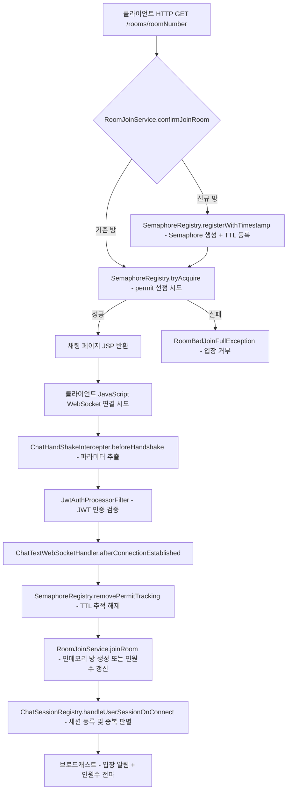
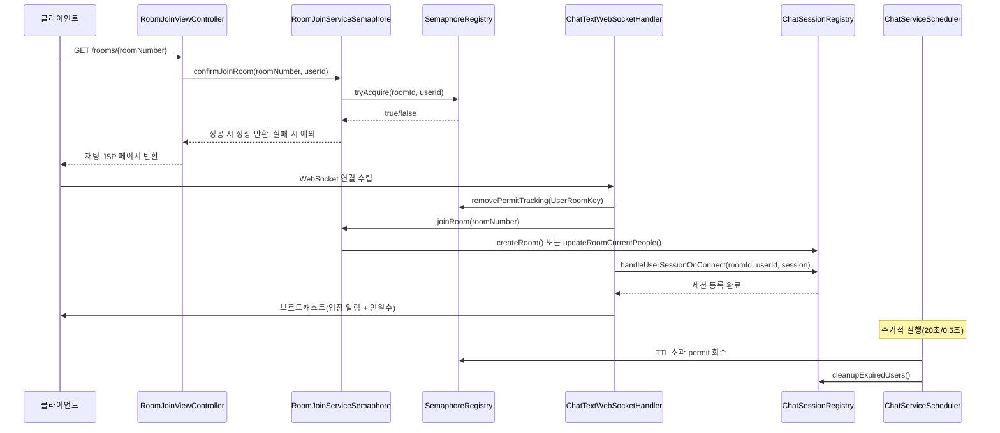

# ChatService 설계 명세서

프로젝트명: ChatService — 실시간 채팅 서비스  
문서 버전: 1.0  
작성일: 2026년 04월 03일  
작성자: 정범진

---

## 목차

1. [개요](#1-개요)
2. [시스템 전체 개요](#2-시스템-전체-개요)
3. [일반 요구사항](#3-일반-요구사항)
4. [시스템 아키텍처](#5-시스템-아키텍처)
5. [API 명세](#6-api-명세)
6. [데이터 모델](#7-데이터-모델)
7. [핵심 비즈니스 로직](#8-핵심-비즈니스-로직)
8. [실시간 서비스 명세](#10-실시간-서비스-명세)
9. [스케줄러 명세](#9-스케줄러-명세)
10. [구현 기술 스택](#11-구현-기술-스택)
11. [부록](#12-부록)

---

## 1. 개요

### 1.1 목적

본 문서는 ChatService 실시간 채팅 시스템의 설계 구조를 기술한다. 이 시스템이 해결하는 핵심 문제는 다음 세 가지이다.

첫째, REST API 기반 입장 허가와 WebSocket 기반 세션 수립이 물리적으로 분리된 이원 프로토콜 구조에서, 복수 사용자가 동일 채팅방에 동시 입장을 요청할 때 발생하는 Race Condition으로 인한 정원 초과 입장 문제이다. HTTP 요청 시점에서는 정원 여유가 있었으나 WebSocket 연결이 확정되는 시점에서는 이미 다른 사용자가 입장을 완료하여 초과가 발생하는 구간이 존재한다.

둘째, 동일 사용자가 복수 브라우저 탭 또는 복수 브라우저를 통해 동시에 WebSocket 연결을 수립할 때 발생하는 세션 충돌 문제이다. 하나의 userId에 복수 WebSocket 세션이 매핑되면 메시지 중복 수신, 인원수 불일치, 퇴장 처리 오류가 연쇄적으로 발생한다.

셋째, REST 단계에서 입장 permit을 확보한 사용자가 WebSocket 연결을 완료하지 않고 이탈(네트워크 단절, 브라우저 종료 등)할 경우, 해당 permit이 영구적으로 점유 상태로 남아 다른 사용자의 입장을 차단하는 자원 고착 문제이다.

### 1.2 범위

본 문서는 ChatService의 서버 측 백엔드 설계를 다룬다. 구체적으로 입장 동시성 제어, WebSocket 세션 라이프사이클 관리, 인증 체계, 스케줄러 기반 자원 회수, Redis 연동 구조를 포함한다. 클라이언트(JSP/JavaScript) 측 구현과 프론트엔드 UI 설계는 본 문서의 범위에 포함되지 않는다.

---

## 2. 시스템 전체 개요

### 2.1 핵심 아키텍처 요약

ChatService는 Spring Boot 3.1 기반의 단일 서버 애플리케이션으로, HTTP REST API와 WebSocket 프로토콜을 동시에 운용한다. 사용자의 채팅방 입장은 HTTP GET 요청으로 시작하여 WebSocket 세션 수립으로 완료되며, 이 두 단계 사이에 Semaphore 기반 동시성 제어가 개입한다.

인증은 Spring Security 필터 체인에서 Stateless 정책으로 운영되며, JWT 토큰의 서명 키를 Redis에 저장하여 매 요청마다 서명값을 비교 검증한다. 세션 기반 인증을 사용하지 않으므로, 서버 측에는 HttpSession이 생성되지 않는다.

채팅방의 생명주기(생성-입장-메시지 송수신-퇴장-삭제)는 전적으로 인메모리 자료구조(ConcurrentHashMap 기반)로 관리된다. OracleDB는 방 생성 대기열의 영속 백업과 사용자 계정 정보 저장에만 사용되며, 채팅방 상태 자체는 DB에 반영되지 않는다.

**주요 구성요소**

| 구성요소 | 클래스 | 역할 |
|---------|--------|------|
| 입장 서비스 | `RoomJoinServiceSemaphore` | REST 요청 시 Semaphore permit 사전 확보 및 WebSocket 연결 후 입장 확정 |
| 세마포어 레지스트리 | `SemaphoreRegistry` | 방별 Semaphore 객체 관리, permit 점유/해제/추적 |
| 세션 레지스트리 | `ChatSessionRegistry` | WebSocket 세션 등록/제거, 중복 탭 판별, 새로고침 복귀 처리, 인원수 동기화 |
| WebSocket 핸들러 | `ChatTextWebSocketHandlerSemaphore` | WebSocket 연결/해제/메시지 브로드캐스트 처리 |
| 핸드셰이크 인터셉터 | `ChatHandShakeIntercepter` | WebSocket 핸드셰이크 전 HTTP 파라미터 추출 및 세션 속성 주입 |
| 방 생성 대기열 | `InMemoryRoomQueueTracker` | 방 생성 요청의 인메모리 임시 저장 및 TTL 관리 |
| 스케줄러 | `ChatServiceScheduler` | TTL 만료 방 생성 대기열 정리, 만료 사용자 세션 정리 |
| Redis 핸들러 | `RedisHandler` | JWT 서명 키 저장/조회, 중복 로그인 방지용 토큰 관리 |
| 인증 필터 | `JwtAuthProcessorFilter` | 매 요청의 JWT 쿠키 추출 및 Redis 기반 서명 검증 |
| 로그인 필터 | `LoginFilter` | 로그인 인증 처리, JWT 발급, Redis에 서명 키 저장, 쿠키 삽입 |

**핵심 처리 흐름**

사용자는 HTTP GET `/rooms/{roomNumber}` 요청으로 채팅방 입장을 시도한다. `RoomJoinViewController`가 요청을 수신하면 `RoomJoinServiceSemaphore.confirmJoinRoom()`을 호출하여 해당 방의 Semaphore에서 permit 확보를 시도한다. permit 확보에 성공하면 채팅 페이지(JSP)가 반환되고, 클라이언트의 JavaScript가 WebSocket 연결을 자동으로 수립한다. `ChatTextWebSocketHandlerSemaphore.afterConnectionEstablished()`에서 `joinRoom()`이 호출되어 인메모리 방 정보에 인원수가 반영되고, `ChatSessionRegistry.handleUserSessionOnConnect()`에서 세션 등록 및 중복 탭 처리가 수행된다. permit 확보에 실패하면 `RoomBadJoinFullException`이 발생하여 입장이 거부된다.

**아키텍처 특징**

| 특징 | 설명 |
|------|------|
| 2단계 입장 분리 | 입장 자격 판별(HTTP/Semaphore)과 입장 확정(WebSocket/세션 등록)을 물리적으로 분리하여 관심사를 격리 |
| 인메모리 상태 관리 | 채팅방 상태를 ConcurrentHashMap 기반으로 관리하여 DB I/O 없이 실시간 동시성 제어 수행 |
| TTL 기반 자원 복구 | 비정상 종료/미연결 상황에서 스케줄러가 주기적으로 TTL 초과 자원을 회수하여 상태 수렴 보장 |

### 2.2 전체 데이터 처리 흐름도



### 2.3 주요 컴포넌트 간 상호작용



---

## 3. 일반 요구사항

### 3.1 기술 요구사항

| 항목 | 내용 |
|------|------|
| 서버 포트 | 8186 |
| 컨텍스트 패스 | `/ChatService` |
| 데이터 형식 | JSP 뷰 기반 서버 사이드 렌더링 + JSON(WebSocket 메시지) |
| 문자 인코딩 | UTF-8 |
| 인증 방식 | JWT(쿠키 전송) + Redis 서명 키 검증, Stateless 세션 정책 |
| WebSocket 엔드포인트 | `ws://{host}:8186/ChatService/chat?roomNumber={n}&sessionKey={key}` |

### 3.2 성능 요구사항

| 항목 | 내용 |
|------|------|
| Tomcat 최대 스레드 | 400 |
| Tomcat 최대 커넥션 | 2000 |
| HikariCP 최대 풀 | 500 |
| Redis Lettuce 최대 활성 커넥션 | 100 |
| Redis Lettuce 최대 유휴 커넥션 | 50 |

---

## 4. 시스템 아키텍처

### 4.1 아키텍처 개요

ChatService는 단일 Spring Boot 애플리케이션 내에서 다음 네 개의 논리적 계층으로 구성된다.

**인증 계층**: Spring Security 필터 체인이 경로별로 분리되어 동작한다. `/login` 경로에는 `LoginFilter`가, `/rooms/**` 및 `/chat/**` 경로에는 `JwtAuthProcessorFilter`가 배치된다. 모든 필터 체인은 `SessionCreationPolicy.STATELESS`로 설정되어 HttpSession을 생성하지 않는다.

**입장 제어 계층**: `RoomJoinViewController` → `RoomJoinServiceSemaphore` → `SemaphoreRegistry` 경로로 처리된다. HTTP 요청 단계에서 Semaphore permit을 확보하며, 실패 시 `RoomBadJoinFullException`을 던져 WebSocket 연결 시도 자체를 차단한다.

**WebSocket 세션 계층**: `ChatHandShakeIntercepter` → `ChatTextWebSocketHandlerSemaphore` → `ChatSessionRegistry` 경로로 처리된다. WebSocket 연결 수립 후 세션 등록, 중복 탭 판별, 메시지 브로드캐스트, 퇴장 처리를 수행한다.

**스케줄러 계층**: `ChatServiceScheduler`가 주기적으로 `InMemoryRoomQueueTracker`의 TTL 만료 방 생성 대기열을 정리하고, `ChatSessionRegistry`의 TTL 만료 사용자 세션을 정리한다.

### 4.2 시스템 구성 요소

| 구성 요소 | 패키지 | 역할 | 주요 기술 |
|----------|--------|------|----------|
| 입장 컨트롤러 | `joinroom.controller` | HTTP 입장 요청 수신 및 채팅 뷰 반환 | Spring MVC, `@PathVariable` |
| 입장 서비스 | `joinroom.service` | permit 확보 및 입장 확정 로직 | `@Transactional`, Semaphore |
| 세마포어 레지스트리 | `concurrency` | 방별 Semaphore 관리 및 permit 추적 | `ConcurrentHashMap`, `Semaphore` |
| 세션 레지스트리 | `websocketcore.model` | WebSocket 세션 상태 통합 관리 | `HashMap`, `ConcurrentHashMap` |
| WebSocket 핸들러 | `websocketcore.core` | 연결/해제/메시지 처리 | `TextWebSocketHandler` |
| 핸드셰이크 인터셉터 | `websocketcore.core` | HTTP→WebSocket 전환 시 파라미터 주입 | `HandshakeInterceptor` |
| 방 생성 대기열 | `createroom.memory` | 방 생성 요청 임시 저장 및 TTL 관리 | `ConcurrentHashMap`, `@PostConstruct` |
| 방 생성 서비스 | `createroom.service` | 방 생성 요청 처리 및 DB/메모리 동기화 | JPA, `@Transactional` |
| 스케줄러 | `scheduler` | TTL 만료 자원 정리 | `@Scheduled` |
| Redis 핸들러 | `redis.handler` | Redis 연산 래퍼 | `RedisTemplate`, Lettuce |
| JWT 인증 필터 | `auth.filter.customfilter` | 요청별 JWT 검증 | `OncePerRequestFilter` |
| 로그인 필터 | `auth.filter.customfilter` | 로그인 처리 및 JWT 발급 | `UsernamePasswordAuthenticationFilter` |

### 4.3 데이터 흐름

**입장 흐름의 데이터 이동 경로**:

`HttpServletRequest`(roomNumber, userId, JWT 쿠키) → `RoomJoinViewController`(경로 변수 추출) → `RoomJoinServiceSemaphore`(Semaphore 조회/permit 시도) → `SemaphoreRegistry`(semaphoreMap, userPermitMap 갱신) → JSP 뷰 반환 → 클라이언트 JavaScript → WebSocket 핸드셰이크(`HttpServletRequest` → `WebSocketSession.attributes` 복사) → `ChatTextWebSocketHandlerSemaphore`(permit 추적 해제, joinRoom 호출) → `ChatSessionRegistry`(roomList, roomUserSessions, roomMap 갱신) → 브로드캐스트(JSON TextMessage)

**인증 흐름의 데이터 이동 경로**:

로그인 시: `HttpServletRequest`(userid, password) → `LoginFilter.attemptAuthentication()` → `AuthenticationManager` → `UserAuthenticationProvider` → 인증 성공 시 `JWTUtil.generateSigningKey()` + `generateToken()` → Redis에 `{토큰: 서명키Base64}` 및 `{userId: 토큰}` 저장 → 응답 쿠키에 JWT 삽입

인증 요청 시: `HttpServletRequest`(쿠키의 JWT) → `JwtAuthProcessorFilter` → Redis에서 `{토큰}` 키로 서명키 조회 → 서명키로 JWT 검증 → `SecurityContextHolder`에 `Authentication` 설정 → `request.setAttribute("userId", ...)` 및 `request.setAttribute("userName", ...)`

### 4.4 Spring Security 필터 체인 구조

`SecurityConfig`에서 경로별로 분리된 `SecurityFilterChain` Bean이 등록된다. 각 체인은 독립적으로 동작하며, 모든 체인에 `SessionCreationPolicy.STATELESS`가 적용된다.

| 체인 | 경로 매처 | 필터 | 인증 요구 |
|------|----------|------|----------|
| indexFilterChain | `/` | `IndexFilter` | 불필요 (permitAll) |
| loginFilterChain | `/login` | `LoginFilter` | 불필요 (로그인 처리 자체) |
| logoutFilterChain | `/logout` | Spring Security Logout Handler | 불필요 |
| membersServiceFilterChain | `/members/**` | `JwtAuthProcessorFilter` | POST, DELETE만 필요 |
| roomListFilterChain | `/rooms`, `/api/rooms`, `/rooms/new`, `/rooms/{roomId}` | `JwtAuthProcessorFilter` | 전체 필요 |
| chatWebSocketFilterChain | `/chat`, `/chat/**` | `JwtAuthProcessorFilter` | 전체 필요 |

---

## 5. API 명세

### 5.1 채팅방 입장 API

| 항목 | 내용 |
|------|------|
| **기능 설명** | 지정된 방 번호의 채팅방 입장을 시도하고, 성공 시 채팅 페이지를 반환 |
| **HTTP Method** | GET |
| **Endpoint URL** | `/rooms/{roomNumber}` |

#### 5.1.1 요청 (Request)

**Path Parameters**

| 파라미터 | 타입 | 필수 | 설명 |
|---------|------|------|------|
| roomNumber | int | ✓ | 입장할 채팅방 번호 |

**Request Headers**

| 헤더명 | 필수 | 설명 |
|--------|------|------|
| Cookie: Authorization={JWT} | ✓ | JWT 인증 토큰 (HttpOnly 쿠키) |

#### 5.1.2 응답 (Response)

**성공 응답: 200 OK**

JSP 뷰(`chatservice/chat/chat`)가 반환된다. 뷰에 전달되는 Model 속성:

| 속성명 | 타입 | 설명 |
|--------|------|------|
| roomNumber | int | 입장한 방 번호 |
| nickName | String | 인증된 사용자의 닉네임 (`Authentication.getDetails()`) |

#### 5.1.3 에러 응답

| 상황 | 처리 |
|------|------|
| 정원 초과 | `RoomBadJoinFullException` 발생 → ExceptionHandler에서 처리 |
| 존재하지 않는 방 | `RoomBadJoinFullException` 발생 (메시지: "유효하지 않은 방 번호") |
| JWT 인증 실패 | `JwtAuthenticationFailureHandler`에서 401 응답 |

### 5.2 채팅방 생성 요청 API

| 항목 | 내용 |
|------|------|
| **기능 설명** | 새 채팅방 생성을 요청하고 DB 대기열에 등록 |
| **HTTP Method** | POST |
| **Endpoint URL** | `/rooms/new` |

`RoomQueueService.creationQueueService()`가 호출되어 `RoomQueueEntity`를 DB에 저장하고, `InMemoryRoomQueueTracker`에 `RoomQueueVO`를 등록한다. 반환값은 생성된 방 번호(roomNumber)이다.

### 5.3 WebSocket 엔드포인트

| 항목 | 내용 |
|------|------|
| **프로토콜** | WebSocket (ws://) |
| **Endpoint URL** | `/chat?roomNumber={n}&sessionKey={key}` |
| **핸들러** | `ChatTextWebSocketHandlerSemaphore` |
| **인터셉터** | `ChatHandShakeIntercepter` |
| **AllowedOrigins** | `*` |

**WebSocket 메시지 포맷 (서버 → 클라이언트)**

| type | 필드 | 설명 |
|------|------|------|
| `CHAT` | roomNumber, user, content | 채팅 메시지 브로드캐스트 |
| `INFO` | content | 입장/퇴장 알림 메시지 |
| `USER_COUNT` | count | 현재 방 인원수 갱신 |
| `SESSION_KEY` | sessionKey | sessionKey 발급/갱신 (서버→클라이언트 동기화) |

---

## 6. 데이터 모델

### 6.1 데이터베이스 스키마

#### 6.1.1 chat_room_creation_queue (방 생성 대기열 테이블)

**용도**: 채팅방 생성 요청을 영속적으로 보관하는 대기열 테이블. 서버 재기동 시 `InMemoryRoomQueueTracker`가 이 테이블에서 데이터를 복원한다.

| 컬럼명 | 데이터 타입 | 제약조건 | 설명 |
|--------|-------------|----------|------|
| roomnumber | NUMBER | PK, IDENTITY | 방 번호 (자동 생성) |
| roomtitle | VARCHAR2 | NOT NULL | 방 제목 |
| currentpeople | NUMBER | | 현재 인원수 (대기열 시점에서는 0) |
| maxpeople | NUMBER | NOT NULL | 최대 허용 인원수 |

**엔티티 매핑**: `RoomQueueEntity` (`@Entity`, `@Table(name = "chat_room_creation_queue")`)

#### 6.1.2 사용자 테이블

사용자 계정 정보를 저장하며, `UserEntityRepository`를 통해 접근한다. Spring Security의 `UserDetailsService` 구현체인 `UserEntityDetailService`가 이 테이블을 조회하여 인증을 수행한다. (테이블 스키마 상세는 user 패키지의 엔티티에 의존)

### 6.2 인메모리 자료구조

ChatService의 실시간 상태는 DB가 아닌 인메모리 자료구조로 관리된다. 아래는 각 자료구조의 구조와 책임이다.

#### 6.2.1 SemaphoreRegistry 내부 자료구조

| 필드명 | 타입 | 키 | 값 | 역할 |
|--------|------|-----|-----|------|
| semaphoreMap | `ConcurrentHashMap<Integer, Semaphore>` | roomId | Semaphore(maxPeople, fair=true) | 방별 동시 입장 제한 |
| createdAtMap | `ConcurrentHashMap<Integer, Long>` | roomId | 생성 시각(ms) | 신규 방 TTL 관리 |
| userPermitMap | `ConcurrentHashMap<UserRoomKey, Long>` | (userId, roomId) | permit 점유 시각(ms) | 미연결 사용자 permit TTL 추적 |

**UserRoomKey 구조**:
```java
public static class UserRoomKey {
    private final String userId;
    private final int roomId;
    // equals(): userId.equals() && roomId ==
    // hashCode(): 31 * userId.hashCode() + roomId
}
```

#### 6.2.2 ChatSessionRegistry 내부 자료구조

| 필드명 | 타입 | 키 | 값 | 역할 |
|--------|------|-----|-----|------|
| roomList | `Map<String, HashSet<WebSocketSession>>` | roomId(String) | 해당 방의 전체 WebSocket 세션 집합 | 메시지 브로드캐스트 대상 |
| roomUserSessions | `Map<String, Map<String, WebSocketSession>>` | roomId → userId | 특정 사용자의 WebSocket 세션 | 중복 탭 판별 및 강제 종료 대상 식별 |
| roomMap | `ConcurrentHashMap<Integer, ChatRoom>` | roomId | ChatRoom 객체 | 방 메타정보(인원수, 최대인원, 생성시각) |
| roomUserVOMap | `ConcurrentHashMap<Integer, Map<String, RoomUserStateVO>>` | roomId → userId | RoomUserStateVO | 비명시적 종료 사용자 TTL 관리 |
| roomUserSessionKeyMap | `ConcurrentHashMap<String, Map<String, String>>` | roomId → userId | sessionKey(UUID) | 접속 유형 판별(최초/새로고침/중복탭/위조) |

#### 6.2.3 InMemoryRoomQueueTracker 내부 자료구조

| 필드명 | 타입 | 키 | 값 | 역할 |
|--------|------|-----|-----|------|
| roomQueueMap | `ConcurrentHashMap<Integer, RoomQueueVO>` | roomNumber | RoomQueueVO | 방 생성 요청 대기열 |

**RoomQueueVO 구조**:
```java
public class RoomQueueVO {
    private int roomNumber;
    private String roomTitle;
    private int currentPeople;      // 대기열 시점에서 0
    private int maxPeople;
    boolean joined;                 // WebSocket 연결로 실제 방 생성 완료 여부
    private LocalDateTime createdTime;  // 스케줄러 TTL 기준 시각
}
```

`isExpired(int minutes)` 메서드: `joined == true`이면 즉시 만료(방 생성 완료이므로 대기열에서 제거 대상), 그렇지 않으면 `createdTime + minutes`가 현재 시각을 초과했는지 검사한다.

### 6.3 DTO/VO 구조

#### 6.3.1 ChatRoom

**용도**: 인메모리에서 단일 채팅방의 상태를 캡슐화하는 객체. DB 엔티티가 아닌 순수 인메모리 상태 객체이다.

```java
public class ChatRoom {
    private final int roomNumber;       // 방 번호 (불변)
    private final String roomName;      // 방 이름 (불변)
    private int maxPeople;              // 최대 인원
    private int currentPeople;          // 현재 인원 (ChatSessionRegistry를 통해서만 갱신)
    private final LocalDateTime createdAt;  // 생성 시각 (불변)
}
```

#### 6.3.2 RoomUserStateVO

**용도**: 비명시적 종료(새로고침, 탭 종료) 사용자의 임시 퇴장 상태를 추적하는 VO. `roomUserVOMap`에 저장되며, TTL 내 재접속하지 않으면 스케줄러가 영구 퇴장으로 처리한다.

```java
public static class RoomUserStateVO {
    private final String userId;    // 사용자 ID
    private long expireAt;          // 만료 시각(System.currentTimeMillis() + USER_TTL_MILLIS)
}
```

`USER_TTL_MILLIS`는 `ChatSessionRegistry`에서 `1000L`(1초)로 설정되어 있다. 실서비스 기준에서는 10초(`10 * 1000L`)로 조정을 전제한 값이다.

---

## 7. 핵심 비즈니스 로직

### 7.1 2단계 입장 흐름 (confirmJoinRoom → joinRoom)

#### 7.1.1 개요

채팅방 입장은 두 단계로 분리된다. 1단계 `confirmJoinRoom()`은 HTTP 요청 시점에서 Semaphore permit을 확보하여 입장 자격을 판별한다. 2단계 `joinRoom()`은 WebSocket 연결 성공 후 호출되어 인메모리 방 정보에 인원수를 반영하고 방 실체를 생성한다. 이 분리의 설계적 근거는 다음과 같다.

permit 확보를 WebSocket 연결 시점으로 미루면, 모든 입장 요청이 TCP 3-way 핸드셰이크와 HTTP Upgrade 과정을 거친 후에야 정원 초과 여부를 판별할 수 있다. 이는 불필요한 네트워크 비용을 발생시킨다. HTTP 단계에서 permit을 선점함으로써 정원 초과 요청은 WebSocket 연결 비용 없이 즉시 차단된다.

또한 입장 자격 판별 책임이 HTTP 계층(`confirmJoinRoom`)에 고정되고, 세션 수립·관리 책임이 WebSocket 계층(`afterConnectionEstablished`)에 고정되어 관심사가 분리된다.

#### 7.1.2 confirmJoinRoom 처리 흐름

`RoomJoinServiceSemaphore.confirmJoinRoom(int roomNumber, String userId)`:

1단계 — 중복 입장 확인: `ChatSessionRegistry.containsUser(roomId, userId)`를 호출하여 해당 사용자가 이미 해당 방에 WebSocket 세션을 보유하고 있는지 확인한다. 보유하고 있으면 중복 입장이므로 별도 처리 없이 반환한다.

2단계 — 방 존재 형태 확인: `InMemoryRoomQueueTracker.getRoom(roomNumber)`과 `ChatSessionRegistry.getRoom(roomNumber)`을 조회하여 해당 방이 "생성 대기열에 있는 신규 방"인지, "이미 생성된 기존 방"인지, "존재하지 않는 방"인지를 판별한다.

3단계 — 신규 방인 경우: `SemaphoreRegistry.registerWithTimestamp(roomNumber, maxPeople)`을 호출하여 해당 방의 Semaphore를 생성하고 `createdAtMap`에 생성 시각을 기록한다. 이후 `tryAcquire(roomNumber, userId)`로 permit을 확보한다.

4단계 — 기존 방인 경우: `SemaphoreRegistry.tryAcquire(roomNumber, userId)`로 직접 permit 확보를 시도한다.

5단계 — permit 확보 실패: `RoomBadJoinFullException`("입장 실패: 방 정원이 가득 찼습니다.")을 던진다.

6단계 — 존재하지 않는 방: `RoomBadJoinFullException`("유효하지 않은 방 번호입니다.")을 던진다.

#### 7.1.3 joinRoom 처리 흐름

`RoomJoinServiceSemaphore.joinRoom(int roomNumber)`:

이 메서드는 HTTP 요청이 아닌 WebSocket 핸들러(`afterConnectionEstablished`)에서 직접 호출된다.

1단계 — 방 실체 확인: `ChatSessionRegistry.getRoom(roomNumber)`로 인메모리에 방이 존재하는지 확인한다.

2단계 — 방 미존재 시 생성: `InMemoryRoomQueueTracker.getRoom(roomNumber)`에서 대기열 메타 정보(`RoomQueueVO`)를 조회하고, `ChatSessionRegistry.createRoom(roomNumber, chatRoom)`으로 인메모리 방을 생성한다. 대기열의 `joined` 플래그를 `true`로 설정하여 스케줄러가 이 대기열을 정리 대상으로 인식하게 한다.

3단계 — 인원수 동기화: `ChatSessionRegistry.updateRoomCurrentPeople(roomNumber, maxPeople - availablePermits)`를 호출하여 Semaphore의 잔여 permit 수를 기준으로 현재 인원수를 산출한다.

#### 7.1.4 설계 원칙

**관심사 분리 (Separation of Concerns)**: 입장 자격 판별(`confirmJoinRoom`)과 입장 확정(`joinRoom`)이 서로 다른 프로토콜 계층에서 서로 다른 시점에 실행된다. `confirmJoinRoom`은 HTTP 요청-응답 사이클 내에서 동기적으로 실행되며, `joinRoom`은 WebSocket 연결 이벤트에서 비동기적으로 실행된다. 두 메서드 사이의 유일한 공유 상태는 `SemaphoreRegistry`의 permit 점유 상태이다.

**원자적 자원 통제 (Atomic Resource Control)**: `Semaphore.tryAcquire()`는 JVM 레벨에서 원자적으로 실행되므로, 복수 스레드가 동시에 동일 방의 permit을 시도하더라도 정원을 초과하는 결과가 발생하지 않는다. `SemaphoreRegistry`의 `semaphoreMap`이 `ConcurrentHashMap`이므로 방별 Semaphore 조회 자체도 스레드 안전하다.

### 7.2 sessionKey 기반 접속 유형 판별

#### 7.2.1 개요

WebSocket 연결이 수립되면 `ChatSessionRegistry.handleUserSessionOnConnect()`가 호출되어 현재 접속이 최초 입장인지, 동일 탭 새로고침인지, 중복 탭 접속인지, 위조 접근인지를 판별한다. 판별 기준은 서버 측 `roomUserSessionKeyMap`에 저장된 sessionKey와 클라이언트가 WebSocket 핸드셰이크 파라미터로 전달한 sessionKey의 존재 여부 및 동등성이다.

#### 7.2.2 판별 분기 구조

**사전 유효성 검사**: 클라이언트 sessionKey가 존재하나 서버 sessionKey가 null인 경우, 이는 명시적 종료 후 클라이언트 SessionStorage가 초기화되지 않은 예외 상황으로 판단한다. 클라이언트에 `SESSION_KEY: null` 메시지를 전송하여 강제 초기화하고, 이후 분기에서 최초 입장으로 처리되도록 `clientSessionKey`를 `"null"`로 재설정한다.

**분기 1 — 최초 입장** (clientSessionKey == "null" && serverSessionKey == null): UUID 기반 새 sessionKey를 생성하여 서버(`roomUserSessionKeyMap`)와 클라이언트(WebSocket 메시지) 양쪽에 저장한다. `roomUserSessions`와 `roomList`에 현재 세션을 등록한다.

**분기 2 — 동일 탭 새로고침** (clientSessionKey == serverSessionKey): 동일 탭에서의 새로고침으로 판별한다. 새로고침 시 기존 JavaScript 컨텍스트가 만료되면서 기존 WebSocket 세션의 `onclose` 이벤트가 발생하고, 거의 동시에 새로운 페이지 로드에서 새 WebSocket 연결의 `onopen`이 발생한다. 이때 `onclose`와 `afterConnectionEstablished`의 실행 순서가 보장되지 않는다. 이를 흡수하기 위해 `roomUserVOMap`에 해당 userId가 TTL 상태로 존재하는지를 최대 100ms(5ms 간격)까지 polling으로 대기한 뒤, TTL 항목이 있으면 제거하고 기존 세션을 새 세션으로 교체한다. 인원수와 permit은 변경하지 않는다.

**분기 3 — 중복 탭 접속** (clientSessionKey == "null" && serverSessionKey != null): 서버에 기존 sessionKey가 남아 있으나 클라이언트는 sessionKey가 없으므로, 이는 다른 탭/브라우저에서의 새로운 접속이다. `roomUserSessions`에서 기존 세션을 조회하여 `CloseStatus(3000, "중복 세션 강제 종료")`로 강제 종료한다. 새 UUID sessionKey를 발급하고 양쪽에 동기화한다. 기존 세션을 제거하고 새 세션을 등록한다. 인원수와 permit은 변경하지 않는다(중복 탭 종료 코드 3000은 `handleUserSessionOnClose`에서 별도의 인원수 감소를 수행하지 않는다).

**분기 4 — 위조/동기화 불일치** (그 외): 클라이언트 sessionKey가 존재하나 서버와 불일치하는 경우, 인위적 접근으로 간주한다. 클라이언트에 `SESSION_KEY: null`을 전송하고 `CloseStatus(3001, "중복 세션 강제 종료")`로 즉시 연결을 종료한다. 서버 측 자료구조에는 어떤 등록도 수행하지 않는다.

#### 7.2.3 handleUserSessionOnClose 종료 코드별 처리

| CloseStatus 코드 | 발생 조건 | 처리 내용 |
|-------------------|----------|----------|
| 1000 | 클라이언트 JS에서 명시적 close() 호출 (방 나가기) | permit 반환(`releasePermitOnly`), sessionKey 삭제, 사용자 전체 정리(`removeUserFromRoom`) |
| 3000 | `handleUserSessionOnConnect`에서 중복 탭 감지 시 기존 세션 강제 종료 | 인원수/permit 변경 없음 (동일 사용자의 세션 교체이므로) |
| 3001 | 위조/동기화 불일치로 인한 강제 종료 | 인원수/permit 변경 없음 (애초에 등록되지 않은 세션) |
| 그 외 (1001, 1006 등) | 탭 종료, 브라우저 종료, 네트워크 단절 등 비명시적 종료 | `markImplicitExitUser()` 호출: `roomUserVOMap`에 TTL 등록, 브로드캐스트 도메인에서 세션 제거, `ChatRoom.currentPeople` 감소 |

### 7.3 removeUserFromRoom 로직

`ChatSessionRegistry.removeUserFromRoom(int roomNumber, String userId)`:

이 메서드는 사용자가 완전히 방을 이탈할 때 호출되며, 다음 자료구조를 순차적으로 정리한다.

1단계: `roomUserSessions`에서 해당 userId의 세션을 제거한다. 해당 방의 사용자 세션 맵이 비면 방 번호 키 자체를 제거한다.

2단계: `roomList`에서 해당 userId에 매핑된 WebSocket 세션을 `removeIf`로 제거한다. 세션 집합이 비면 방 번호 키 자체를 제거한다.

3단계: `ChatRoom.currentPeople`을 `maxPeople - semaphoreRegistry.getAvailablePermits(roomNumber)`로 갱신한다.

4단계: 방 삭제 조건 검사. 현재 인원수가 0이고(`chatRoomEmpty`), TTL 대기 사용자가 없고(`voEmpty`), 세션이 모두 정리된(`sessionEmpty`) 경우에만 `roomMap`에서 방 자체를 제거한다. 세 조건이 모두 충족되어야 하는 이유는, 새로고침 중인 사용자가 TTL 내 재접속할 수 있으므로 인원수가 0이어도 TTL 대기자가 존재하면 방을 유지해야 하기 때문이다.

### 7.4 Redis 기반 JWT 인증 구조

#### 7.4.1 로그인 시 토큰 발급 흐름

`LoginFilter.generateAndStoreJwt(Authentication authResult)`:

1단계: 기존 토큰 무효화. Redis에서 `userId` 키로 기존 토큰을 조회한다. 존재하면 해당 토큰 키와 userId 키를 모두 삭제한다.

2단계: 서명 키 생성. `JWTUtil.generateSigningKey()`로 새 서명 키를 생성한다.

3단계: JWT 생성. `JWTUtil.generateToken(username, userId, roles, key)`로 JWT 토큰을 생성한다.

4단계: Redis 저장. 두 개의 키-값 쌍을 저장한다.
- `{JWT 토큰 문자열} → {서명 키 Base64 인코딩}` (TTL: 10000시간)
- `{userId} → {JWT 토큰 문자열}` (TTL: 10000시간)

첫 번째 쌍은 `JwtAuthProcessorFilter`에서 토큰 검증 시 서명 키를 조회하는 데 사용된다. 두 번째 쌍은 로그인 시 기존 토큰을 무효화하기 위해 userId로 토큰을 역조회하는 데 사용된다.

5단계: 쿠키 설정. `HttpOnly=true`, `Secure=false`, `Path=/` 속성으로 응답 쿠키에 JWT를 삽입한다.

#### 7.4.2 요청별 인증 검증 흐름

`JwtAuthProcessorFilter.doFilterInternal()`:

1단계: 쿠키에서 `Authorization` 이름의 JWT를 추출한다. 없으면 인증 없이 다음 필터로 진행한다.

2단계: Redis에서 `{JWT 토큰}` 키로 서명 키(Base64)를 조회한다. 없으면(TTL 만료 또는 무효화됨) `SecurityContextHolder`를 초기화하고 다음 필터로 진행한다.

3단계: 조회된 Base64 문자열을 서명 키 객체로 복원하고, 해당 키로 JWT의 서명을 검증한다. 검증 실패 시 다음 필터로 진행한다.

4단계: JWT에서 userId, userName, roles를 추출하여 `UsernamePasswordAuthenticationToken`을 생성하고 `SecurityContextHolder`에 설정한다. `request.setAttribute("userId", ...)`와 `request.setAttribute("userName", ...)`를 설정하여 WebSocket 핸드셰이크 인터셉터에서 접근할 수 있게 한다.

5단계: Redis의 토큰 TTL을 갱신(10000시간으로 재설정)한다.

---

## 8. 실시간 서비스 명세

### 8.1 WebSocket 연결 라이프사이클

#### 8.1.1 핸드셰이크 단계

**구현 위치**: `ChatHandShakeIntercepter.beforeHandshake()`

`ServerHttpRequest`를 `ServletServerHttpRequest`로 캐스팅하여 `HttpServletRequest`의 파라미터와 속성을 추출한다. 추출 대상:

| 출처 | 키 | WebSocket Session Attribute 이름 | 설명 |
|------|-----|----------------------------------|------|
| `request.getParameter()` | `roomNumber` | `roomNumber` | 방 번호 |
| `request.getAttribute()` | `userName` | `userName` | 사용자 닉네임 (`JwtAuthProcessorFilter`에서 설정) |
| `request.getAttribute()` | `userId` | `userId` | 사용자 ID (`JwtAuthProcessorFilter`에서 설정) |
| `request.getParameter()` | `sessionKey` | `sessionKey` | 클라이언트 세션키 (최초 접속 시 null) |

`roomNumber`가 null이면 핸드셰이크를 거부(`return false`)한다.

#### 8.1.2 연결 수립 단계

**구현 위치**: `ChatTextWebSocketHandlerSemaphore.afterConnectionEstablished()`

실행 순서:

1. 세션 속성에서 roomNumber, userName, userId를 추출한다.
2. `SemaphoreRegistry.removePermitTracking(UserRoomKey)`: permit TTL 추적 정보를 제거한다. 실제 연결이 성공했으므로 스케줄러의 회수 대상에서 제외한다.
3. `RoomJoinServiceSemaphore.joinRoom(roomId)`: 인메모리 방 생성(신규) 또는 인원수 갱신(기존).
4. `ChatSessionRegistry.handleUserSessionOnConnect(roomNumber, userId, session)`: 세션 등록, 접속 유형 판별, 중복 탭 처리.
5. 브로드캐스트: `INFO` 메시지(입장 알림) + `USER_COUNT` 메시지(인원수).

#### 8.1.3 메시지 처리 단계

**구현 위치**: `ChatTextWebSocketHandlerSemaphore.handleTextMessage()`

수신된 `TextMessage`의 payload를 그대로 `CHAT` 타입 JSON으로 래핑하여 동일 방의 전체 활성 세션에 브로드캐스트한다. 브로드캐스트 대상은 `ChatSessionRegistry.getRoomSessions(roomNumber)`로 조회되며, `isOpen() == true`인 세션에만 전송한다.

```json
{
  "type": "CHAT",
  "roomNumber": "1",
  "user": "사용자닉네임",
  "content": "메시지 내용"
}
```

#### 8.1.4 연결 종료 단계

**구현 위치**: `ChatTextWebSocketHandlerSemaphore.afterConnectionClosed()`

실행 순서:

1. 세션 속성에서 roomNumber, userName, userId를 추출한다.
2. `ChatSessionRegistry.handleUserSessionOnClose(roomNumber, userId, session, status)`: CloseStatus 코드별 분기 처리(7.2.3절 참조).
3. 브로드캐스트: `INFO` 메시지(퇴장 알림) + `USER_COUNT` 메시지(인원수).

#### 8.1.5 전송 오류 처리

**구현 위치**: `ChatTextWebSocketHandlerSemaphore.handleTransportError()`

네트워크 오류 등으로 WebSocket 전송이 실패한 경우, `SemaphoreRegistry.releasePermitOnly(roomId)`와 `removePermitTracking(UserRoomKey)`를 호출하여 permit을 반환하고 추적 정보를 제거한다.

### 8.2 브로드캐스트 메커니즘

`ChatTextWebSocketHandlerSemaphore.broadcast(String roomNumber, TextMessage message)`:

`ChatSessionRegistry.getRoomSessions(roomNumber)`로 해당 방의 `HashSet<WebSocketSession>`을 조회한다. null 또는 empty이면 전송하지 않는다. 각 세션에 대해 `isOpen()`을 확인하고, 열린 세션에만 `session.sendMessage(message)`를 호출한다. 개별 세션의 전송 실패는 로그로 기록하며 다른 세션의 전송을 차단하지 않는다.

---

## 9. 스케줄러 명세

### 9.1 방 생성 대기열 TTL 정리

**구현 클래스**: `ChatServiceScheduler.cleanUpPendingRoomQueue()`  
**실행 주기**: 20초(`@Scheduled(fixedRate = 20 * 1000)`)  
**TTL 기준**: 2분(`EXPIRATION_MINUTES = 2`)

처리 흐름: `InMemoryRoomQueueTracker.removeExpiredRooms(2)`를 호출하여 `roomQueueMap`에서 TTL 초과 항목을 제거하고, 제거된 각 항목에 대해 `RoomQueueEntityJpa.deleteByRoomNumber(roomNumber)`로 DB 대기열 레코드도 삭제한다.

TTL 만료 조건(`RoomQueueVO.isExpired()`): `joined == true`(방 생성 완료)이거나 `createdTime + minutes < now`(시간 초과)인 경우 만료로 판정한다.

### 9.2 사용자 세션 TTL 정리

**구현 클래스**: `ChatServiceScheduler.cleanupExpiredUsersJob()` (현재 코드에서 주석 처리 상태)  
**설계 주기**: 0.5초(`@Scheduled(fixedRate = 500)`)

`ChatSessionRegistry.cleanupExpiredUsers()`를 호출하여 `roomUserVOMap`에 등록된 비명시적 종료 사용자 중 TTL이 만료된 항목을 처리한다.

처리 흐름: `roomUserVOMap`의 전체 방 번호를 순회하면서, 각 방의 사용자 VO 중 `expireAt < now`인 항목을 수집한다. 수집된 각 사용자에 대해 `roomUserVOMap`에서 제거하고, `SemaphoreRegistry.releasePermitOnly(roomNumber)`로 permit을 반환하고, `removeUserFromRoom(roomNumber, userId)`로 세션/방 정보를 정리한다.

### 9.3 사용자 permit TTL 회수

**구현 클래스**: `ChatServiceScheduler.clearExpiredUserPermits()` (현재 코드에서 주석 처리 상태)  
**설계 주기**: 30초  
**TTL 기준**: 120초(`TTL_LIMIT_MS = 120_000L`)

`SemaphoreRegistry.userPermitMap`을 순회하여 permit 점유 시각이 120초를 초과한 항목의 permit을 반환하고 추적 정보를 제거한다. REST 단계에서 permit을 확보했으나 WebSocket 연결이 수립되지 않은 사용자를 대상으로 한다.

---

## 10. 구현 기술 스택

### 10.1 백엔드 기술

| 구분 | 기술 | 버전 | 선정 이유 |
|------|------|------|----------|
| Framework | Spring Boot | 3.1.12 | WebSocket, Security, JPA, Redis 통합 지원 |
| WebSocket | Spring WebSocket (native) | 3.1.x | SockJS fallback 지원, TextWebSocketHandler 기반 커스텀 핸들러 작성 |
| Security | Spring Security | 6.x | 경로별 SecurityFilterChain 분리, Stateless 세션 정책 |
| Database | OracleDB | 19c (ojdbc8:19.8.0.0) | 방 생성 대기열 영속화, 사용자 계정 저장 |
| ORM | Spring Data JPA + MyBatis | JPA 3.1 / MyBatis 3.0.3 | JPA는 엔티티 관리, MyBatis는 복잡 쿼리 지원 |
| Cache/Store | Redis (Lettuce) | Spring Data Redis 3.1.x | JWT 서명 키 저장, 중복 로그인 방지용 토큰 관리 |
| JWT | jjwt | 0.11.5 | JWT 생성/검증/파싱 |
| View | JSP (Tomcat Jasper) | 6.x | 서버 사이드 렌더링 기반 채팅 UI |
| 동시성 | java.util.concurrent | JDK 17 | Semaphore, ConcurrentHashMap, ScheduledExecutorService |

### 10.2 주요 설정

#### 10.2.1 application.yml

```yaml
server:
  port: 8186
  servlet:
    context-path: /ChatService
  tomcat:
    threads:
      max: 400
      min-spare: 10
    max-connections: 2000
    accept-count: 1000
    connection-timeout: 20s

spring:
  datasource:
    driver-class-name: oracle.jdbc.OracleDriver
    url: jdbc:oracle:thin:@127.0.0.1:1521:xe
    username: TOYCHAT
    password: qwer1234
    hikari:
      auto-commit: false
      maximum-pool-size: 500
      minimum-idle: 10

  data:
    redis:
      host: 127.0.0.1
      port: 6379
      lettuce:
        pool:
          max-active: 100
          max-idle: 50
          min-idle: 10

  jpa:
    hibernate:
      ddl-auto: none
    properties:
      hibernate:
        dialect: org.hibernate.dialect.OracleDialect
        physical_naming_strategy: org.hibernate.boot.model.naming.PhysicalNamingStrategyStandardImpl
    open-in-view: false
```

### 10.3 WebSocket 설정

`WebSocketConfig`에서 `WebSocketConfigurer`를 구현하여 다음을 등록한다:

- **핸들러**: `ChatTextWebSocketHandlerSemaphore` (경로: `/chat`)
- **인터셉터**: `ChatHandShakeIntercepter`
- **AllowedOrigins**: `*`
- **의존성 주입**: `@Qualifier("semaphore")` IRoomJoinService, ChatSessionRegistry, SemaphoreRegistry

### 10.4 Redis 설정

`RedisConfig`에서 Lettuce 기반 `RedisConnectionFactory`와 `RedisTemplate<String, Object>`를 Bean으로 등록한다. Serializer는 키/값/해시키/해시값 모두 `StringRedisSerializer`를 사용한다.

---

## 11. 부록

### 11.1 패키지 구조

```
src/main/java/com/chatservice/
├── auth/                       # 인증 체계
│   ├── config/                 # SecurityConfig, CookieLogoutHandler
│   ├── exception/              # 인증 예외 처리
│   ├── filter/
│   │   ├── customfilter/       # IndexFilter, JwtAuthProcessorFilter, LoginFilter
│   │   └── util/               # CookieUtil, JWTUtil
│   ├── provider/               # UserAuthenticationProvider
│   ├── repository/             # UserEntityRepository
│   ├── userdetails/            # UserEntity
│   └── userdetailservice/      # UserEntityDetailService
├── concurrency/                # 동시성 제어
│   ├── SemaphoreRegistry.java
│   └── ChatSessionRegistryIfElse.java (IF-ELSE 기반 구현 - 비활성)
├── createroom/                 # 방 생성
│   ├── controller/
│   ├── dao/                    # IRoomQueueRepository
│   ├── memory/                 # InMemoryRoomQueueTracker
│   ├── model/                  # RoomQueueVO, RoomQueueEntity, RoomQueueDTO, RoomCreationQueueConverter
│   └── service/                # RoomQueueService
├── joinroom/                   # 입장 제어
│   ├── controller/             # RoomJoinViewController
│   ├── converter/              # RoomConverter
│   ├── dao/                    # ChatRoom
│   ├── exception/              # RoomBadJoinFullException
│   ├── exceptionHandler/
│   └── service/                # IRoomJoinService, RoomJoinServiceSemaphore, ...IfElse, ...Synchronized, ...ReentrantLock
├── redis/                      # Redis 연동
│   ├── config/                 # RedisConfig
│   ├── controller/
│   ├── dto/
│   ├── handler/                # RedisHandler
│   └── service/
├── roomlist/                   # 방 목록 조회
│   ├── controller/
│   ├── model/
│   └── service/
├── scheduler/                  # 스케줄러
│   ├── ChatServiceScheduler.java
│   └── RoomQueueEntityJpa.java
├── user/                       # 회원 관리
├── web/                        # 웹 관련 설정
├── websocketcore/              # WebSocket 핵심
│   ├── core/                   # ChatTextWebSocketHandlerSemaphore, WebSocketConfig, ChatHandShakeIntercepter
│   └── model/                  # ChatSessionRegistry
└── ChatServiceApplication.java
```

### 11.2 동시성 제어 구현체 비교

`joinroom.service` 패키지에는 네 가지 동시성 제어 구현체가 존재한다. `IRoomJoinService` 인터페이스를 구현하며, `@Qualifier`로 런타임에 선택된다. 현재 활성 구현체는 `RoomJoinServiceSemaphore`이다.

| 구현체 | 동시성 메커니즘 | 특징 |
|--------|----------------|------|
| `RoomJoinServiceSemaphore` | `java.util.concurrent.Semaphore` | 방별 격리, 비차단(tryAcquire), fair=true, 현재 활성 |
| `RoomJoinServiceSynchronized` | `synchronized` 블록 | 단일 모니터 기반, 전역 직렬화 |
| `RoomJoinServiceReentrantLock` | `ReentrantLock` | 방별 락 가능하나 수동 해제 필요 |
| `RoomJoinServiceIfElse` | 조건문 기반 인원수 검사 | 원자성 미보장, Race Condition 취약 |

### 11.3 문서 변경 이력

| 버전 | 작성일 | 작성자 | 변경 내용 |
|------|--------|--------|----------|
| 1.0 | 2026-04-03 | 정범진 | 초안 작성 — 전체 소스 코드 기반 설계 명세 |

---

## 문서 종료

본 문서는 'ChatService 실시간 채팅 서비스'의 상세 설계 명세를 제공한다.

**문서 작성 완료일**: 2026년 04월 03일  
**문서 상태**: 초안
